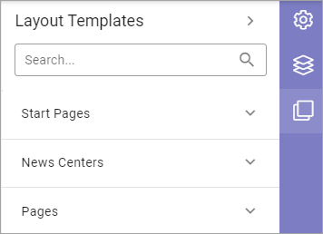

Layout Templates
=====================

For a quick start when creating a new page, you can use a Layout Template for the page. Here's an example of available groups of templates:

For all templates you will se a preview image.

.. image:: layout-templates-pages.png

When you have chosen a template, the page will change to show the sections and blocks the template contains.

.. image:: layout-templates-page-example.png

You can try several templates before you decide. Nothing is saved until you save a draft, and, as usual, nothing is shown for others until you publish.

