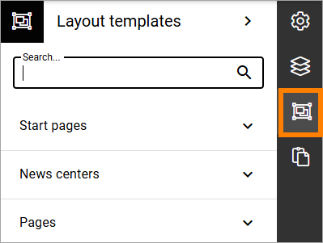
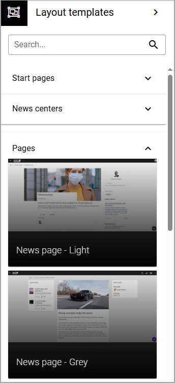
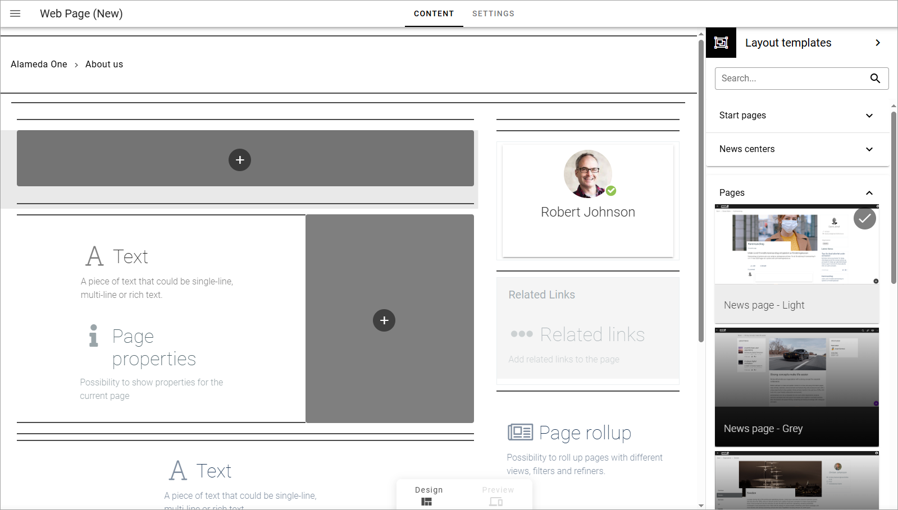

Layout templates
=====================

For a quick start when creating a new page type, you can use a layout template. (**Note!** only available when working with page types). Here's an example of available groups of templates:

For all templates you will se a preview image.

When you have chosen a template, the layout of the page type will change to show the sections and blocks the template contains, for example:

You can try several templates before you decide. Nothing is saved until you save a draft or publish the new page type.

You can also select another layout template when editing a page type but beware that a lot of changes can be made if you already have added content, or even added or removed blocks, for the page type.

