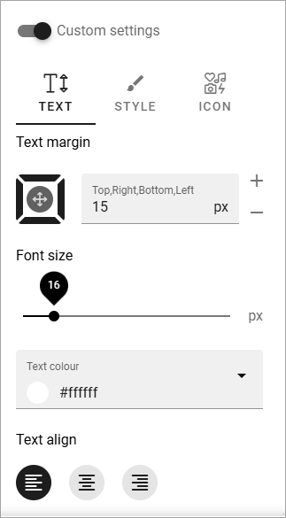

Block header
==============

You can set custom settings for the block headers on this page, by clicking the button.

.. image:: page-toolbar-block-header.png

Then these settings becomes available:

It is the settings set up for the business profile, in Omnia admin, you can edit specifically for this page. 

See this page for more information: :doc:`Content Header </admin-settings/business-group-settings/settings/block-title/index>`

