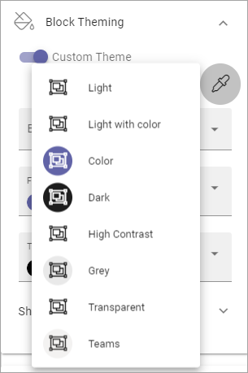

Block theming
==============

Here you can choose a custom theme for blocks on this page:

.. image:: block-theming-v6.png

If you chose to set a Custom theme, you can click the icon to select a theme.

The themes are set up for the business profile in Omnia admin, see: :doc:`Theme </admin-settings/business-group-settings/settings/theme/index>`

When you have chosen a theme you can edit colors using the color fields available. For example:

.. image:: block-theming-theme-set.png

Advanced settings
-----------------
If you choose to show advanced settings, here's what you can do:

.. image:: block-theming-theme-advanced.png

When you try them out, previews are shown in the blocks on the page.

