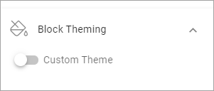

Block theming
==============

Here you can choose a custom theme for blocks on this page:

You use the options exactly the same way as for the layout theming, see: :doc:`Layout theming </general-assets/layout-explorer/page-layout/layout-theming/index>`

