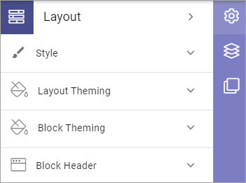

Page layout
==================

This functionality was called Page style in earlier Omnia versions and was available in the action menu for page editing.

Here, the following is available:

Select page for more information:

.. toctree::
   :titlesonly:

   page-style/index
   layout-theming/index
   block-theming/index
   block-header/index

