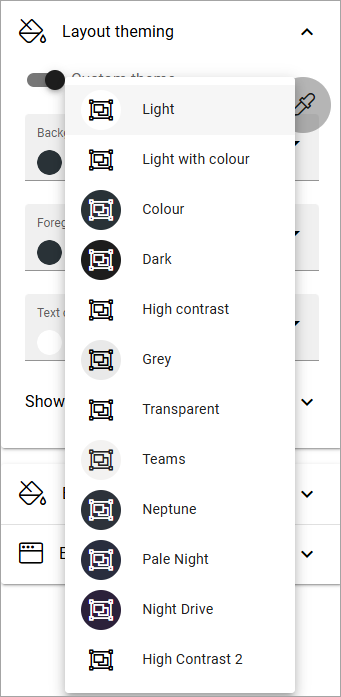
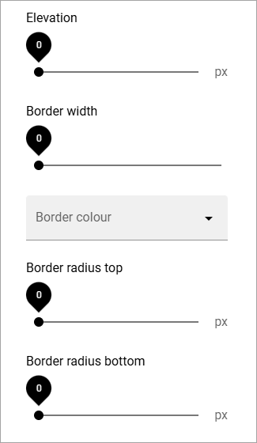

Layout theming
================

Here you can choose to set a custom theme for this page. 

.. image:: layout-theming.png

If you select Custom theme, you can click the icon to select a theme from the list:

The themes are set up for the business profile in Omnia admin, see: :doc:`Theme </admin-settings/business-group-settings/settings/theme/index>`

When you have chosen a theme you can edit colors using the color fields available. 

Advanced Settings
------------------
The advanced settings are the following:

