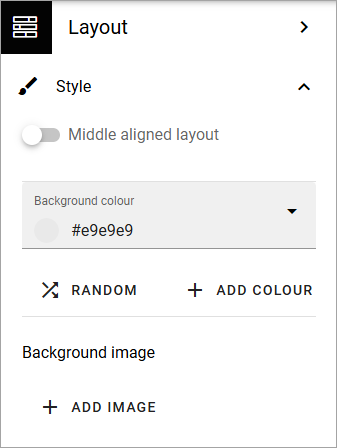
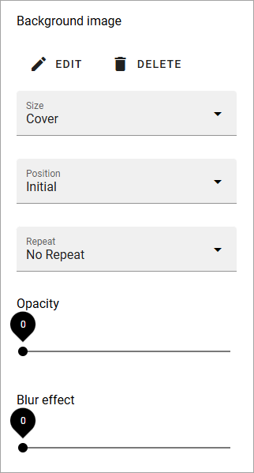

Page style
====================

Here you can use the following settings:

+ **Middle aligned layout**: For a lyout that's aligned at the center of the page, select this option.
+ **Background color**: Here you can choose a background color for the whole page.
+ **RANDOM**: If you want to try a random background color, click here. (You can click the x in the field above to remove it, if it didn't work.)
+ **ADD COLOR**: If you want to add an additional background color for various effects, click here. An additional color field is placed above where you can select color.
+ **Background image**: To add a background image to the page, click ADD IMAGE and use the media picker to choose an image. See this page for more information:  :doc:`The media picker </general-assets/media-picker/index>`

Settings for background image
**********************************
When you have added a background image, you can use these settings:

+ **EDIT**: Click this link to edit the image in the Media Picker (see link above for more information.)
+ **DELETE**: Click here to remove the image from the page.
+ **Size**: Set the size here; Auto, Cover or Custom. When you select Custom you can set a custom size in pixels. When you select Cover, the whole page is covered by the image. This may cause some parts of the image to not be shown, depending on the width/height of the image. 
+ **Position**: Set the position of the image here. The result can be that different parts of the image is shown depending on what you selected for Size.
+ **Repeat**: If you did set a custom size for the image you can select if the image should be repeated. (You can set it for Auto and Cover as well, but ususally with no effect.)
+ **Opacity**: You can set the opacity of the background image, using this slider.
+ **Blur effect**: To blur the background image, use this slider.
