Media picker
===================

The Media picker can be used to add an image or a video to a block, or to the page content through the RTF editor. Any image on the editor's computer can be selected, as well as from any central image location registered in Omnia admin. An image can be pasted from the clipboard as well. Besides that, additional providers can be set in Omnia admin.

When the Media picker starts, something like the following is shown:

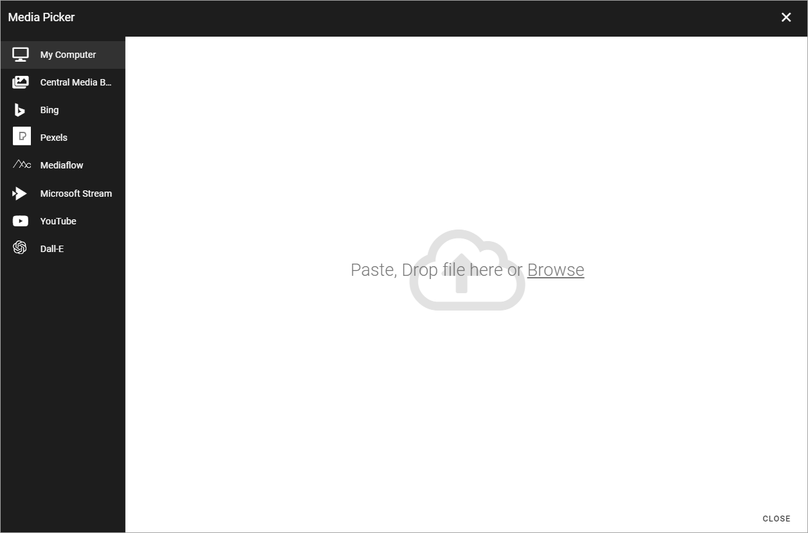

My computer
*************
Select "My computer" to either paste an image from the clipboard or to browse for an image (see image above.)

Central media bank
*****************************************
When you select a central media bank, the images there will be shown, for example:

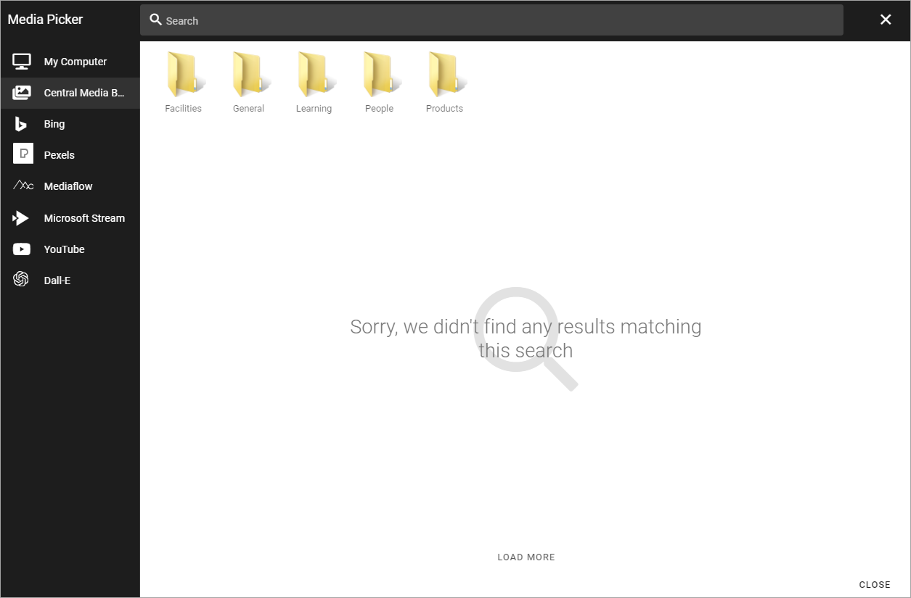

Note the search field at the top.

To select an image, open the folder if needed, click it and the settings will be shown. Settings are the same for all images, see below.

Settings of image banks are made for each business profile. For more information see: :doc:`Central Image Location </admin-settings/business-group-settings/settings/central-image-location/index>`

Note that videos can be handled in SharePoint media libraries as well, and some Microsoft video editing options.

Bing
*******
For Bing to be available, the feature "Bing" must be active. When selecting Bing you can search for any Bing image, or use the predefined search categories, if any is set up. Bing search categories can be set up by an administrator in Omnia admin.

.. image:: media-picker-bing-search-v7.png

+ **Search**: Free text search is available in this field. You must always type a search string here, before using any filters.
+ **Size**: If you just want to find images of a certain size, select size in this field: Small, Medium, Large or Wallpaper.
+ **Aspect**: If you just want to find images with a certain aspect, select aspect in this field: Square, Wide or Tall.
+ **Type**: If you just want to find images of a certain type - as defined by Bing, select type in this field: Clipart, Line or Photo.

To select an image, click it and the settings will be shown. Settings are the same for all images, see below.

**Important note!** Omnia applies a filter to the Bing search automatically so only images that are free to use can be found through the Image picker.

Mediaflow
************
This option requires a subscription to the Mediaflow service. Please find more information here: https://www.mediaflow.com/.

For Mediaflow (Pro) to be available, the prerequisites in Omnia are:

1. The feature "Mediaflow" must be active.
2. Client Id, Client secret and Refresch token must be added under "Permissions" - "Secrets" - "MediaFlow" for a business profile. (These settings are provided by MediaFlow).
3. The specific settings for MediaFlow may need to be edited. See this link (Link to be added).

When Mediaflow has been set up, you can search or browse available content:

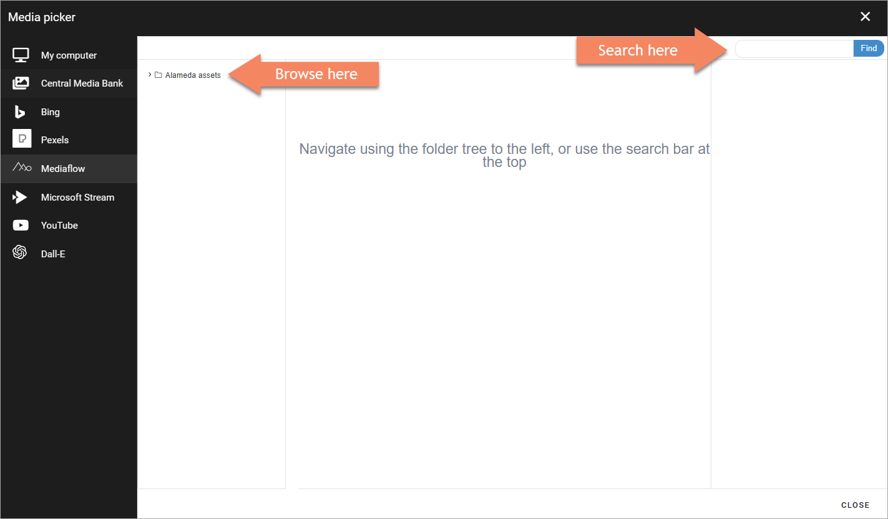

To select an image, click it and select "Use this file". Also note the information shown, for example file size.

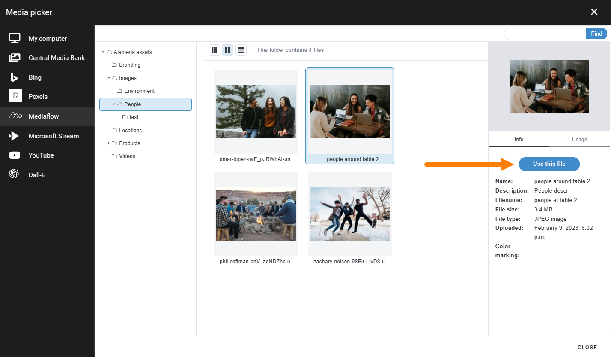

When you have done that, Omnia's settings are shown, as described below.

Pexels or other provider
**************************
For Pexels to be available the feature "Pexels" must be active. Available search- or filtering fields depend on what the provider offer. For Pexels only a search field is available:

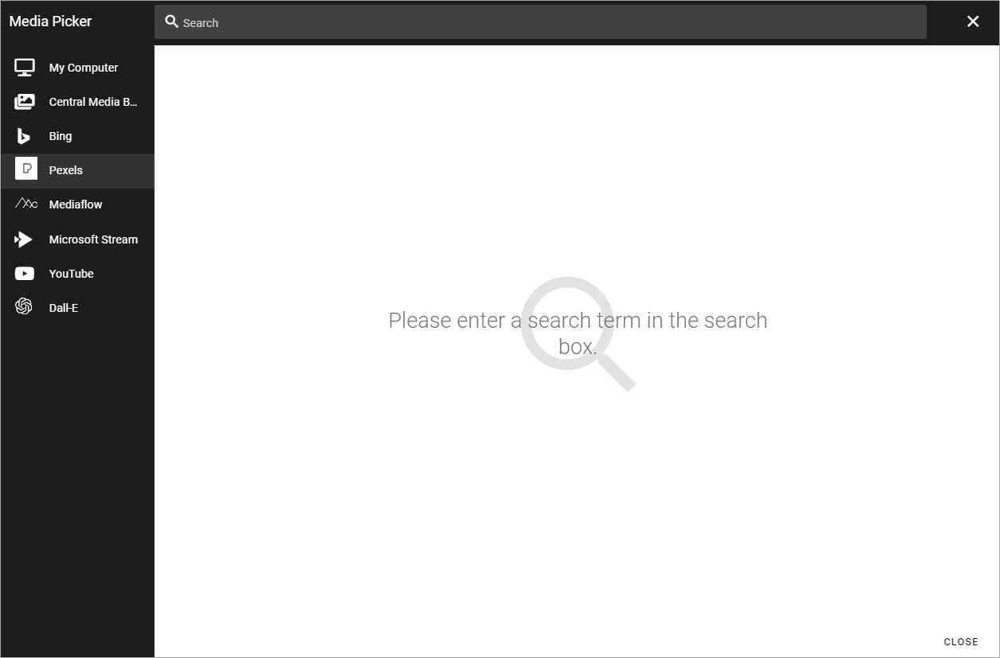

To select an image, click it and the settings will be shown. Settings are the same for all images, see below.

**Important note!** All images from Pexels are always free to use, and edit.

**A note about MediaFlow**: This feature requires a subscription to the Mediaflow service. Please find more information here: https://www.mediaflow.com/.

Using Dall-E to create images
******************************
If Dall-E is available, it can be used to create images in the Media picker. Here's how to use it:

1. Click Dall-E.

.. image:: image-picke-dall-e.png

2. Type a description of the image and click the button to the right:

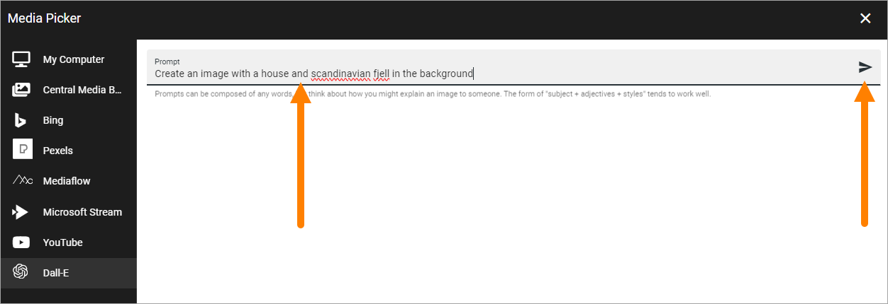

3. Click the image to add it to the media block or text block where you started.

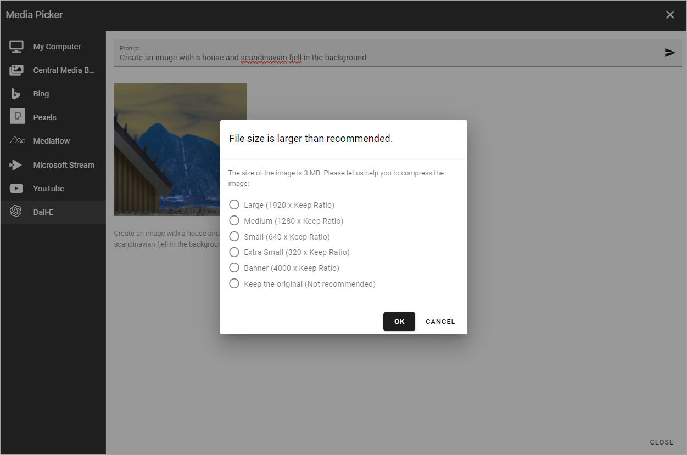

Now you can choose size and edit the image the normal way, see below.

As an alternative, you can point at the image and select to download it (left icon) or scrap it and try another instruction (right icon).

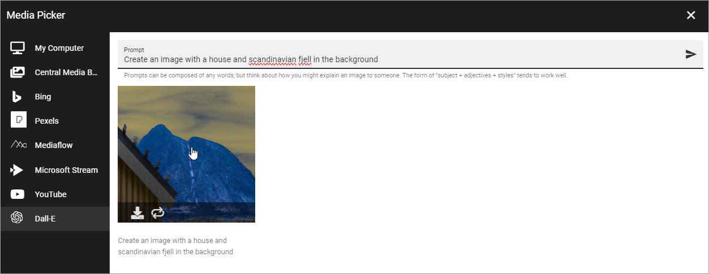

File size larger than recommended
****************************************
If you select an image that is too big, a warning is shown and you can decide what to do. What is considered "too big" in your organization is set up in Omnia admin, together with available options.

The message can look like this:

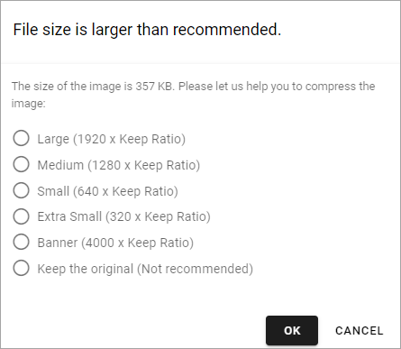

A desciption of the settings that can be made for the Media picker is found here: :doc:`Media picker settings </admin-settings/tenant-settings/settings/media-picker/index>`

**Note!** In the Media block a default scaling can be set. If it is, no dialog for a big image is shown. Instead, all images added will be scaled to the default scaling automatically.

Settings for an image
***********************
When an image has been selected, the following settings can be made:

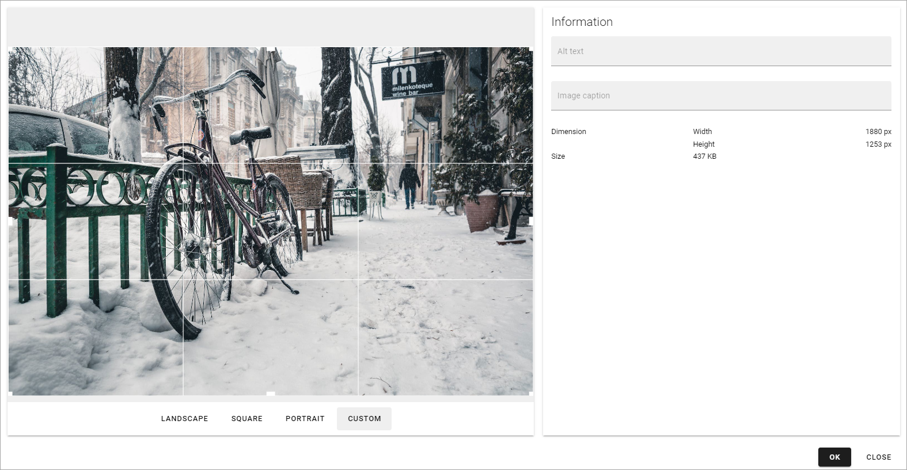

To edit, point at the image and the following tools becomes available:

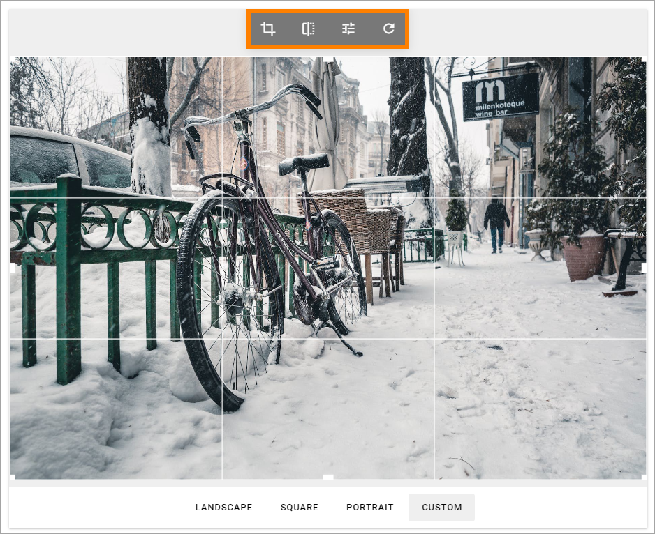

Point at an icon in the toolbar and you'll see what it's for, from left to right: Crop, Flip, Filter and Reset.

Don't forget to save your changes by clicking OK.

Crop an image
-------------------
Select the crop tool and use the settings this way:

+ **Landscape**, **Square** and **Portrait**: Click the preview and use the selection on the image to decide wich part of the image to show when it's used in landscape, square or portrait format.
+ **Custom**: Set a custom shape using the eight squares as handles. Just draw to the desired shape. When a custom image is used in a page image area the full width of the area is used and the height of the area is adapted.

Flip an image
---------------
When you have select "Flip" in the toolbar, you can choose "Flip X" to flip sidewise, "Flip Y" to flip horisontrally and you reset using the icon to the right.

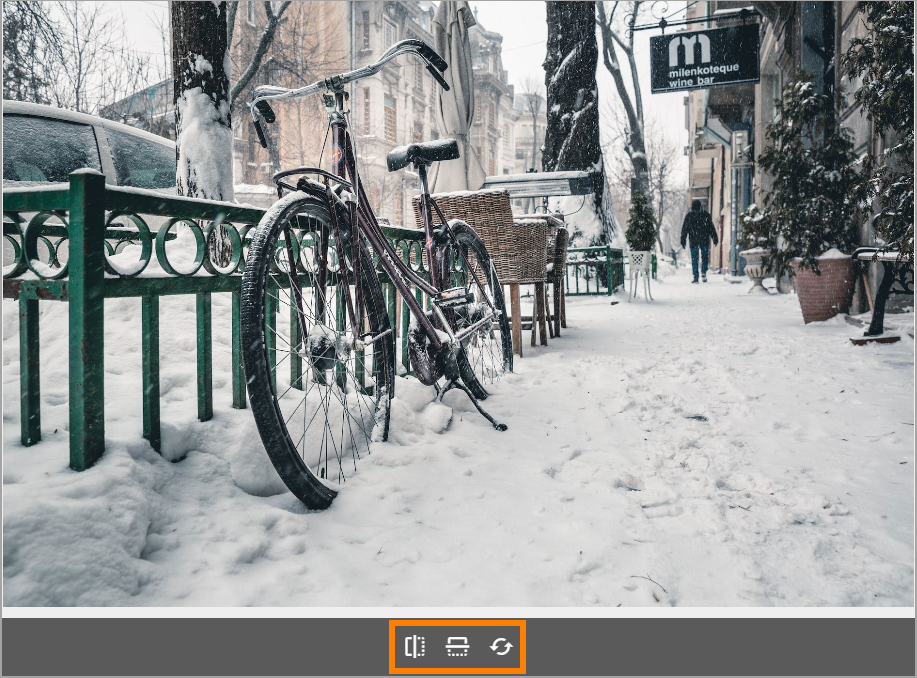

Apply a filter on an image
---------------------------
When you have selected "Filter" in the toolbar, the following is available:

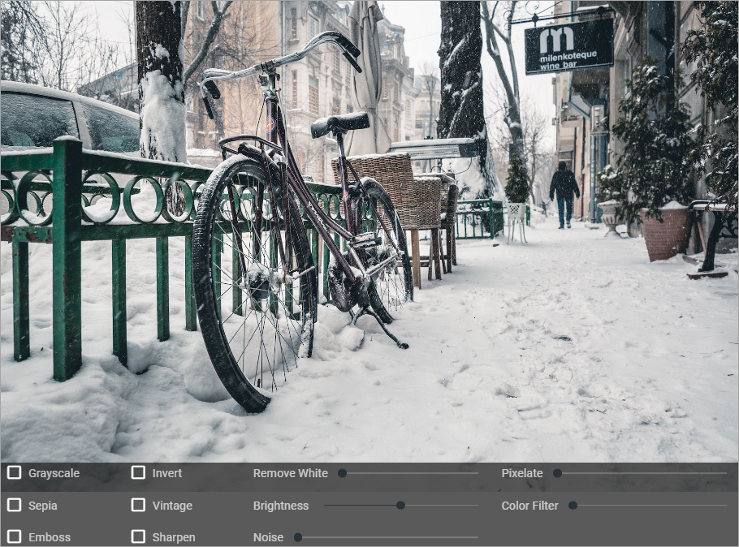

When you try out any of the filters you'll see a preview of the image.

To go back to the original image, you can always click "Reset" in the toolbar.

Information
------------
To the right in the Media picker, you can add an alt text and a caption for the image. Some information about the image is also shown.

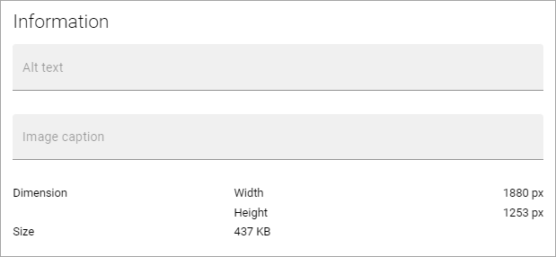

Videos
*******
To add a video, select one of the providers that are set up, for example your company's Microsoft 365 Stream, or YouTube.

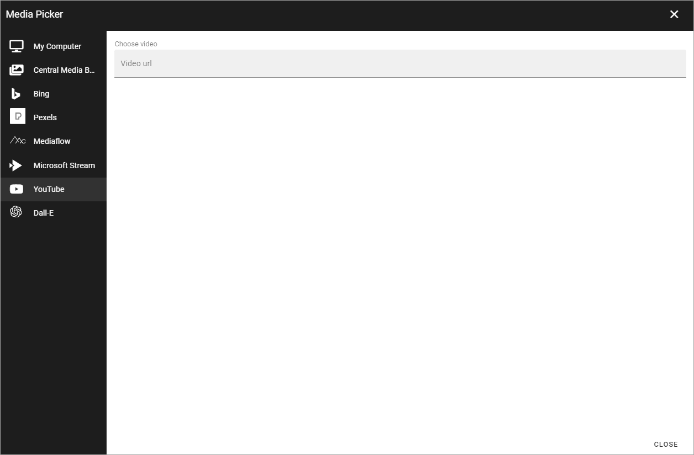

Here's how to add a video:

1. Go to the video.
2. Copy the URL for the video.
3. Paste the URL here.

Now the following settings are available:

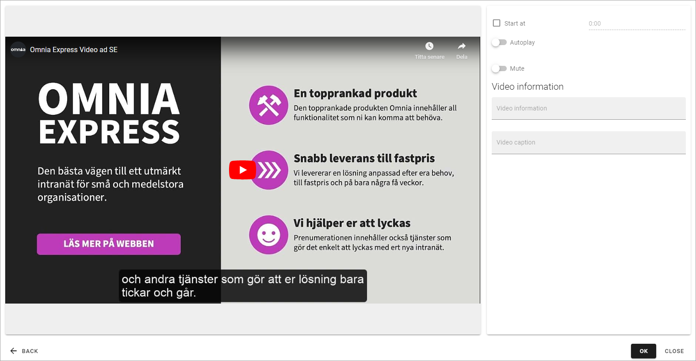

+ **Start at**: If the video should not start at the beginning, set when it should start. Use the format minutes:seconds.
+ **Autoplay**: If the video should start automatically when a user opens the page, select this option.
+ **Mute**: To play the video without sound, select this option.
+ **Video information**: You can add an alt text for the video and a caption here. Note that not all types of videos can display an alt text.

**Note!** For videos that are stored in SharePoint libraries, the settings for those videos are handled in the SharePoint library.

