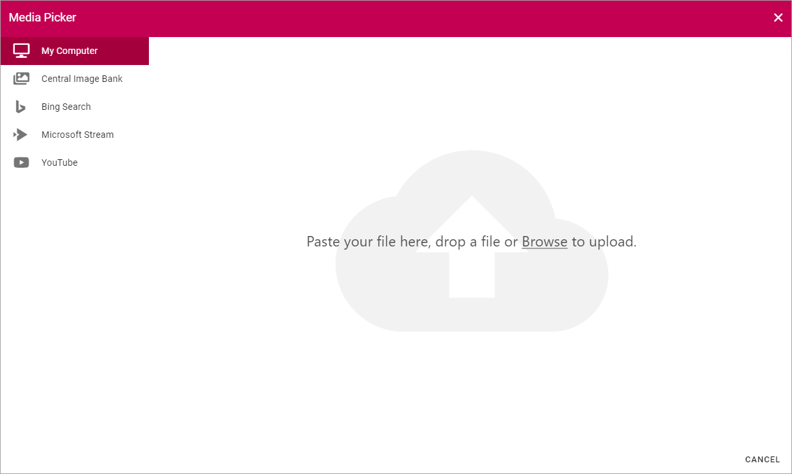
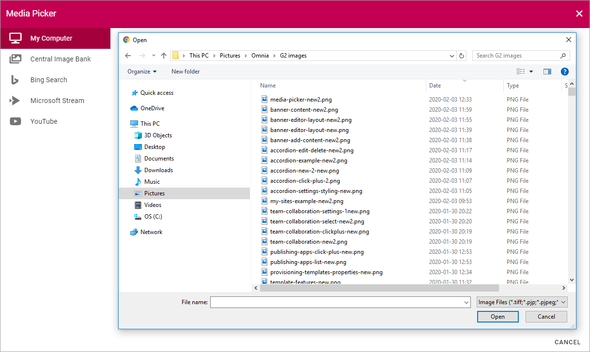
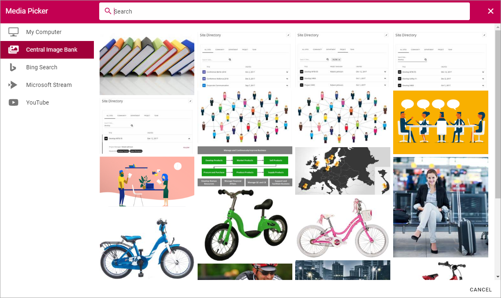
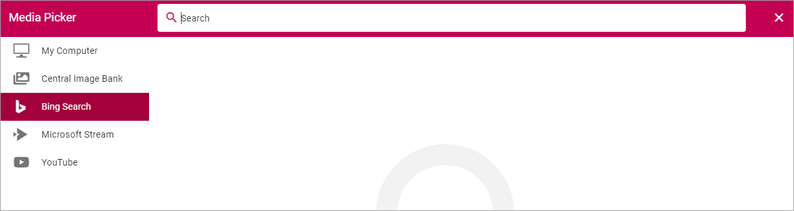
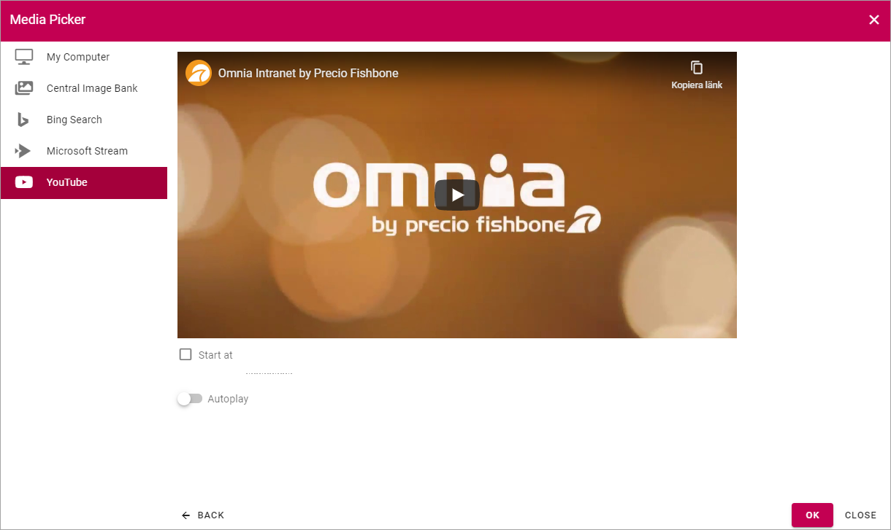
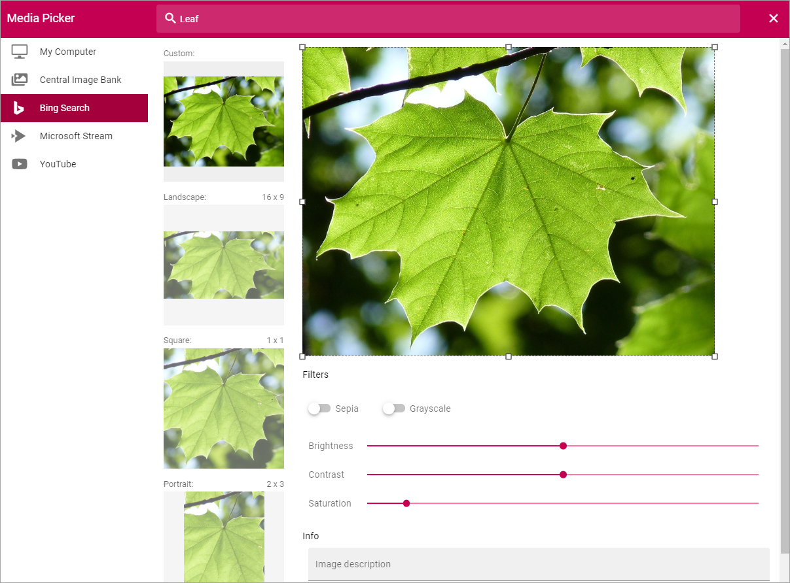

Media Picker
===========================================

The Media Picker can be used to add an image or a video to a block or to the page content. Any image on the editor's computer can be selected, as well as from any central image location registered in Omnia Admin. An image can be pasted from the clipboard as well. Besides that, additional providers can be set in Omnia Admin, for example Bing. Regarding Bing, only images that are free to use and share will be available.

When the Media picker starts, something like the following is shown:

My Computer
*************
Select "My Computer" to either paste an image from the clipboard or to browse for an image. 

Central Image Bank
********************
When select a Central Image Bank, the images there will be shown, for example:

Note the Search field at the top.

To select an image, double click or select the image and click "SELECT".

Bing Search
***************
When selecting "Bing Search" (if available) you can search for any Bing image, or use the predefined search categories, if any is set up. Bing search categories can be set up by an administrator in Omnia Admin.

When a bing search has been conducted, something like the following is shown:

.. image:: media-picker-bing-after-search-new.png

+ **Search**: Use this field to conduct a new search.
+ **Size**: Use this field the filter the search result on size; Small, Medium, Large, Wall paper, All.
+ **Aspect**: Here you can filter on the image format; Square, Wide, Tall, All.
+ **Type**: Use this to filter on image type; Clipart, Line, Photo, All.

To select an image, double click or select the image and click "SELECT".

Videos
*******
To add a video, select one of the providers that are set up, for example "Microsoft Stream" for your company's Microsoft 365 Stream, or "YouTube".

.. image:: media-picker-video-new.png

Here's how to add a video:

1. Go to the video.
2. Copy the Url for the video.
3. Paste the Url here.

Now the following settings are available:

+ **Start at**: If the video should not start at the beginning, set when it should start. Use the format minutes:seconds.
+ **Autoplay**: If the video should start automatically when a user opens the page, select this option.

Settings for an image
***********************
When an image has been selected, the following settings can be made:

+ **Custom**: Set a custom shape using the eight squares as handles. Just draw to the desired shape. When a custom image is used in a page image area the full width of the area is used and the height of the area is adapted.
+ **Landscape**, **Square** and "Portrair**: Click the preview and use the selection on the image to decide wich part of the image to show when it's used in landscape, square or portrait format.
+ **Filters**: Use the filters to adjust the image; Sepia coloring, Grayscale coloring, Brightness, Contrast and Saturation.
+ **Info**: You can add an Alt Text for the image in this field. 

Don't forget to save your changes when you're done.

Images that are too big
************************
If a user uploads an image that is too big, a warning is shown and the user can select to make the image "Web safe", that is downsized to the the maximum size for images set, or keep the original size.

.. image:: media-picker-make-web-safe.png

The setting for maximum image size is set in Omnia Admin.

