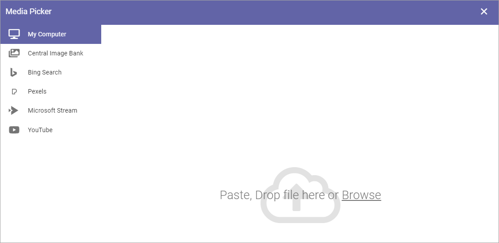
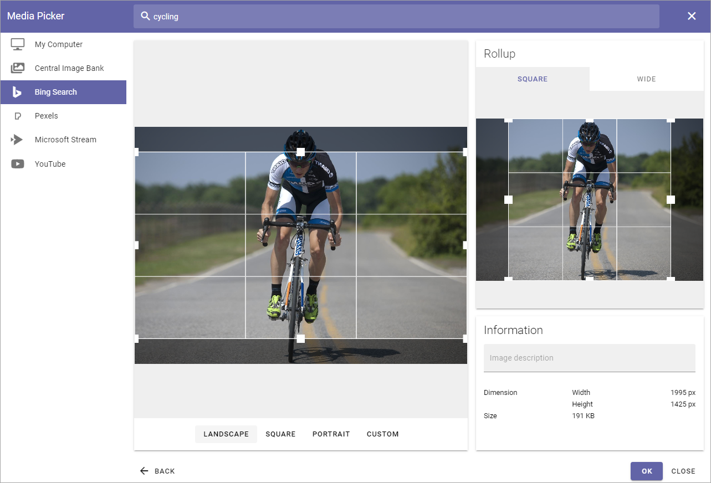
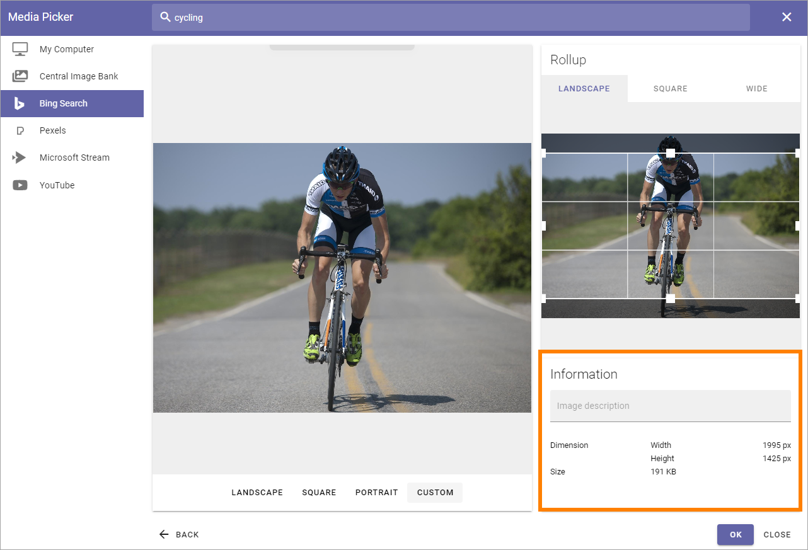
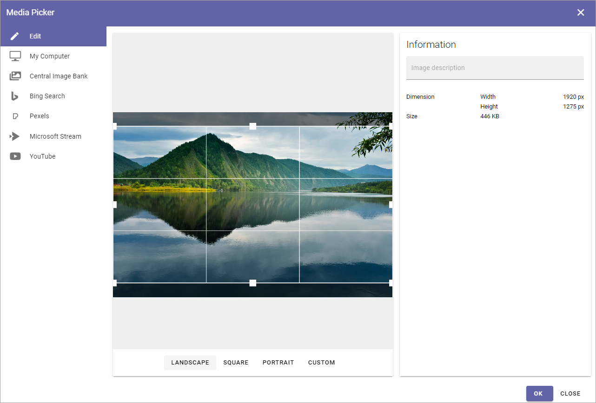
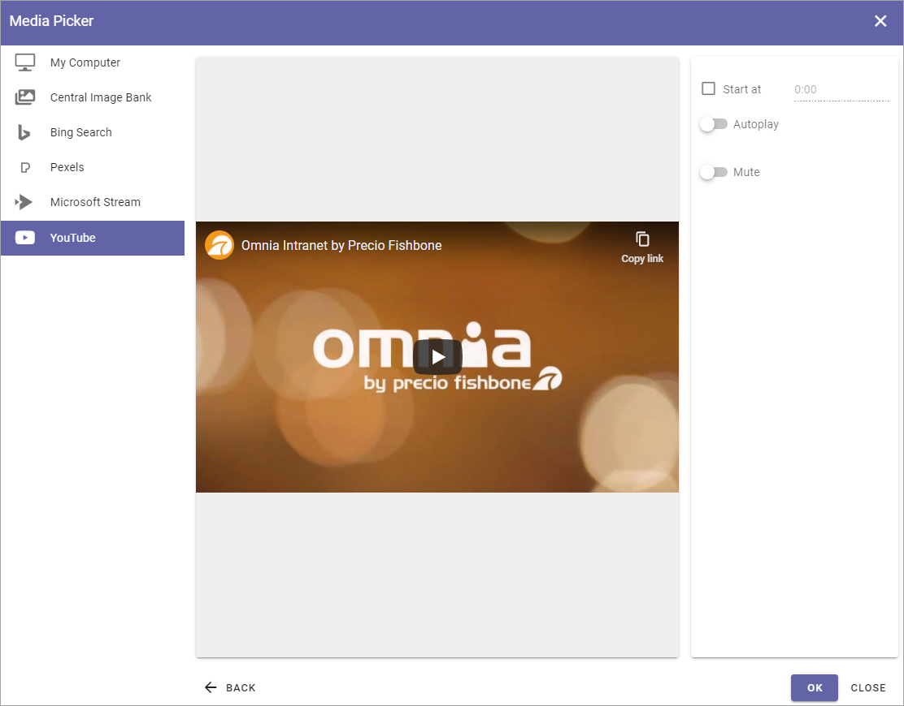

Media Picker
===================

The Media Picker can be used to add an image or a video to a block or to the page content. Any image on the editor's computer can be selected, as well as from any central image location registered in Omnia Admin. An image can be pasted from the clipboard as well. Besides that, additional providers can be set in Omnia Admin.

When the Media picker starts, something like the following is shown:

This is an example of how Media Picker will look when you're adding a new image. When editing an image, it looks slightly different, see below.

My Computer
*************
Select "My Computer" to either paste an image from the clipboard or to browse for an image. (see image above.)

Central Image Bank/Central Media Bank
*****************************************
When you select a Central Image Bank, the images there will be shown, for example:

.. image:: media-picker-central-image-bank-v6.png

Note the Search field at the top.

To select an image, click it and the settings will be shown. Settings are the same for all images, see below.

Settings of image banks are made for each Business Profile. For more information see: :doc:`Central Image Location </admin-settings/business-group-settings/settings/central-image-location/index>`

In Omnia 6.12 and later, videos can be handled in Sharepoint media libraries and some video editing options, similar to those in Stream, has been added by Microsoft. In Omnia 6.12, this option has therefore been renamed **Central Media Bank**. Video editing has to be made in the Sharepoint library, not in the Media Picker.

Bing Search
***************
When selecting "Bing Search" (if available) you can search for any Bing image, or use the predefined search categories, if any is set up. Bing search categories can be set up by an administrator in Omnia Admin.

.. image:: media-picker-bing-search-v6.png

+ **Search**: Free text search is available in this field. You must always type a search string here, before using any filters.
+ **Size**: If you just want to find images of a certain size, select size in this field: Small, Medium, Large or Wallpaper.
+ **Aspect**: If you just want to find images with a certain aspect, select aspect in this field: Square, Wide or Tall.
+ **Type**: If you just want to find images of a certain type - as defined by Bing, select type in this field: Clipart, Line or Photo.

To select an image, click it and the settings will be shown. Settings are the same for all images, see below.

**Important Note!** Omnia applies a filter to the Bing search automatically so only images that are free to use can be found through the Image Picker.

Pexels or other provider
**************************
Available search- or filtering fields depend on what the provider offer. For Pexels (if available), only a Search field is available:

.. image:: media-picker-pexel-search-v6.png

To select an image, click it and the settings will be shown. Settings are the same for all images, see below.

**Important Note!** All images from Pexels are always free to use, and edit.

Images that are too big
************************
If you select an image that is too big, a warning is shown and you can decide what to do. What is considered "too big" in your organization is set up in Omnia Admin, together with available choices.

The message can look like this:

.. image:: media-picker-too-big-v6.png

A desciption of the settings that can be made for Media Picker is found here: :doc:`Media Picker Settings </admin-settings/tenant-settings/settings/media-picker/index>`

**Note!** In the Media block a default scaling can be set. If it is, no dialog for a big image is shown. Instead, all images added will be scaled to the default scaling automatically.

Settings for an image
***********************
When an image has been selected, the following settings can be made:

To edit, point at the image and the following tools becomes available:

.. image:: media-picker-image-settings-v6-tollbar.png

Point at an icon in the toolbar and you'll see what it's for, from left to right: Crop, Flip, Filter and Reset.

Don't forget to save your changes by clicking "OK".

Crop an image
-------------------
Select the Crop tool and use the settings this way:

+ **Landscape**, **Square** and "Portrait**: Click the preview and use the selection on the image to decide wich part of the image to show when it's used in landscape, square or portrait format.
+ **Custom**: Set a custom shape using the eight squares as handles. Just draw to the desired shape. When a custom image is used in a page image area the full width of the area is used and the height of the area is adapted.

Flip an image
---------------
When you have select "Flip" in the toolbar, you can choose "Flip X" to flip sidewise, "Flip Y" to flip horisontrally and you reset using the icon to the right.

.. image:: media-picker-image-settings-v6-flip.png

Apply a filter on an image
---------------------------
When you have selected "Filter" in the toolbar, the following becomes available:

.. image:: media-picker-image-settings-v6-filter.png

When you try out any of the filters you'll see a preview of the image.

To go back to the original image, you can always click "Reset" in the toolbar.

Image in rollups
-------------------
In the right part of Media Picker you can edit which part of the image to display when (and if) it's used in different block rollups. You can set diferent parts for all three formats; Landscape, Square and Wide.

.. image:: media-picker-image-settings-v6-rollups-new.png

It works the same here as when you use Crop in the image toolbar.

Information
------------
In this part of Media Picker, you can add an Alt Text for the image and some information about the image is shown.

Edit a page image in Write mode
************************************
When editing a page image in write mode, the following is available in Media Picker:

Point at the image and use the toolbar for editing, as described above. Click "OK" to save the changes, or "CLOSE" to discard them.

Videos
*******
To add a video, select one of the providers that are set up, for example your company's Microsoft 365 Stream, or YouTube.

.. image:: media-picker-video-v6.png

Here's how to add a video:

1. Go to the video.
2. Copy the Url for the video.
3. Paste the Url here.

Now the following settings are available:

+ **Start at**: If the video should not start at the beginning, set when it should start. Use the format minutes:seconds.
+ **Autoplay**: If the video should start automatically when a user opens the page, select this option.
+ **Mute**: To play the video without sound, select this option.

