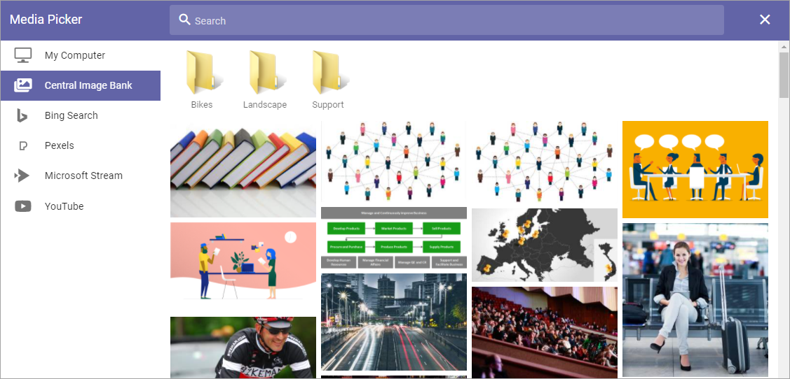
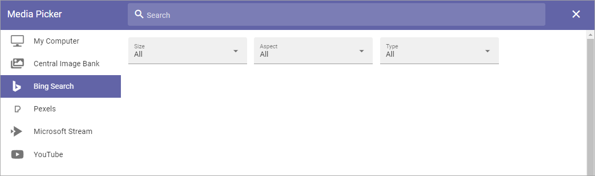
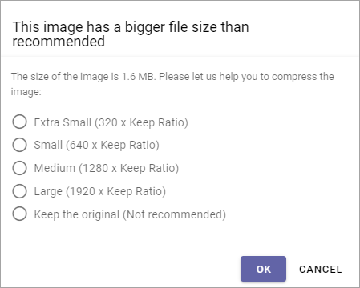

Media Picker (v6)
===================

**(This documentation is not yet finished, but will be very soon).**

This is how you can use the Media Picker in Omnia v6.

The Media Picker can be used to add an image or a video to a block or to the page content. Any image on the editor's computer can be selected, as well as from any central image location registered in Omnia Admin. An image can be pasted from the clipboard as well. Besides that, additional providers can be set in Omnia Admin.

When the Media picker starts, something like the following is shown:

.. image:: media-picker-v6.png

This is an example of how the Media Picker will look when you're addning a new image. When editing an image, it looks slightly different, see below.

My Computer
*************
Select "My Computer" to either paste an image from the clipboard or to browse for an image. (see image above.)

Central Image Bank
********************
When you select a Central Image Bank, the images there will be shown, for example:

Note the Search field at the top.

To select an image, click it and the settings will be shown. Settings are the same for all images, see below.

Settings of image banks are made for each Business Profile. For more information see: :doc:`Central Image Location </admin-settings/business-group-settings/settings/central-image-location/index>`

Bing Search
***************
When selecting "Bing Search" (if available) you can search for any Bing image, or use the predefined search categories, if any is set up. Bing search categories can be set up by an administrator in Omnia Admin.

+ **Search**: Free text search is available in this field. You must always type a search string in this field.
+ **Size**: If you just want to find images of a certain size, select size in this field: Small, Medium, Large or Wallpaper.
+ **Aspect**: If you just want to find images with a certain aspect, select aspect in this field: Square, Wide or Tall.
+ **Type**: If you just want to find images of a certain type - as defined by Bing, select type in this field: Clipart, Line or Photo.

To select an image, click it and the settings will be shown. Settings are the same for all images, see below.

Pexels or other provider
**************************
Available search- or filtering fields depend on what the provider offer. For Pexels (if available), only a Search field is available:

.. image:: media-picker-pexel-search-v6.png

To select an image, click it and the settings will be shown. Settings are the same for all images, see below.

Images that are too big
************************
If you select an image that is too big, a warning is shown and you can decide what to do. What is considered "too big" in your organization is set up in Omnia Admin, together with available choices.

The message can look like this:

A desciption of the settings that can be made for the Media Picker is found here: :doc:`Media Picker Settings </admin-settings/tenant-settings/settings/media-picker/index>`

