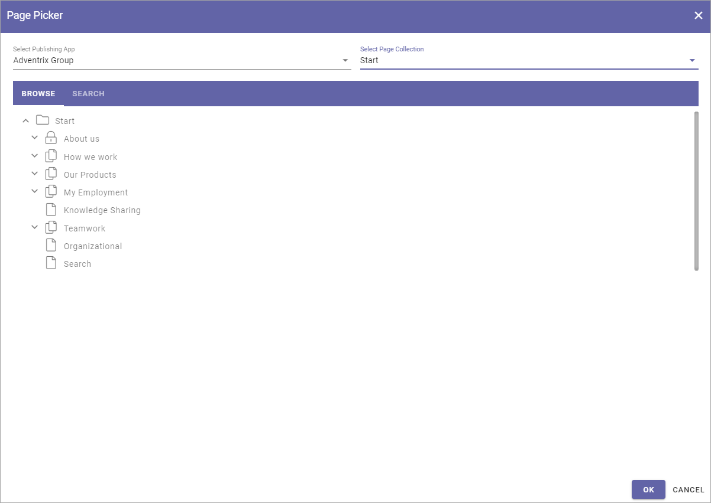
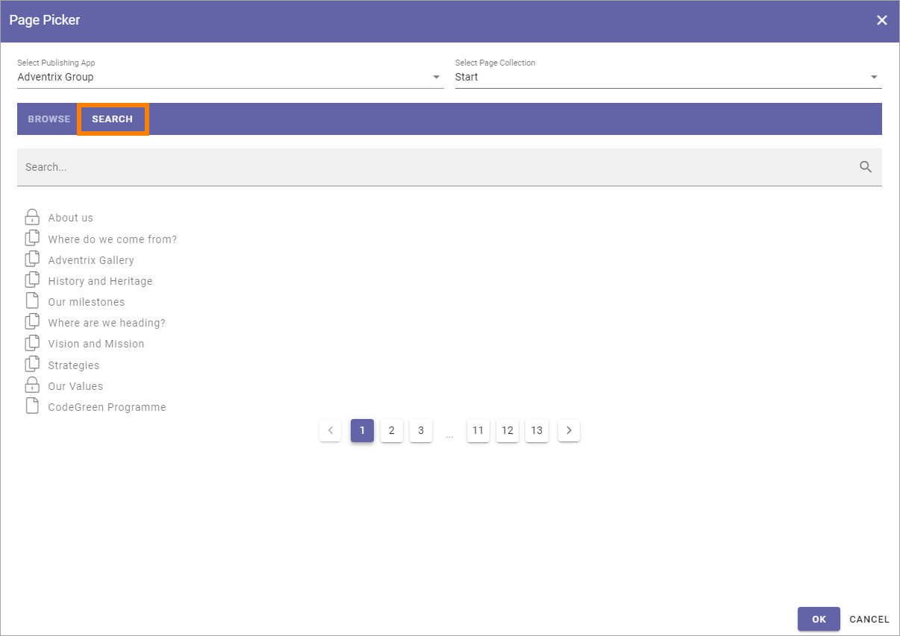

Page Picker
==============

You can use the Page Picker to select pages to show in a list. Only Published and shown pages are available to pick.

.. image:: page-picker.png

Use the Page Picker this way:

1. Select Publishing App to the left.
2. to the right - select Page Collection within the Publishing App.

You can now browse the list of pages in a view similar to the page navigation, for example:

3. Navigate the page structure to find the page you want to pick (you can pick one pr more).
4. Click to select a page (click again to deselect).
5. Click OK when you're done.

.. image:: page-picker-navigate-click-ok.png

I you picked pages through a block, the selected pages are now listed. Here's an example in the Page Rollup block:

.. image:: page-picker-navigate-selected.png

To remove a page from the list, click the dust bin.

Another way is to search for pages. 

1. Select the Publishing and the Page Collection.
2. Click the tab SEARCH.

A flat list of the pages in the Page Collection is shown, for example:

3. Use the search field to search for pages. 

You can search the pages titles. Here's an example with a search for "our":

.. image:: page-picker-search-example.png

As you can see, the search results contains all page titles starting with our, but also those where titel contains our somewhere, in this example Human res**our**ces and Traingin and C**our**ses.

4. Click to select a page (click again to deselect).
5. Click OK when you're done.

I you picked pages through a block, the selected pages are now listed the same way as shown above.

