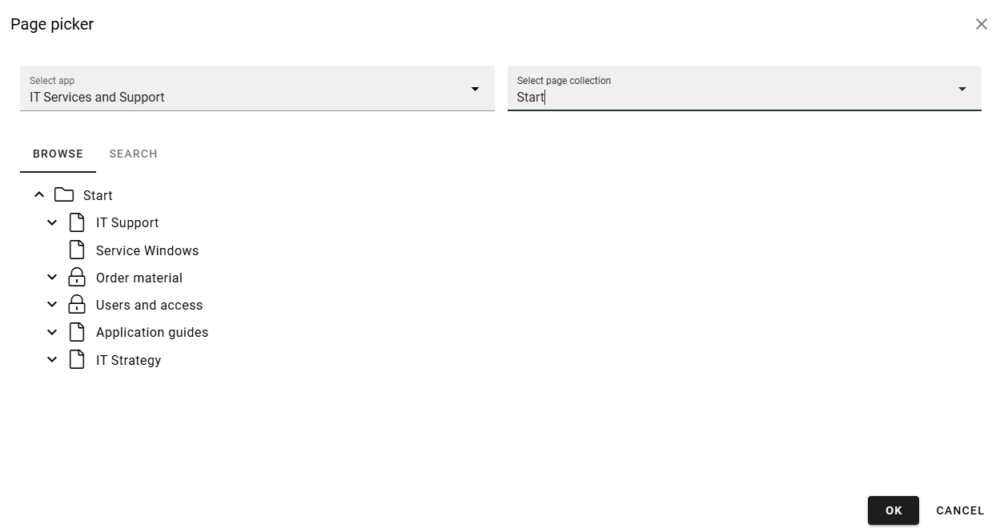
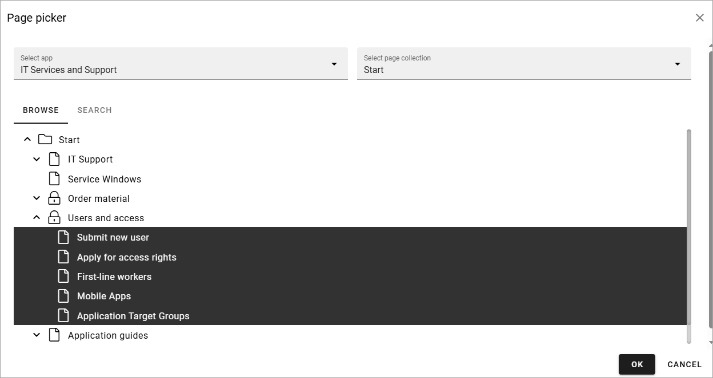
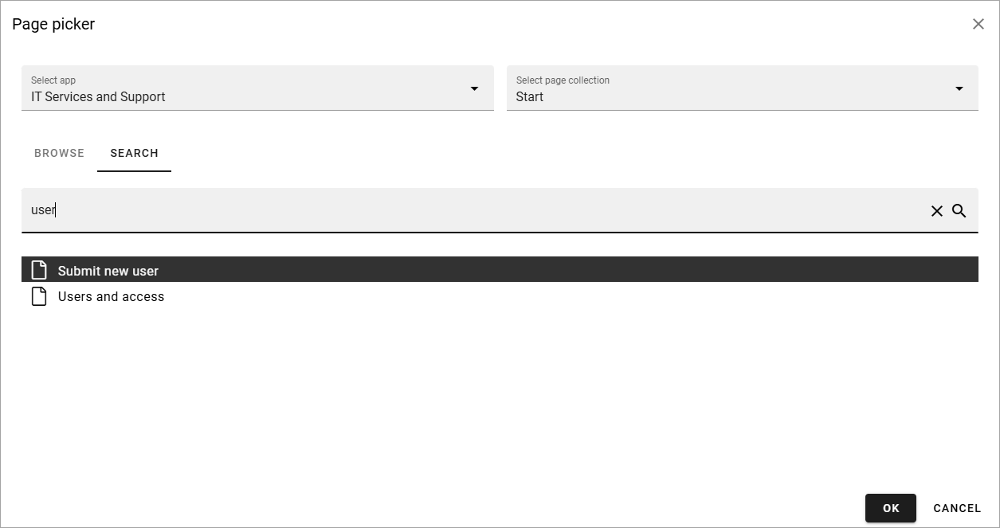

Page picker
==============

You can use the page picker to select pages to show in a list. Only published and shown pages are available to pick. Variations can be picked as well, if available.

Use the page picker this way:

Navigating and picking
**************************
1. Select publishing app to the left.
2. To the right - select page collection within the publishing app.

You can now browse the list of pages in a view similar to the page navigation, for example:

3. Navigate the page structure to find the page you want to pick (for a page rollup you can pick more than one).
4. Click to select a page (click again to deselect).
5. Click OK when you're done.

Here's an example when pages is picked for a page rollup:

To remove a page, click the dust bin.

Search for pages
*****************
Another way is to search for pages: 

1. Select the publishing app and the page collection.
2. Click the tab SEARCH.
3. Use the search field to search for pages.

You can search the pages titles. Here's an example with a search for "user". A flat list of the pages in the page collection is shown:

As you can see, the search result contains all page titles starting with "user", but also those where the title contains "user" somewhere.

4. Click to select a page (click again to deselect).
5. Click OK when you're done.

I you picked pages through a block, the selected pages are now listed the same way as shown above.

