Roles and permissions in Omnia
==================================

**Work on this page is ongoing, Will be finished soon.**

This page contains an overview of roles and permissions in Omnia.

Roles and permissions in Omnia admin
****************************************

Tenant Administrator
----------------------
A tenant administrator can: 

+ Edit all settings in Omnia admin.
+ Add colleagues to various permissions within the tenant.
+ Create business profiles and add business profile administrators.

These permissions can be set for the tenant:

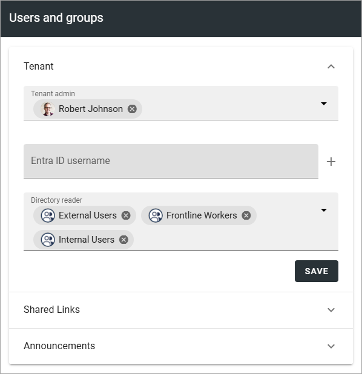

**Directory Reader**: Can view all user profiles in the user directory (read-only access). This includes permissions to use the identity picker for selecting users and to access aggregated user information in the people rollup using the Users scope.

**Shared links administrator for the tenant**: Can use all Shared links options for the tenant.

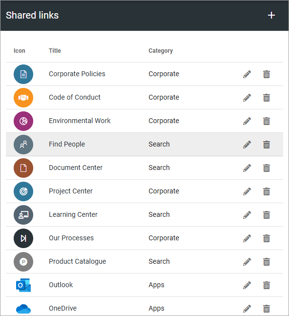

**Announcements administrator for the tenant**: Can use all announcements options for the tenant.

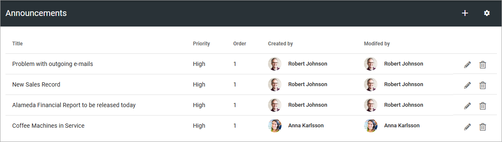

Business profile administrator
--------------------------------
A tenant administrator creates the business profiles needed, and adds at least one administrator for each business profile.

A business profile administrator can:
+ Edit all settings for the business profile, in Omnia admin.
+ Edit permissions for the business profile, including adding and removing business profile administrators.
+ Create publishing apps in the business profile.

These permissions can be set in the business profile:

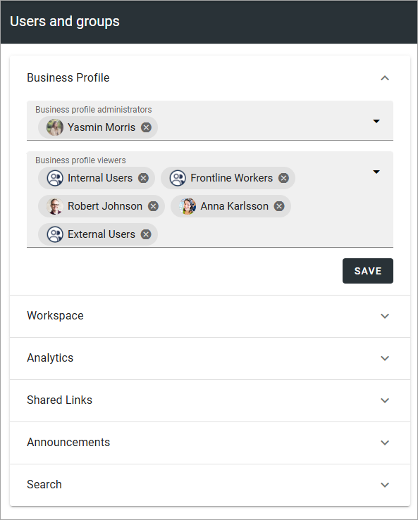

**Business profile viewers**: To be able to access a business profile and use the various user options, user’s must be added to the Business profile viewers list. 

**Workspace designer**: Can work with all workspace settings within the business profile.

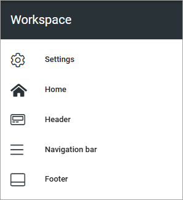

**Workspace contributor**: Users/groups that should be able to comment on business profile announcements and be able to send organization wide posts, must be added as workspace contributors.

**Workspace reader**: can use the workspace navigation within the business profile.

**Analytics readers**: All users that should have permission to see analytics data for the business profile must be added as “Analytics readers. That’s true for tenant administrators and business profile administrators as well. No administrator has automatic access to analytics. An analytics reader will also be added as a user within Matomo.

**Shared links administrator in a business profile**: Can use the options for Shared links within the business profile. 

**Announcements administrator in a business profile**: Can use the Announcements functionality within the business profile.

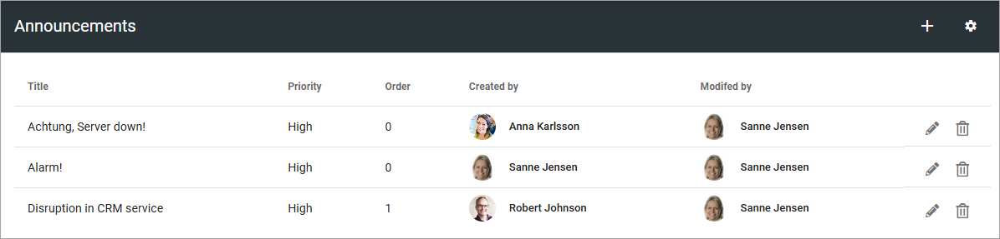

**Search administrator**: can edit all settings for search within the business profile. 

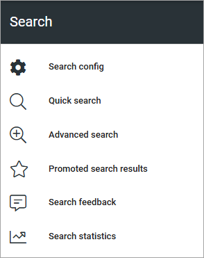

Roles and permissions in a Publishing app
******************************************

Publishing app administrator
------------------------------
A business profile administrator creates the publishing app and adds at least one publishing app administrator. 

A publishing app administrator can:

+ Edit all settings for the app.
+ Create page collections within the publishing app.
+ Edit permissions for a page collection within the app.
+ Create and edit local page types, meaning page types that exists in a page collection in the app only (not tenant page types).
+ Delete a comment in the app (in the Page likes and comments block).
+ Create a form using an action button.
+ Act as a page collection administrator when needed.

The publishing app settings are available here:

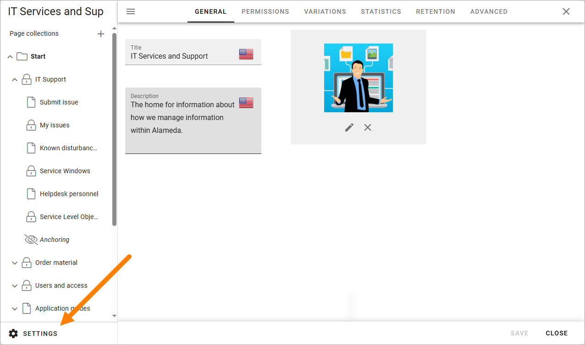

**Publishing app contributor**: Contributor permissions is needed for colleagues that should be able to add comments to publishing pages. This permission can be set when editing app permissions:

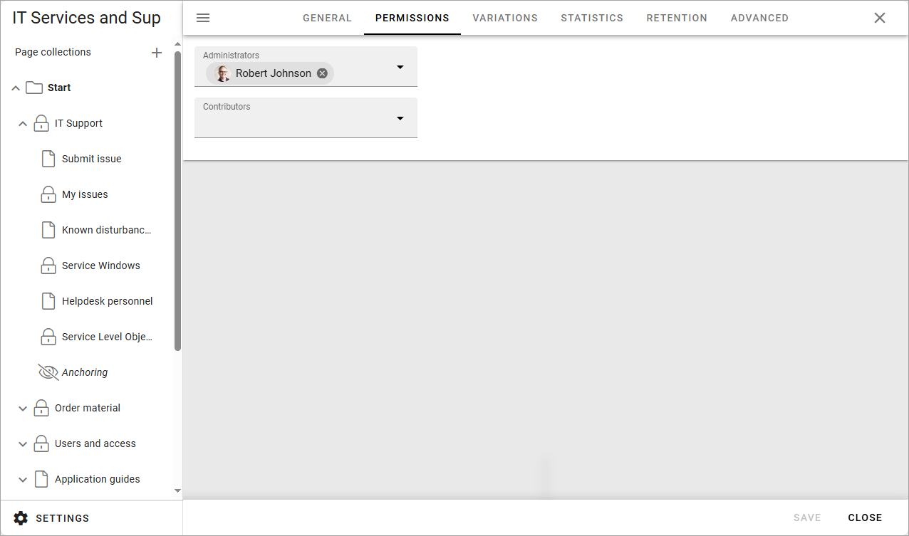

Roles and permissions in a Page Collection
*********************************************

Page collection administrator
-----------------------------------
Page collection administrators can be added to a page collection by the app administrator. A page collection administrator can:

+ Edit all page collection settings.
+ Edit permissions for the page collection: Administrator, Editor, Author and Reader permissions.
+ Edit the root page of the page collection (a page editor or author can not do that).

The page collection settings are available when the top node in eth pafe collection is selected:

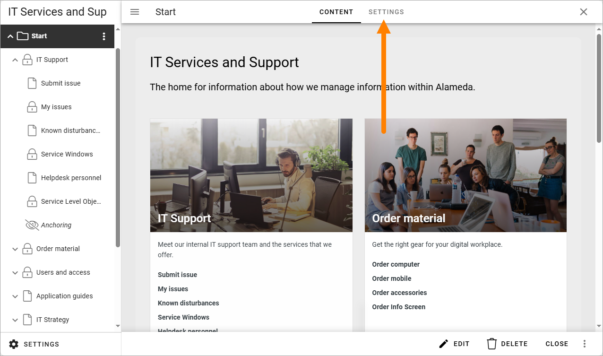

The permissions settings are available at the top node of the page collection:

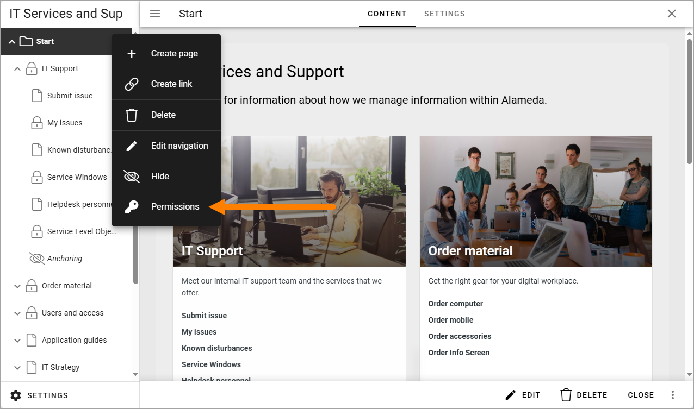

And these permissions can be set her:

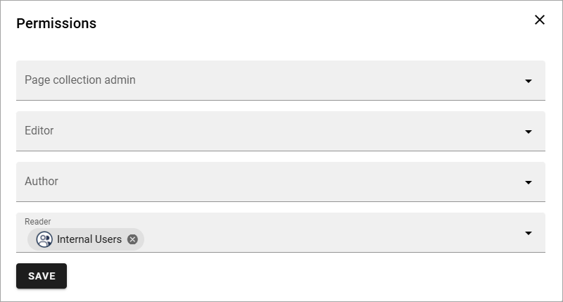

**Page collection editor**: can create, delete and restore pages in the page collection and use Design mode to work with sections and blocks on pages. A page collection editor can also use Write mode (meaning, can do all an author can do, as well).

**Page collection author**: can edit contents on pages in the page collection, using Write mode.

**Page collection reader**: All colleagues that should be able to read information in a page collection must have the permission “Page collection reader”. 

