Editing text with the RTF Editor
=====================================

When editing text in Omnia, a RTF editor can be available. What is available in the editor is set up in Omnia Admin, and in a few cases in the block itself.

**Note!** Options available in the RTF Editor can differ a lot, depending on how it's set up. Not all options described below may be available.

For more information about the settings, see: :doc:`RTF Editor Settings </admin-settings/tenant-settings/settings/rtf-editor/index>`

Using the RTF Editor
**********************
Here's all of the options that may be available in the editor, as of Omnia 7.1:

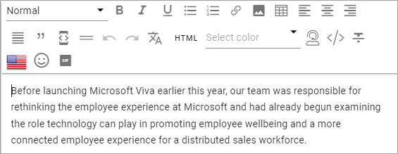

There are two lists and a number of icons available. You use the flag to note the language for the text you're entering. 

You point at an icon for a tool tip. Here's an example:

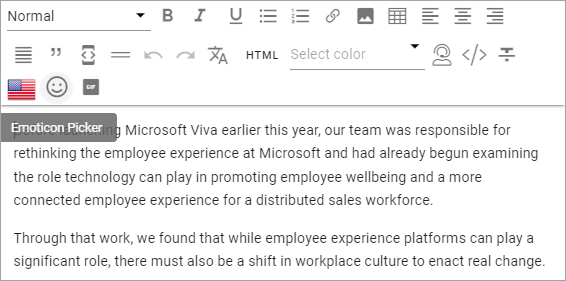

Some options are also available as a floating toolbar, when text is selected, for example Add Link, Keep Text Only and OpenAI (if available):

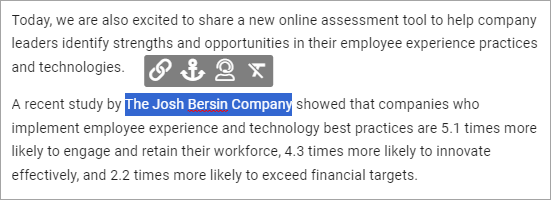

Se below for more information.

Add style
---------------
A number of styles can be available. To add a style, do the following:

1. Select the text.
2. Open the Styles list and select style.

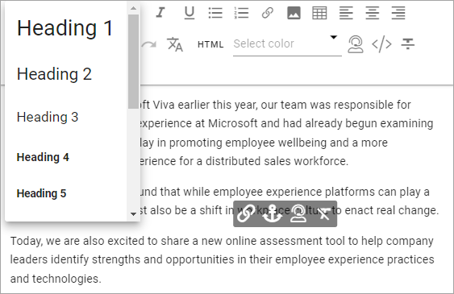

This example only shows headings, but there are other styles available below. Any style can be added to this list in Omnia Admin (see link above).

Add link
----------
To add a link, do the following.

1. Click where the link should be added, or select some text that should the clickable text for the link.
2. Click the icon in the toolbar at the top, or in the floating toolbar.

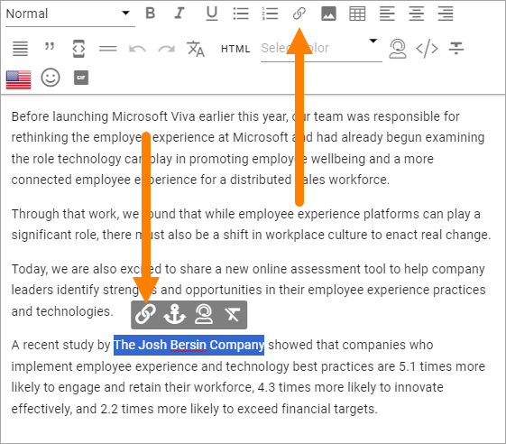

The Add Link general asset is shown. If you selected text, it's added to the Title field:

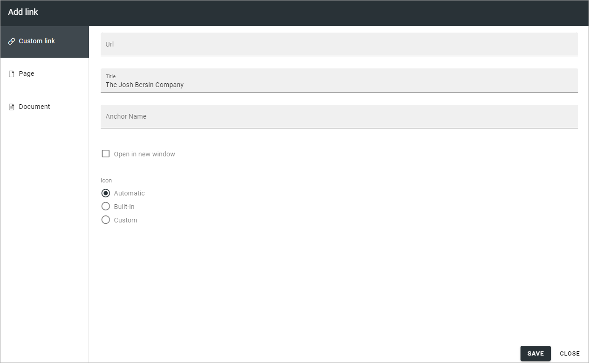

See this page for more information: :doc:`Add Link </general-assets/add-link/index>`

To edit or remove a link:

1. Select some of the clickable text for the link.
2. Use the icons in the floating toolbar.

Add link to an Enterprise term
-------------------------------
You may be able to add a link to an enterprise term, and by that use the Enterprise Glossary functionality.

Here's how to add such a link:

1. Type the text as usual and when you type something that match a term in the Enterprise Glossary, it's highlighted.

.. image:: rtf-editor-glossary-aware-highlight.png

2. To add a link to that term (you don't have to), click the term and the following is shown:

.. image:: rtf-editor-glossary-aware-highlight-icons-new.png

3. Click the left icon to create the link (the one to the left to remove it).

For more information about Glossary Terms, see: :doc:`Enterprise Glossary </admin-settings/tenant-settings/properties/enterprise-glossary/index>`

Add and edit Media
--------------------
You can add an image or a video to the text. This is how:

1. Click where the image or video should be added.
2. Click the Media icon.

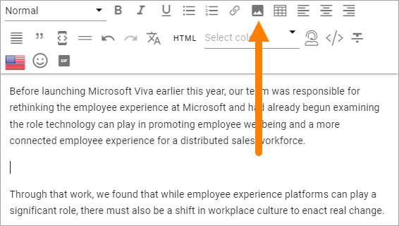

3. Use the Media Picker to add the image or video.

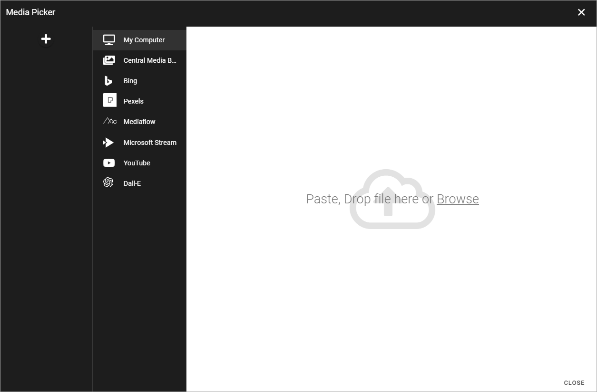

See this page for more information: :doc:`Media Picker </general-assets/media-picker/index>`

The image/video area fills up the whole width (same width as the text), the height/width ratio intact. Some tools also becomes available. Here's an example for a photo:

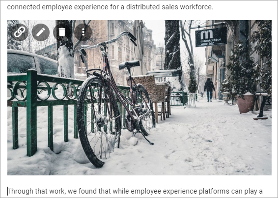

From left to right:

+ To create a clickable link on the image.
+ To edit the image in Media Picker.
+ To remove the image.
+ To set the width of the image.

For a video, it's not possible to create a clickable link. The other three tools are availble for a video as well.

To create a clickable link, click the link tool shown on the image and use the Add link general asset to add the link, see: :doc:`Add Link </general-assets/add-link/index>`

When you click the tool to set the image width, the the tool becomes two. Click this one to set the width:

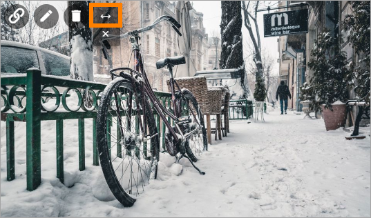

The following is shown:

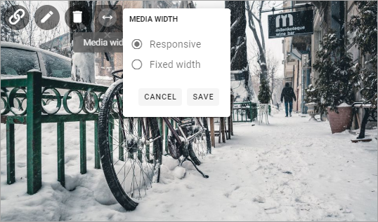

Responsive width is the default, meaning the image fills the whole width of the RTF area in the block, with the height/width ratio intact. (This works the same for a video).

You can also set an exact width in pixels by selecting "Fixed Width". 

Add an animated GIF
---------------------
It can be possible to add an animated GIF to the RTF Editor, if settings allow it, using this icon:

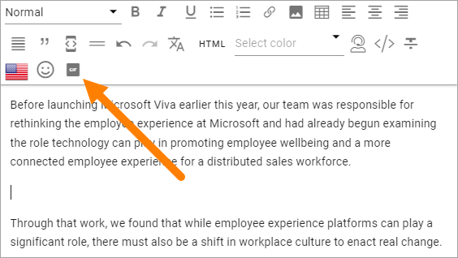

1. click where the animated GIF should be placed.
2. Click the icon.

Something like the following is now shown:

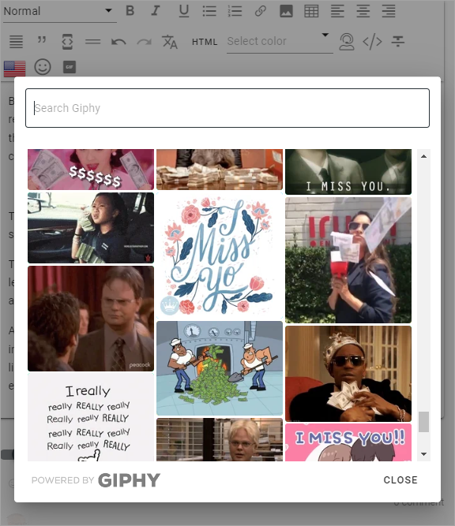

3. Use the search field or just browse to find an animated GIF.
4. Click the GIF to add it.
5. Click the GIF in the RTF Editor, for editing options.

To remove an animated GIF, click it and click the dust bin shown.

You can also add a clickable link to the GIF, using the normal Link toll, see above under the heading "Add and edit Media". 

Add an emoji
---------------------
It can be possible to add an emoji to the RTF Editor, if settings allow it, using this icon:

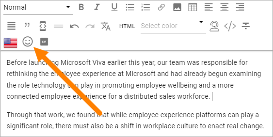

1. click where the emoji should be placed.
2. Click the icon.

Something like the following is now shown:

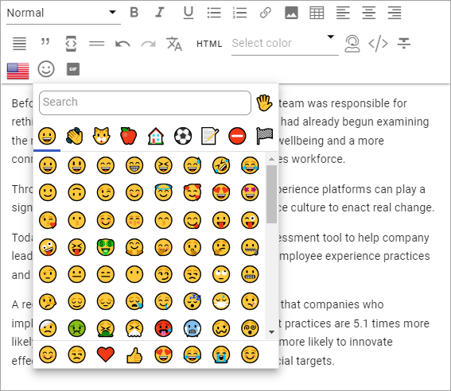

3. Use the search field or just browse to find the emoji you want.
4. Click the emoji to add it. (You can add more than one if you want to).
5. Click outside the emoji window to close it.

Add a table
------------
To add a table, do the following:

1. click where the table should be placed.
2. Click the Table icon.

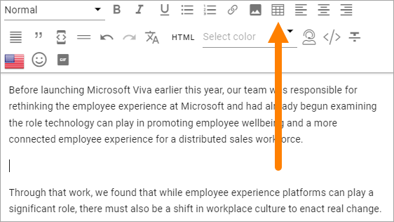

3. Click somewhere in the table for more options.

Something like the following now becomes available:

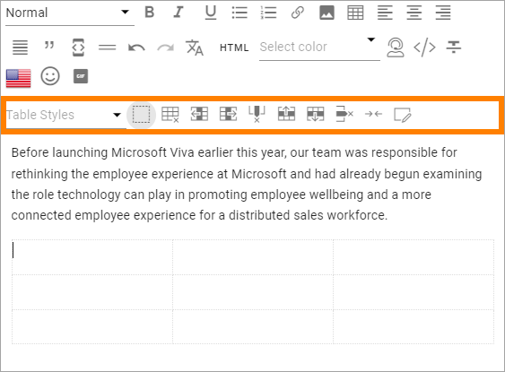

Most of these option you recognize from other applications, for example Microsoft Word.

In the Table Styles list, a number of styles are available:

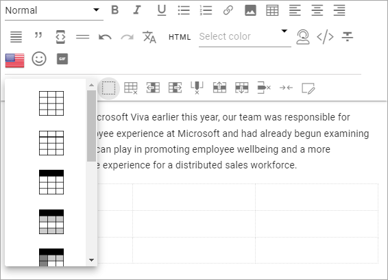

You can also style an individual cell using the icon to the far right.

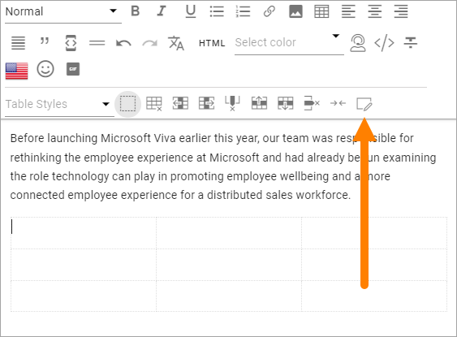

Pasting text only
-------------------
A well known problem when pasting text from other sources into an HTML environment is that styles and the like from the original text does not work - or is not wanted. To make that problem go away, you can paste the text as Text only.

All style tags are removed. Default HTML styles is kept.

1. Paste the text.
2. Click the Keep text only icon.

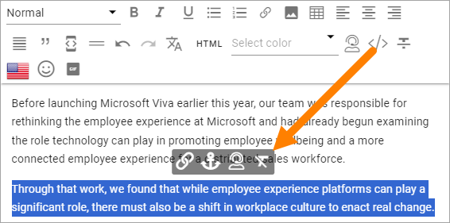

You can also use this option on text you already have in the block. Just select the text and the option becomes available.

Pasting contents from Microsoft Word
-------------------------------------
When pasting contents from a Microsoft Word document into a Rich Text field, some of the text formats can also be pasted. Headings are also regornized and the RTF Editor settings for these headings are applied. 

Note that bold, underscore and headings are considered default HTML styles and will be kept, with the RTF Editor settings, even when pasting text only is selected.

Images from the Word document are also pasted, if you select them. Note that this apply to Rich Text fields (blocks) only. It does not work for plain text.

Add an anchor (bookmark)
---------------------------
Anchors can be used in the Add Link general asset and when creating a link button using the Action button block. So, if you add an anchor (bookmark) to the text, links can be created to that anchor.

Here's how to add an anchor:

1. Type the text.
2. Select the text where the anchor should be placed.
3. Click the anchor icon.

.. image:: anchor-icon-v7.png

4. Add an anchor name and save.

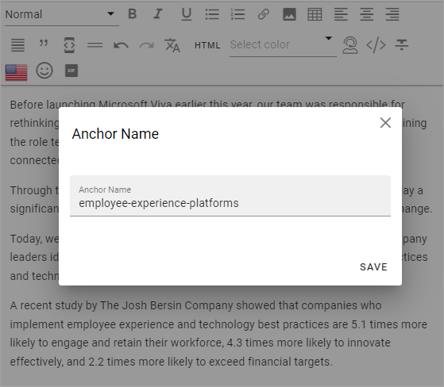

For more information about Add link, see: :doc:`Add link </general-assets/add-link/index>`

For more information about the Action button block, see: :doc:`Action button </blocks/button-link/index>`

Using Machine Translation
---------------------------
If the option is available you can machine translate the text in a block, this way:

1. Click the icon.

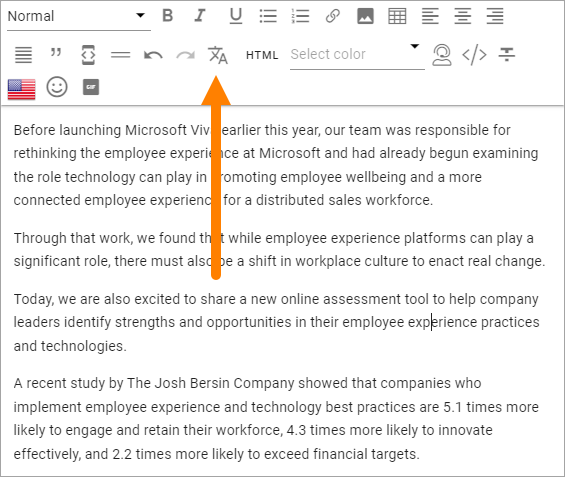

2. Select the language to translate to.

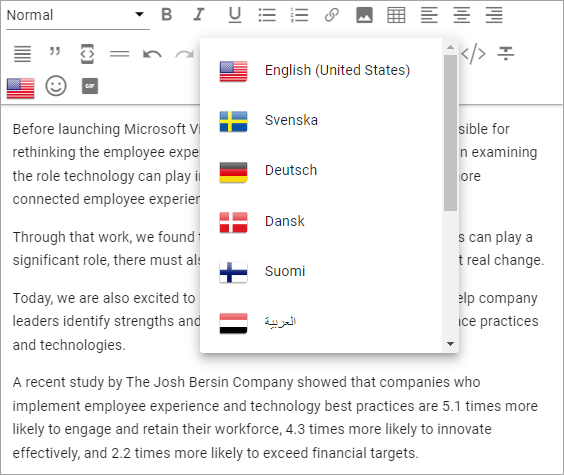

Any language can be selected here. The languages set up in Omnia Admin are shown at the top of the list. To select another language, select "Show all Languages" at the bottom of the list.

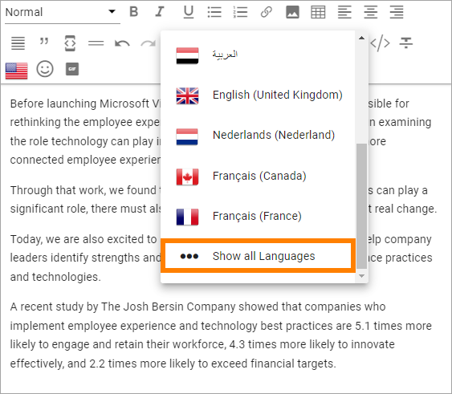

**Note!** You can use Ctrl-Z or just Discard Changes if you change your mind.

Using OpenAI
-----------------
If available, you can use OpenAI to suggest changes to the text, or maybe even to suggest some text for you.

If OpenAI is available, you use the following icon to start the option:

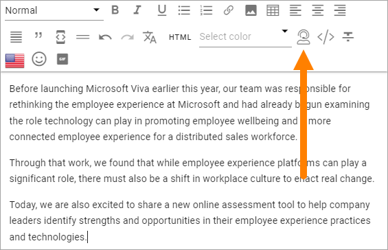

If you select a part of the text, it's also available on the floating toolbar:

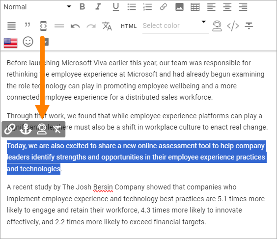

Here's how to use it:

1. Click the icon to process the whole text, or select part of the text and then click the icon to only process that part.
2. Choose what to do.

What is available here can differ greatly, if available at all. It's fully up to administrators to set up in Omnia Admin. Here's an example:

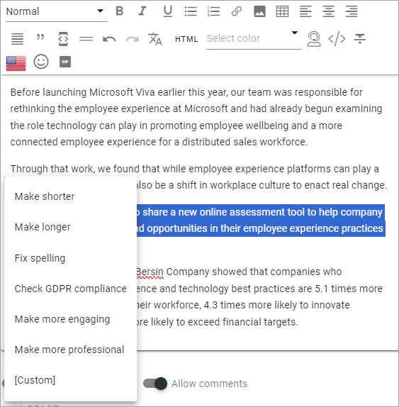

3. Select option.
4. Check OpenAIs suggestion and edit if needed (or cancel the whole suggestions with Ctrl-Z).

If a Custom option is available (can be named something else) you can ask OpenAI to do more or less anything you like (with text that is).

The chat window, which can be called something else, can look this way:

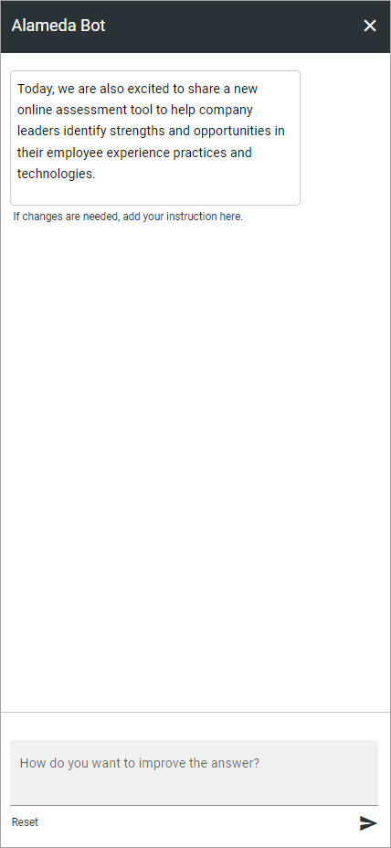

You can ask OpenAI to do any changes to the text, or create new text, by using "normal" conversation. Just try it out, what will be saved is totally up to you.

In this example the author was thinking about adding a section about the central railway station in Stockholm, but didn't know what it was called. So he simply asked OpenAI that.

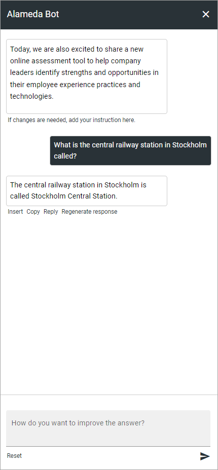

HTML
------
If it's available, you can work with the HTML Code, if you know how. When you click the icon a separate window is opened, where you do your HTML work.

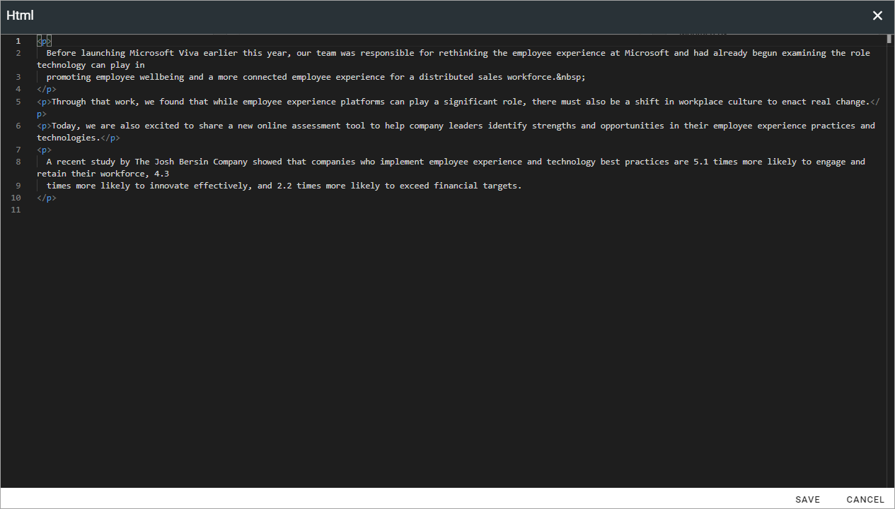

