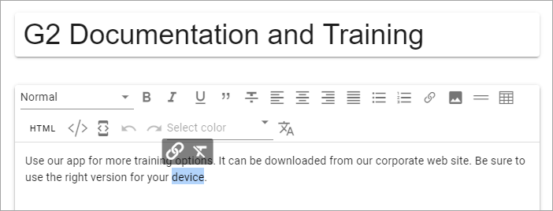
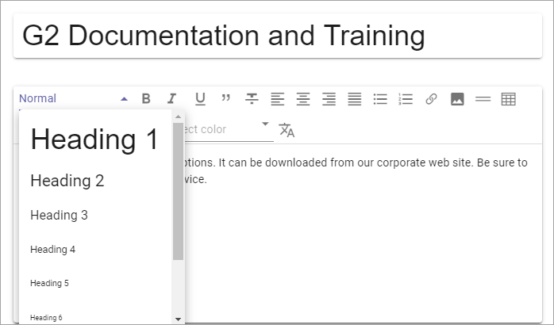
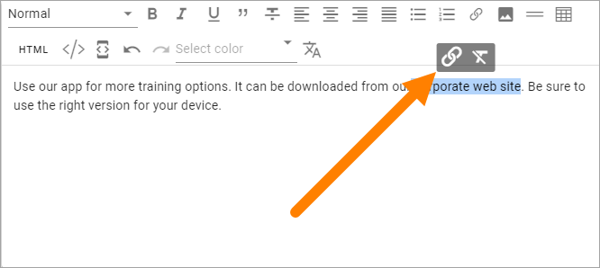
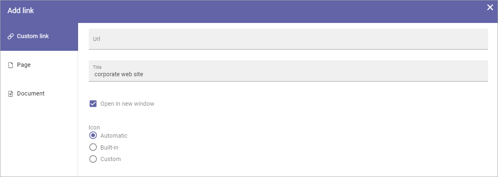
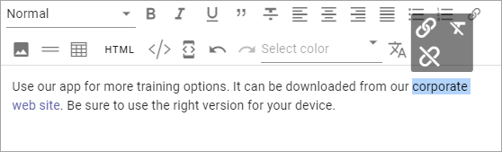
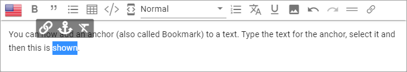
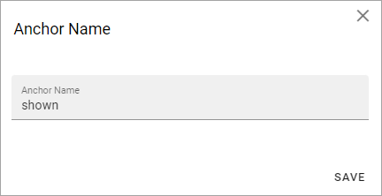
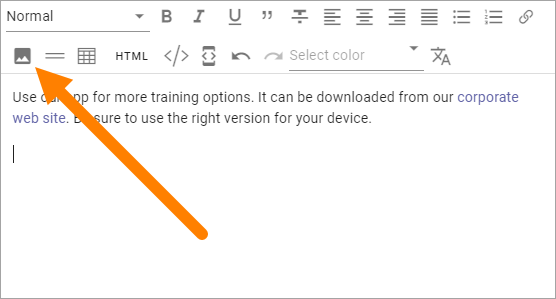
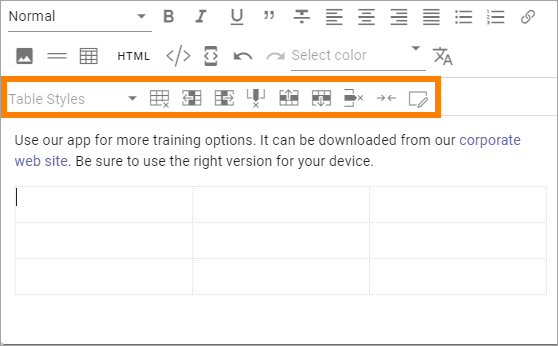
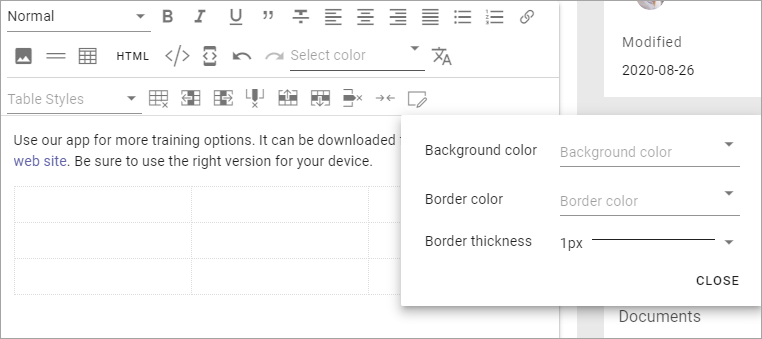

Editing text with the RTF Editor
=====================================

When editing text in Omnia, a RTF editor can be available. What is available in the editor is set up in Omnia Admin, and in a few cases in the block itself.

For more information about the settings, see: :doc:`RTF Editor Settings </admin-settings/tenant-settings/settings/rtf-editor/index>`

Using the RTF Editor
**********************
Here's the options that may be available in the editor:

.. image:: rtf-editor-all-options.png

There are two lists and a number of icons available. You point at an icon for a tool tip. Here's an example:

.. image:: rtf-editor-all-tooltip.png

Some options are also available as a floating toolbar, when text is selected, for example Add Link and Keep Text Only:

Se below for more information.

Add style
---------------
A number of styles can be available. To add a style, do the following:

1. Select the text.
2. Open the Styles list and select style.

This example only shows headings, but any style can be added to this list in Omnia Admin (see link above).

Add link
----------
Too add a link, do the following.

1. Click where the link should be added, or select some text that should the clickable text for the link.
2. Click the icon in the toolbar at the top, or in the floating toolbar.

The Add Link general asset is shown. If you selected text, it's added to the Title field:

See this page for more information: :doc:`Add Link </general-assets/add-link/index>`

To edit or remove a link:

1. select some of the clickable text for the link.
2. Use the icons in the floating toolbar.

Add and anchor (Bookmark)
---------------------------
Anchors can used in the Add Link general asset and when creating a link button using the Action button block. So, if you add an anchor (bookmark) to the text, links can be created to that anchor.

Anchors are available in Omnia 6.7 and later.

Here's how to add an anchor:

1. Type the text.
2. Select the text where the anchor should be placed.
3. Click the anchor icon.

4. Add an anchor name and save.

For more information about Add link, see: :doc:`Add link </general-assets/add-link/index>`

For more information about the Action button block, see: :doc:`Action button </blocks/button-link/in/index>`

Add Media
-----------
You can add and an image or a video to the text. This is how:

1. Click where the image or video should be added.
2. Click the Media icon.

3. Use the Media Picker to add the image or video.

.. image:: rtf-editor-media-picker.png

See this page for more information: :doc:`Media Picker </general-assets/media-picker/index>`

The image/video area area fills up the whole width (same width as the text), the height ratio intact, for example:

.. image:: rtf-editor-media-example-image.png

4. If you need to edit the image/viedo area in some way, use the icons; the pen to edit in the Media Picker, the dust bin to remove and the icon with the three dots to set the width or alignment. 

Here's an example with an image in a much smaller size and aligned to the middle of the text area:

.. image:: rtf-editor-media-example-image-smaller.png

Note the new icon to the right in the floating toolbar. You can use it to set the text flow in relation to the image/video area.

Add a table
------------
To add a table, do the following:

1. click where the table should be placed.
2. Click the Table icon.

.. image:: rtf-editor-table.png

3. Click somewhere in the table for more options.

Something like the following now becomes available:

Most of these option you recognize from other applications, for example Microsoft Word.

In the Table Styles list, a number of styles are available:

.. image:: rtf-editor-table-edits-table-styles.png

You can also style an individual cell using the icon to the far right.

Pasting text only
-------------------
A well known problem when pasting text from other sources into an HTML environment is that styles and the like from the original text does not work - or is not wanted. To make that problem go away, you can paste the text as Text only.

1. Paste the text.
2. Click the Keep text only icon.

.. image:: rtf-editor-test-only.png

You can also use this option on text you already have in the block. Just select the text and the option becomes available.

Using Machine Translation
---------------------------
If the option is available you can machine translate the text in a block, this way:

1. Click the icon.

.. image:: rtf-editor-machine-translation.png

2. Select the language to translate to (the language must have been set up in Omnia Admin).

.. image:: machine-translation-select-language.png

**Note!** You can use Ctrl-Z or just Discard Changes if you change your mind.

HTML
------
If it's available, you can work with the HTML Code, if you know how. When you click the icon a separate window is opened, where you do your HTML work.

.. image:: rtf-editor-html.png

