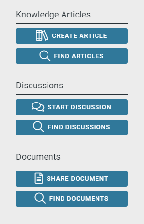
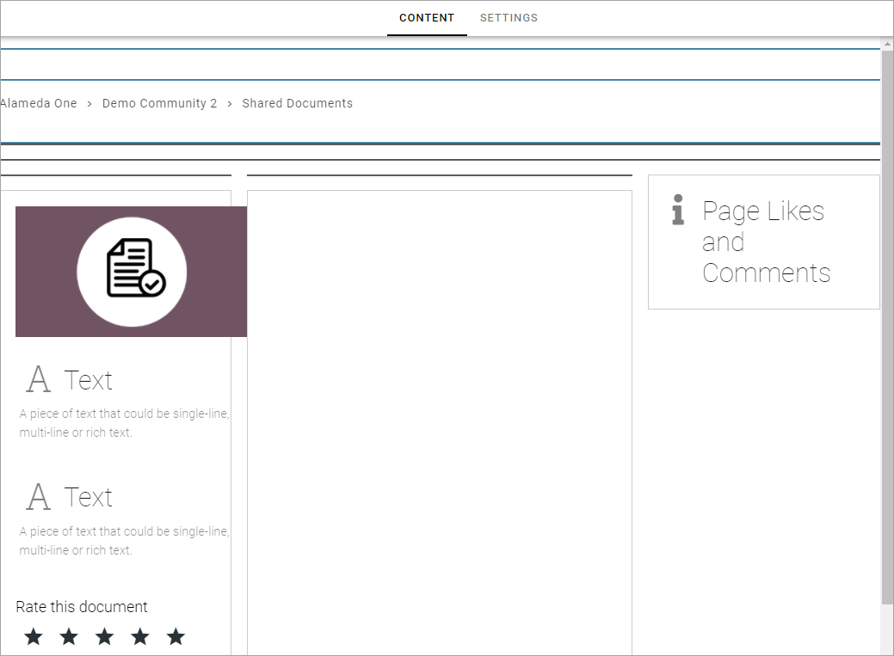
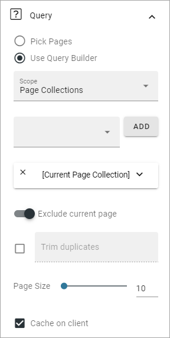

Share Documents
===========================================

A block can be set up, for example using an Action Button, to let users easily share a document with others by uploading it locally on a page. This can very useful, especially in a Comunity, but can be used in other types of apps as well. 

One document can be uploaded each time. A document uploaded this way will be read only.

This is needed:

+ A property, for example Document Data.
+ A Page Type for this purpose, with an iFrame block pointing to the property.
+ A page set up to list the uploaded, local documents.

Note that this can be added to Setup for the central Community template, and added to the Community Layouts, so Share Documents functionality will be added automatically to all new communities.

Implementation example
*************************
Here's an example, where Share Document is available in a community:

When a user clicks SHARE DOCUMENT, this is shown:

.. image:: share-document-button-upload.png

The user can upload by using drag and drop, add a description (Summary) and tag the document. Also note that a name for the uploader is registered. The name can be changed if the user uploads a document for someone else.

The user must click PUBLISH for the upload to start.

For all users of the community to read a shared document, the button FIND DOCUMENTS will be used. When clicked, something like the following is shown:

.. image:: find-document-button-list.png

The document title can be clicked to read a document. The uploader's name can also be clicked to display that user's User Profile Card, if it's used within your organization, or the user's Delve page if the Profile Card is not used.

How it is set up
------------------
This implementation example is set up the following way:

1. A Page Type called Shared Document is set up, with an iFrame block in the middle.

Under Settings, the property "Document Data" is added, and other properties that will be used in the Page Type.

.. image:: share-document-pagetype-2.png

The iFrame block is pointing to the Document Data property.

.. image:: share-document-pagetype-3.png

2. Under Communities for the Business Profile, a Layout and a Template is set up.

The Layout is called Shared Docucments.

.. image:: share-document-layout-1.png

And it's set up this way:

.. image:: share-document-layout-2.png

SHARE DOCUMENT is set up using an Action Button with these settings:

.. image:: share-document-layout-3.png

FIND DOCUMENTS is set up using an Action Button with these settings:

.. image:: share-document-layout-4.png

The list is set up with a Tab Section:

.. image:: share-document-layout-5.png

And under that, a Page Rollup with the following Query:

In the Community Template, the following is added to Setup:

.. image:: share-document-template.png

