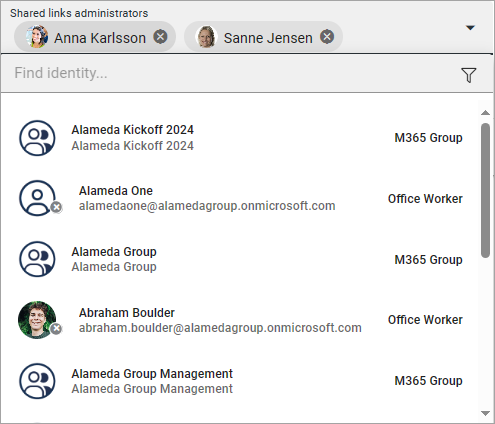
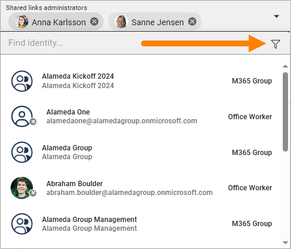
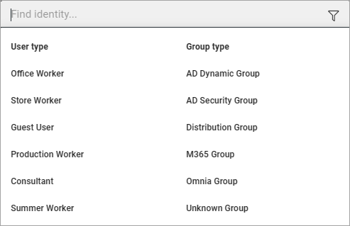
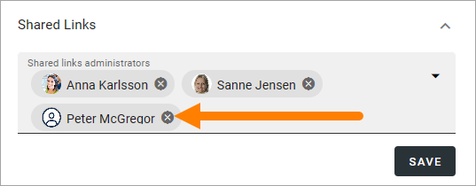

Using the people picker
=============================================

The people picker, sometimes called the identity picker, is used in many places in Omnia. 

To use it, just click in the search field and start typing. Here' an example:

Normally, single users, security groups and Microsoft 365 groups can be added here (In Omnia on-prem, Microsoft 365 groups can’t be used). There are a few excepetions where only single users can be added.

Also note that to be available in the people picker, users and groups may have to imported the correct way from the AD.

If you just want to search for a specific user type or a specific group type, click here to filter:

What you can filter depends on settings in Omnia Admin. Here's an example:

If you happen to select a user or a group by mistake, just click the x to remove.

