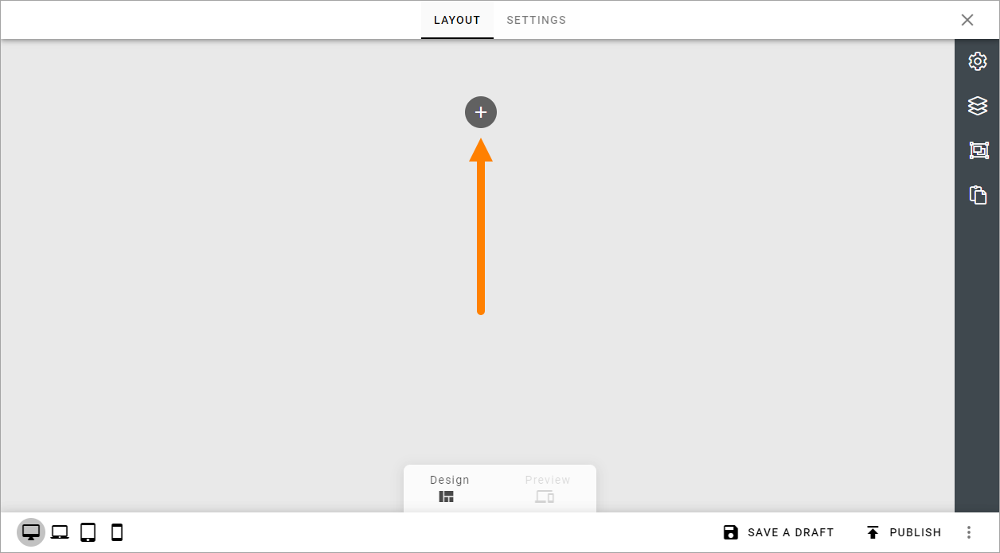
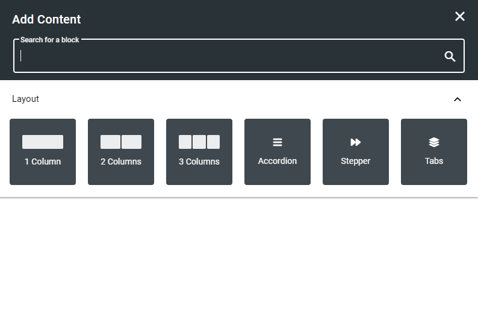
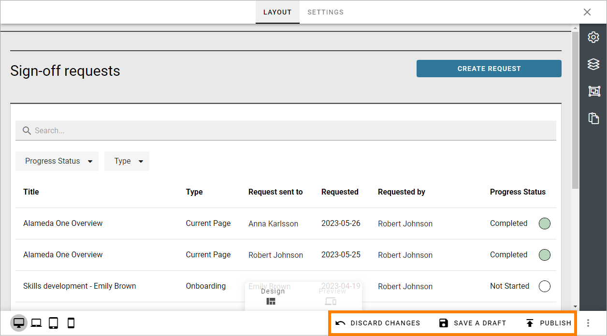
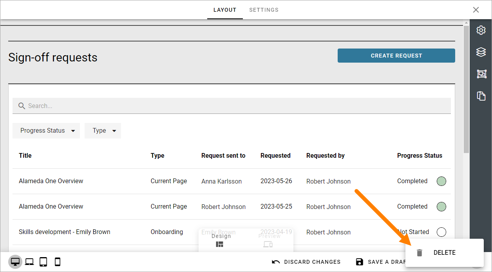

Working with Layouts
================================================
You can create different layouts for a number of features in Omnia. A great deal of what you can do with a layout is the same for all features, and that is what is described here.

Generally, you can use all options for sections and blocks available in Omnia.

1. Start by clicking the plus to add a section.

2. Then select section layout, just like you would do when working with a Page Type.

3. Continue building up the layout using sections and blocks.

For more information, see these pages:

+ :doc:`Working with sections and blocks </pages/page-types/working-with-sections-and-blocks/index>`
+ :doc:`Settings for sections </pages/page-types/section-settings/index>`
+ :doc:`Working with blocks </blocks/working-with-blocks/index>`

Saving a draft and publishing
---------------------------------
Saving a draft, discarding changes and finally publishing the layout, works very similar to working with pages.

For more information, see these pages:

+ :doc:`Edit a page </pages/edit-page/index>`
+ :doc:`Publish page changes </pages/publish-page-changes/index>`

But note that it's very similar, not exactly the same. Some options for pages are not available here (like scheduled publishing).

One thing that is perhaps not that obvious is how to delete a layout, if needed. You will find that option in the menu:

