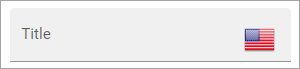
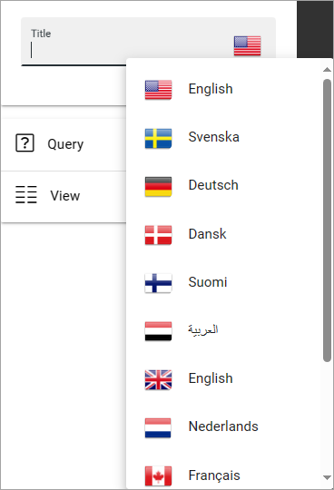

Working with several languages
=============================================

If you need to publish information in several languages in Omnia, you start with setting up the languages you need in Omnia Admin.

To publish pages in more than one language, you use variations. Languages for the variations, are set up in the publishing app settings, meaning each publishing app can have it's own variations settings.

For more information about variations, see: :doc:`Language version of a page </pages/language-versions-of-a-page/index>`

Texts in blocks and variations
********************************
When there are no variations in a publishing app, you can add the text in several tenant languages, in most text fields in blocks. If it's possible, it's indicated by a flag in the field, for example:

Just click the flag and select the language you want to use, and add the text.

Users should see the text in the language they have chosen in the Language setting. If the text has not been added in the language a user has chosen, the text in the field falls back to default language as set in Omnia admin for the business profile.

When variations has been set up in a publishing app, adding texts in several languages are now done in the variation, in most block fields. This is also called a multi lingual field. This is indicated by a "clean" field, for example:

.. image:: flag-in-field-clean.png

A variation is really a copy of a main/source page, where a variation author can add the information in the chosen  language.

For more information on how an author/variation editor can work with a variation page, see: :doc:`Edit page variation </pages/edit-page-variations/index>`

