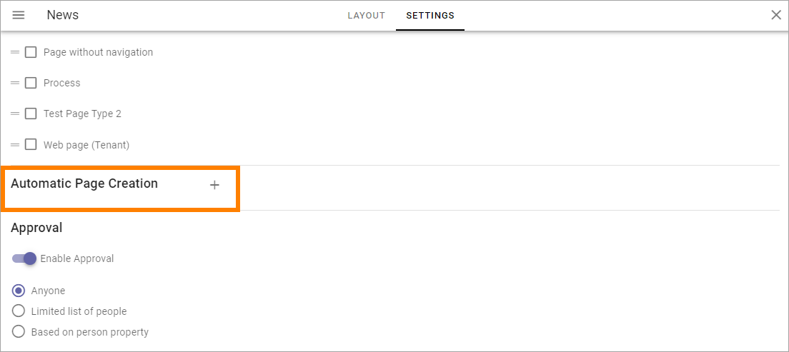
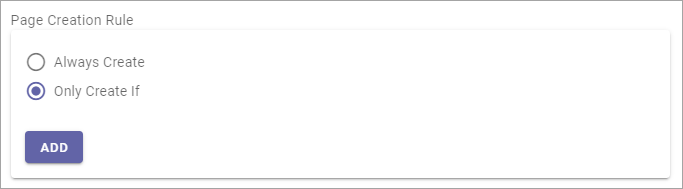

Automatic Page Creation
=========================
**(This documentation is just started, more will be added soon).**

In Omnia v6 an administrator can setup rules in a Page Collection for automatic page creation.

It works this way: Whenever a page is published in the Page Collection and match a specific rule, a copy of the page will be published to another Page Collection in the tenant.

This can for example be used to make sure a specific type of news will be published in more than one News Center, for example both in the internal News Center and in a partner portal or a customer portal. But this is just one example, it can be used with any type of page.

The settings are available here, in the Page Collection Settings:

Click the plus and the following settings becomes available:

.. image:: automatic-page-2.png

(Not all options are shown in the image.)

+ **Name**: Add name for the rule.
+ **Page Creation Rule**: If pages in this Page Collection always should be copied, select "Always Create". If pages should be copied only when certain prerequisites are met, select "Only Create If". See below for more information about this.
+ **Page Creation Info**: Select the Publishing, App, Page Collection to copy to, and choose the Page Type to be used.
+ **Reusable content**: (A desciption will be added soon.)
+ **Mapped Variations**: (A desciption will be added soon.)

Don't forget to save when you're done.

When editing a Automatic Page Creation rule, all settings described above are available.

Only Create If
---------------
When you select this option, the following is shown:

Click ADD to set one or more rules. The first step, when creating a rule, is to select a property.

.. image:: automatic-page-4.png

Set additional settings as neded. Here's a very simple example. Pages should only be copied if they are created by Anna Karlsson.

If needed, click ADD again and set the next rule. 

