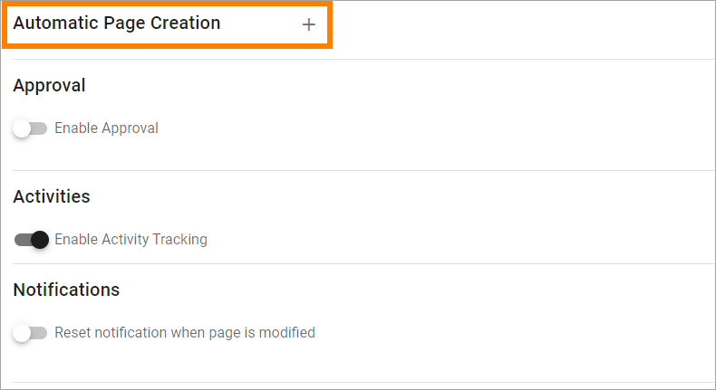
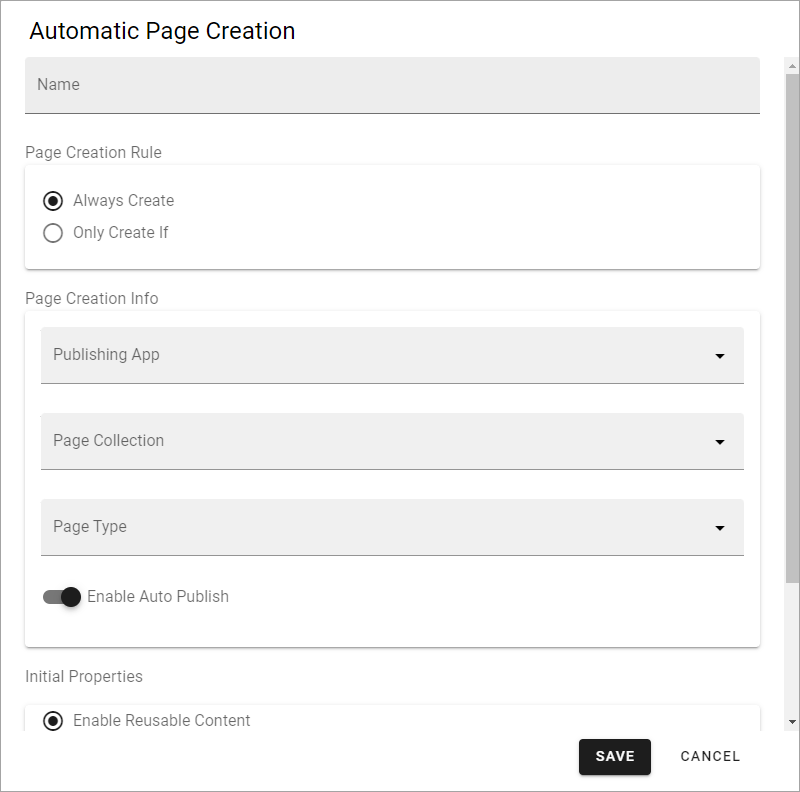
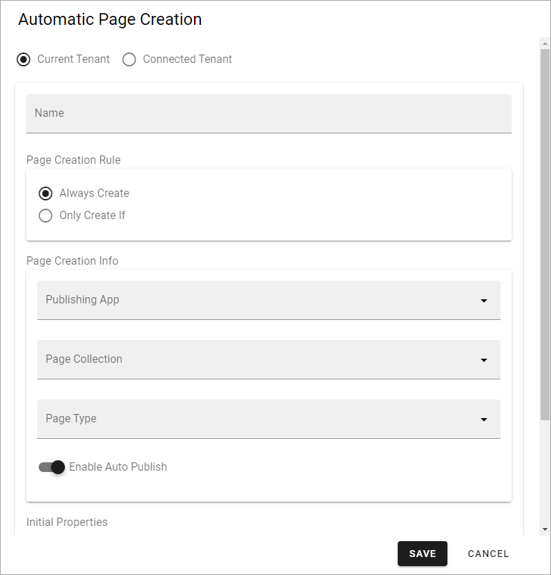
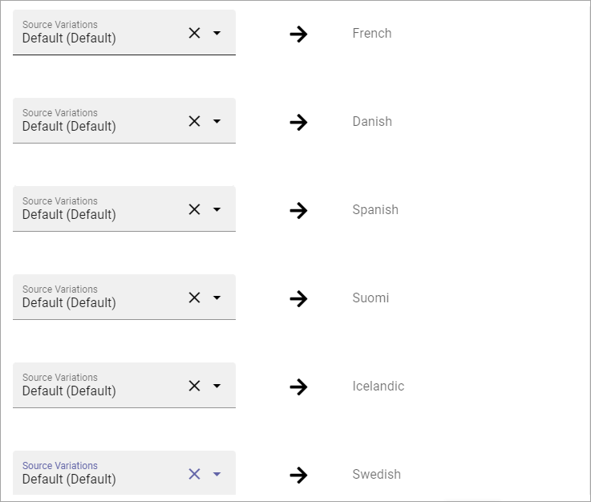
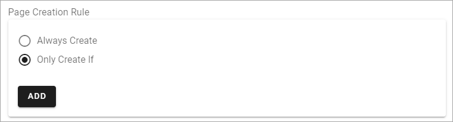
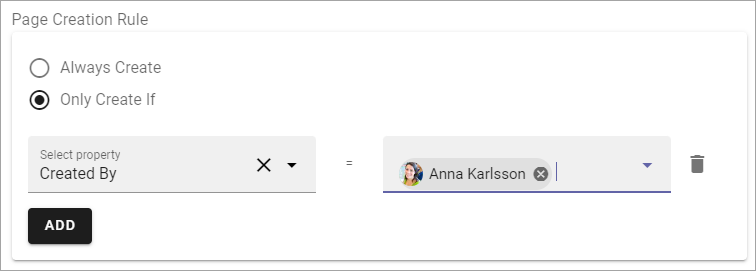

Automatic page creation
=========================

An administrator can setup rules in a page collection for automatic page creation.

It works this way: Whenever a page is published in the page collection and match a specific rule, a copy of the page will be published to another page collection in the tenant. To be more specific; it is the information contained in the properties that are copied, not the whole page as it is. Therefore the page in the target page collection can look different depending on available page types. 

In Omnia 7.0 and later, it can be possible to publish a copy of a page to another tenant as well. A prerequisite is that tenants that should be available for automatic page creation are registered as connected tenants in Omnia admin. See this page for more information: :doc:`Connected tenants </admin-settings/tenant-settings/system/connected-tenants/index>`

This can for example be used to make sure a specific type of news will be published in more than one news center, for example both in the internal news center and in a partner portal or a customer portal. But this is just one example, it can be used with any type of page.

**A tip!** If you want to make sure the copied page looks the same in the target page collection - use the same tenant page type in both source and target page collections. You can find more information about tenant page types on this page: :doc:`Tenant page types </admin-settings/tenant-settings/webcontent-managament/page-types/index>`

**Note!** You should not use this option for Events. Also note that if you work with variations, the default variation must be active for the settings to show up.

Settings
*********
The settings are available here, in the page collection settings:

Click the plus and the following settings becomes available (in Omnia 6.13 and earlier):

The following settings are available in Omnia 7.0 and later:

(Not all options are shown in the images, but are listed below.)

+ **Current tenant/Connected tenant**: Available in Omnia 7.0 and later. Choose if the rule should apply for the this tenant or for a connected tenant.
+ **Name**: Add a name for the rule.
+ **Page creation rule**: If pages in this page collection always should be copied, select "Always create". If pages should be copied only when certain prerequisites are met, select "Only create if". See below for more information about this.
+ **Page creation info**: Select the publishing app, page collection to copy to, and choose the page type to be used. In Omnia 7.0 and later, a conntected tenant could also be selected.
+ **Enable auto publish**: If this option is selected a new page is always published automatically. It’s only applicable when a new page is created, not when it’s updated.
+ **Initial properties**: Choose the source of the initial properties; "EnablerReuse content" or "Copy property to page on creation". Then select the property/propeties to get this from. For more information, see below. In Omnia 7.0 and later only properties to copy is available.
+ **Mapped variations**: If the source page and/or the target page uses variations, you have to map variations, see below.

Don't forget to save when you're done.

When editing an automatic page creation rule, all settings described above are available.

Setup for reusable content
------------------------------
When you activate reusable content, select a property that should have a reusable content connection in the target page, and click ADD.

Add all reusable content properties this way.

Here's an example:

.. image:: automatic-page-reusable-example-new.png

To remove a property from the list, click the dust bin.

Selecting properties to add to the page when creating works exactly the same.

Mapped variations
-------------------
Here's an example of mapping you have to do:

.. image:: automatic-page-mapped-new.png

In this example, the target page collection has a number of variations set up. You have to map variations from the source page to the variations in the target page. If there are more (possible) variations for the source page, it does not matter. In this example there are four (possible) variations for the source page, and some of them are the same as for the target page. The mapping can then look like this:

Only create if
---------------
If you select this option, you must create one or more rules:

Click ADD to set the first rule. The first step, when creating a rule, is to select a property.

.. image:: automatic-page-4-new2.png

Here's a very simple example. Pages should only be copied if they are created by Anna Karlsson:

If needed, click ADD again and set the next rule. 

Note that, in case you create several rules here, all rules must be met for a copy to be created. It's an AND relation between rules. If it is possible to select multiple values for a property within a rule, it's an OR relation between values. 

