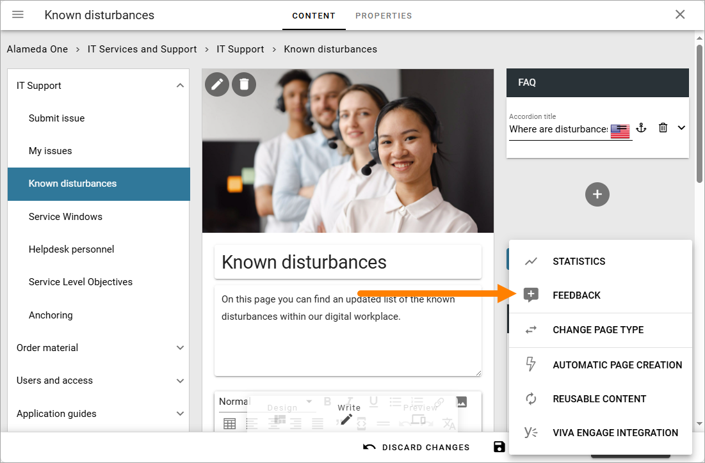
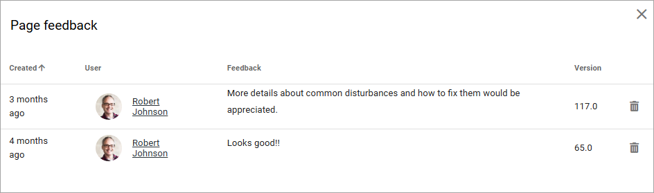

Check page feedback
===============

If a Page feedback block is added to a page, or if a action button is added for this purpose, users can create feedback for the page.

To check the feedback, you need to be page author (= have permission to edit the page in Write mode).

To check out if any feedback is available, edit the page in Write mode, open the menu and select FEEDBACK.

Here's an example:

You can decide to keep the feedback or delete i after having read it.

If you want to contact a user about the feedback, click the name. The user profile card will open, if it’s used within your organization. If it’s not, the colleague’s delve page will be displayed, and you can find the contact informations there.

Also note that the block can be set up so the feedback information is sent thorugh Email to the page contact, see the bottom of this page for more information: :doc:`Page feedback block </blocks/page-feedback/index>`

