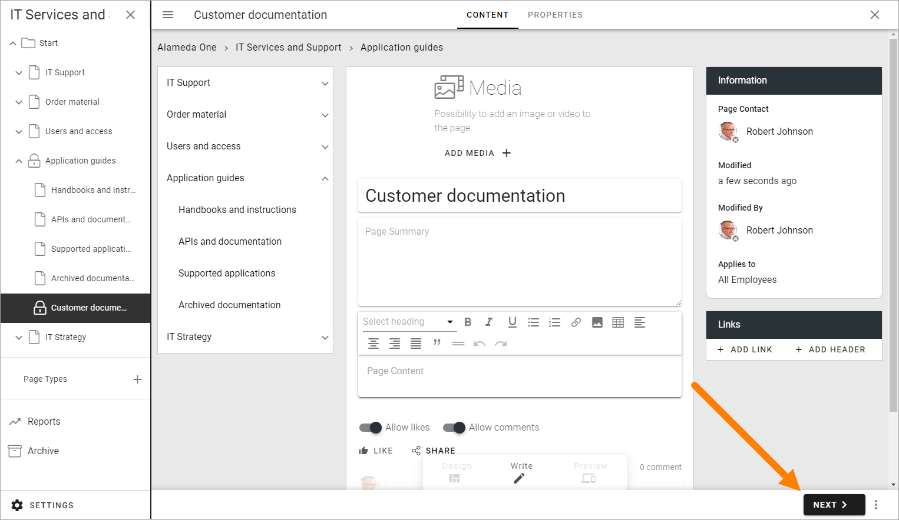
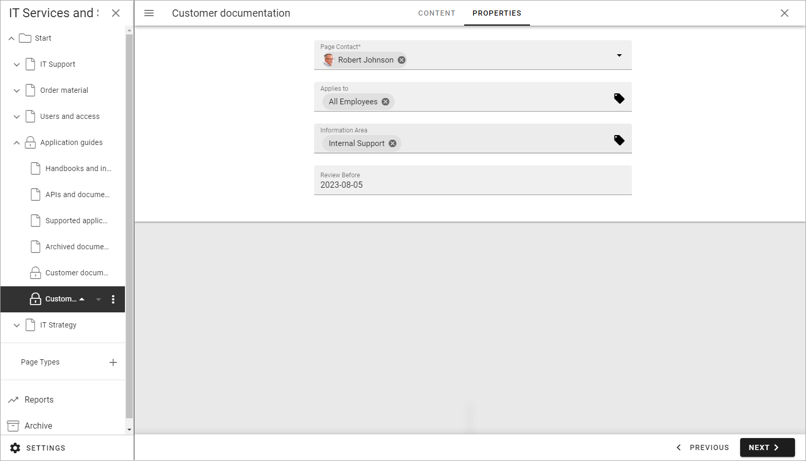
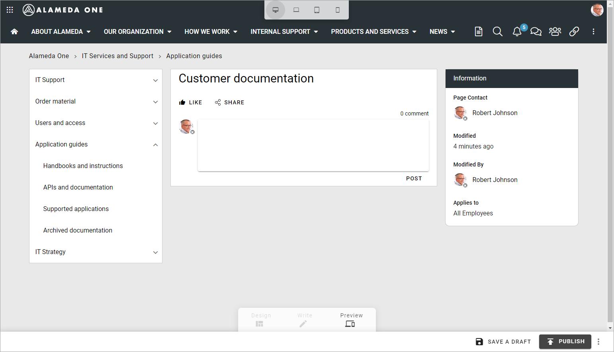

Create a page
===========================================

When you need to create a publishing page, do the following:

1. Go to a page, for example the page where you are going to create the new page as a sub page.
2. Open the editor.

.. image:: select-edit-new2.png

The navigation structure with the existing pages are now opened to the left:

.. image:: page-structure-new2.png

When already editing a page, you can open the navigation at the top left.

.. image:: open-navigation-new2.png

When the navigation is open, create a new page this way:

3. Open the menu for the page where the new page will be a sub page:

.. image:: new-page-open-menu-new2.png

4. Select "Create page".

.. image:: new-page-create-page-new2.png

5. Add a title for the page and select page type if availble (if there's only type available, then the page type is selected automatically and the field is simply not shown, as seen in the next image):

.. image:: new-page-create-page-title.png

The URL is added automatically, based on the page name, but can be edited if needed.

6. Click CREATE.

.. image:: new-page-create-page-title-create.png

What you can do from here depends on your permissions. The default mode is Write mode. If you are able to use Design mode, see below.

In Write mode you can now add content to some of the blocks added by the page type, and besides that a wizard is started to help you with the necessary steps when creating a new page:

.. image:: new-page-example-blocks.png

If you add content to the page now or if you want to do that later, by editing the created page, it's up to you. The options for content are the same later. In this example there are four blocks where you can add/edit content:

.. image:: new-page-example-blocks-write-mode.png

See below for useful links to descriptions on how to add/edit content.

7. Click "Next" for the next Wizard step.

8. Add property information as needed:

Available properties and if they are mandatory or not, are set up in settings for the page type.

Page contact and Review date are two common properties. The page contact is often used for page owner to receive page feedback, if applicable, but other property fields can be used for that purpose. Review date is just a date for a reminder that it may be time to review the page in case it needs an update. Set the review as you see fit, but a review at least once a year is probably a good idea.

9. Click "Next" to go the next Wizard step.

It can be possible to publish to channels (but it's not in this example). If that is allowed in the page collection, a "Channel" tab will be shown. You can then select the channels to publish to, but this is never mandatory. 

Normally publication to a channel must be approved by the channel administrator, but if you are set up as a publisher for that channel, you can publish directly, without approval.

Here's an example from another page collection, with four channels available. The author has chosen to publish in the channel he or she is publisher for:

.. image:: publish-to-channel.png

When the last wizard step has been edited, something like the following is shown. What you will do next is really up to you, but to save a draft at this point is a good idea.

More information about how publishing works and the options in preview mode can be found on this page: :doc:`Publish page changes </pages/publish-page-changes/index>`

**Note!** A new page is never shown for users until it's published at least once.

Some useful links regarding editing of blocks:

+ :doc:`Edit a page </pages/edit-page/index>`

+ :doc:`Editing text with the RTF editor </general-assets/rtf-editor/index>`

Working with a new page in Design mode
*****************************************
When the page is created (or later when editing) you can add additional blocks, and edit some of the block's settings - if you have the right permissions, see: :doc:`Working with blocks </blocks/working-with-blocks/index>`

Every block available also has a separate description, select the block on this page for more information: :doc:`Blocks </blocks/index>`

Page style and layout templates
---------------------------------
When woking with a page in Design mode, you can also use Layout explorer. There's a number of layout templates you can use, if you wish, for a new page. See: :doc:`Layout templates </general-assets/layout-explorer/layout-templates/index>`

In Layout explorer there are a number of page style settings as well, see this page for more information: :doc:`Page style </general-assets/layout-explorer/page-layout/page-style/index>`

