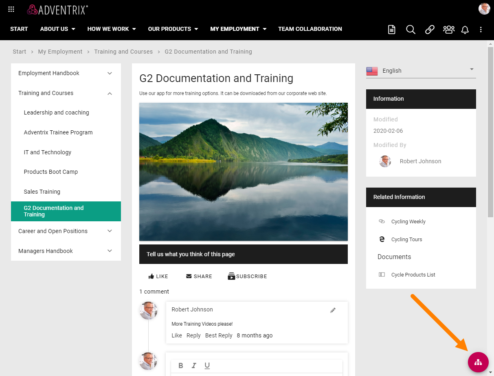
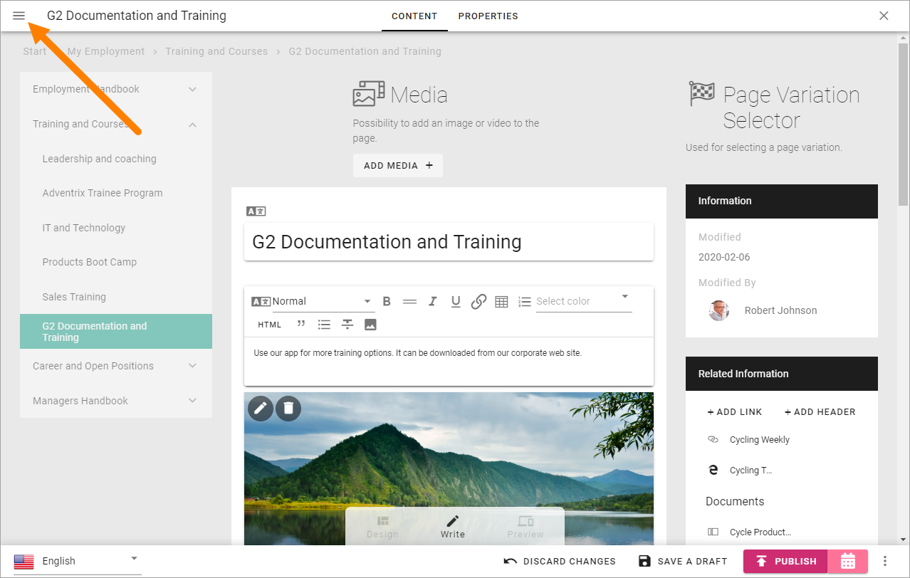
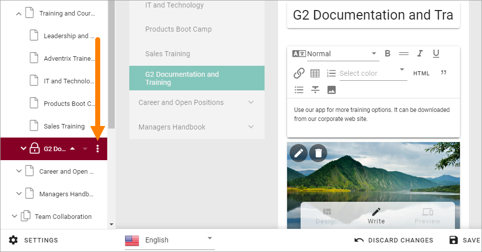
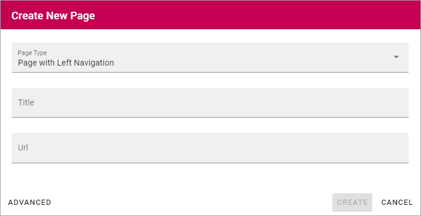
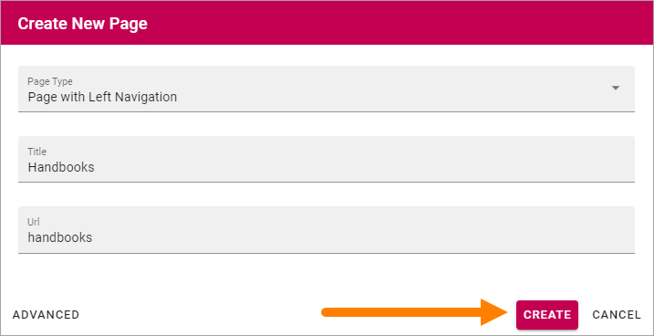

Create a page
===========================================

When you need to create a publishing page, do the following:

1. Go to a page, for example the page where you are going to create the new page as a sub page.
2. Open the editor.

The navigation structure with the existing pages are now opened to the left:

.. image:: page-structure-new.png

When already editing a page, you can open the navigation at the top left.

When the navigation is open, create a new page this way:

3. Open the menu for the page where the new page will be a sub page:

4. Select "Create Page".

.. image:: new-page-create-page-new.png

5. Choose settings for the page:

+ **Page Type**: Open the list and select the Page Type you want to use (can be changed later).
+ **Title**: The Page Title will be shown when searching and as a node in the navigation (can be changed later).
+ **Url**: The last section of the Url will be based on the Title. You can edit it if needed. 
+ **Advanced**: Use this option to set some Advanced options.
+ **Create**: The page is created when you click this button, not before that.

When the page is created you add content by using blocks, see: :doc:`Working with blocks </blocks/working-with-blocks/index>`

Every block available also has a separate description, select the block on this page for more information: :doc:`Blocks </blocks/index>`

Some default blocks can already be in place for the Page Type, and besides that a wizard is started to help you with the necessary steps when creating a new page:

6. Click "Next" for the next Wizard step.

.. image:: new-page-example-new.png

7. Add Property information as needed. 

Available properties and if they are mandatory or not, are set up in settings for the Page Type.

Page Contact and Review Date are two common properties. The page contact is often used for page owner to receive page feedback, if applicable, but other property field can be used for that purpose. Review Date is just a date for a reminder that it may be time to review the page in case it needs an update. Set the Review as you see fit, but a review at least once a year is probably a good idea.

8. Click "Next" to go the next Wizard step.

.. image:: new-page-properties-next-new.png

When the last Wizard step has been edited, something like the following is shown. What you will do next is really up to you, but to save a draft at this point is a good idea.

.. image:: new-page-finished-new.png

**Note!** A new page is never shown for users until it's published at least once.

Page Style and Layout Templates
************************************
In Layout Explorer, there's a number of Layout Templates you can use, if you wish, for a new page. See: :doc:`Layout Templates </general-assets/layout-explorer/layout-templates/index>`

In Layout Explorer there are a number of Page Style settings as well, see this page for more information: :doc:`Page Style </general-assets/layout-explorer/page-layout/page-style/index>`

