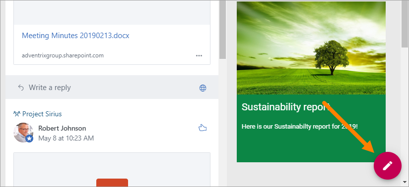
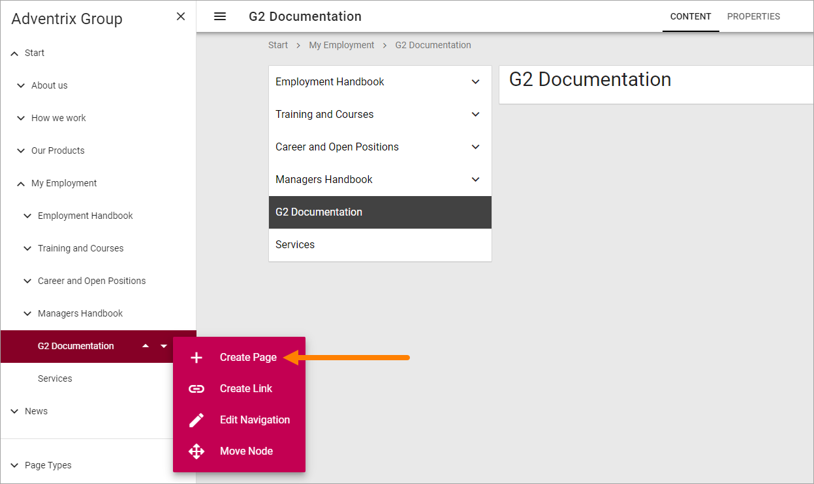
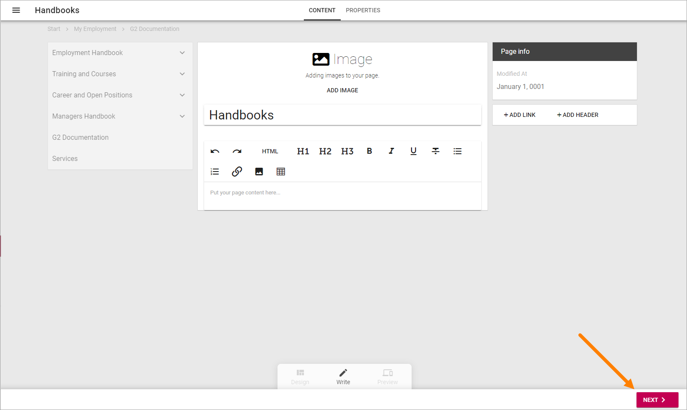
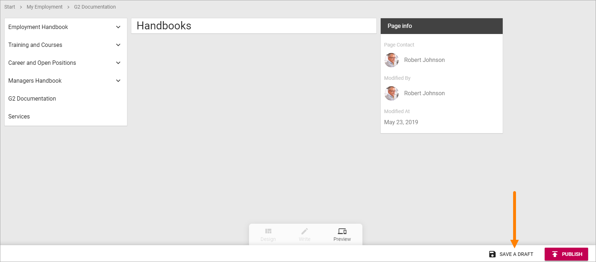

Create a page
===========================================

When you need to create a publishing page, do the following:

1. Point at the Edit button.

2. Select to edit navigation.

.. image:: edit-navigation.png

The navigation structure with the existing pages are now opened to the left:

.. image:: page-structure.png

When already editing a page, you can open the navigation at the top left.

.. image:: open-navigation.png

When the navigation is open, create a new page this way:

3. Open the menu for the page where the new page will be a sub page:

.. image:: new-page-open-menu.png

4. Select "Create Page".

5. Choose settings for the page:

.. image:: new-page-settings.png

+ **Page Type**: Open the list and select the Page Type you want to use (can be changed later).
+ **Title**: The Page Title will be shown when searching and as a node in the navigation (can be changed later).
+ **Url**: The last section of the Url will be based on the Title. You can edit it if needed. Note that the Url can't be changed once the page is created.
+ **Advanced**: Use this option to set som Advanced options.
+ **Create**: The page is created when you click this button, not before that.

.. image:: new-page-create-button.png

When the page is created you add content by using blocks, see: :doc:`Working with blocks </blocks/working-with-blocks/index>`

Every block available also has a separate description, select the block on this page for more information: :doc:`Blocks </blocks/index>`

Some default blocks can already be in place for the Page Type, and besides that a wizard is started to help you with the necessary steps when creating a new page:

6. Click "Next" for the next Wizard step.

7. Add Property information as needed. 
8. Click "Next" to go the next Wizard step.

.. image:: new-page-properties-next.png

When the last Wizard step has been edited, something like the following is shown. What you will do next is really up to you, but to save a draft at this point is a good idea.

**Note!** A new page is never shown for users until it's published at least once.

