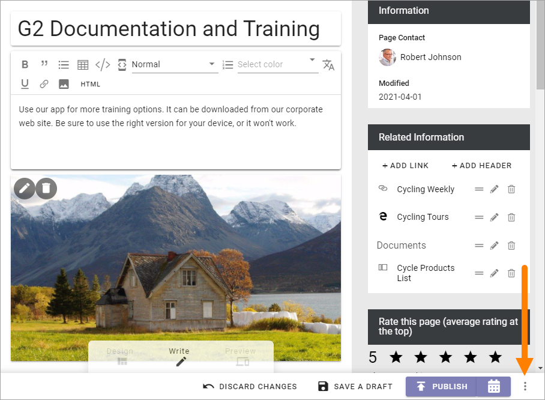
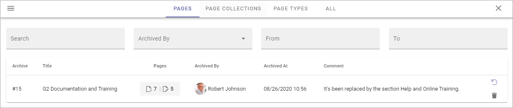
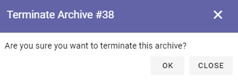
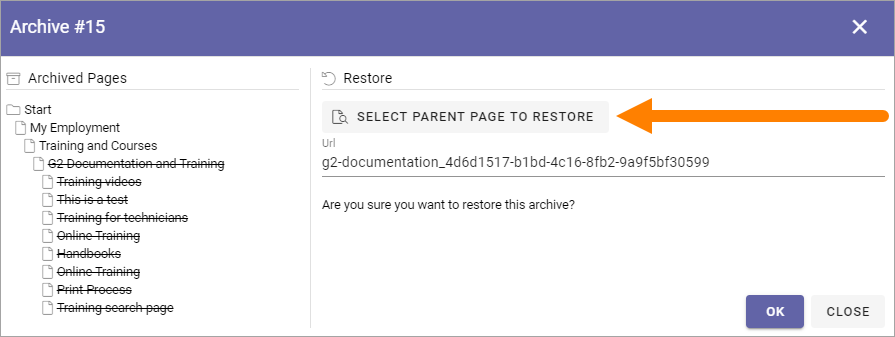

Archive a page
================= 

When working with the navigation you can archive a page that is no longer needed. This is instead of a delete option. Just remember that if other pages links to a page you archive, the links will no longer work. You have to edit or remove such links.

If a page has sub pages you can still archive it. Then all sub pages will also be archived. Both published pages and drafts will be archived. If variations for the page or sub pages exists, they will also be archived.

When you archive a page, it may be possible to create a new draft page in that process.

You can archive a whole Page Collection the same way as is described here and you can archive unused Page Types as well.

All colleagues with editor permissions to a page can archive that page. To be able to restore an archived page you must be Publishing App Administrator. There's one archive per Publishing App.

For more technical information about archiving pages, see the bottom of this description.

Here's how to archive a page:

1. Go to the page (if it's a page you haven't published you must edit any page and then open the edit navigation to go to the page to archive).
2. Edit the page.
3. Open the action menu at the bottom right.

4. Select ARCHIVE.

.. image:: archive-menu2-new.png

Something like the following is shown:

.. image:: archive-message.png

Note the message "You are about to archive a lot of pages" which is telling you that the page you have chosen has sub pages.

5. Type a comment (Mandatory!) and click OK to archive the page, or CANCEL if you change your mind.

Archiving a Page Collection
****************************
Archiving a Page Collection works exactly the same as described above. Just select the page collection's top node and select ARCHIVE.

Archiving a Page Type
**********************
Page Types that are used for active pages (published or drafts) can not be archived. If you would like to archive pages and the page type used for these pages, archive the pages first, and then the page type.

Archiving a Variation
***********************
You can archive a variation separately from the main page if needed. Just open the variation and archive the same way as you do a page. An archived variation can be restored or terminated the same way as a page, see below. If the main page is archived, variations of that page are always archived as well.

Automatic Archiving
********************
You can setup automatic archiving for pages based on a property. See the bottom of this page for more information: :doc:`Page Type Settings </pages/page-types/page-type-settings/index>`

Another way to do this is to use the settings for archiving in the Publishing App Settings. See the heading "Archive" on this page: :doc:`Publishing App Settings </pages/page-settings/index>`

Archive and create draft
******************************
When archiving a page, it may be possible to create a new draft. This is possible if:

+ The page has no sub pages.
+ No variations are created for the page.

When it is possible to create a draft when archiving, the following option is availble:

.. image:: archive-create-draft.png

Restore or terminate an archived page
*****************************************
If you have Publishing App Administrator permissions you can restore or terminate an archived page, with eventual sub pages, for that Publishing App. Page Collections and Page Types works the same way.

All archived pages for the Publishing App are available here:

.. image:: archive.png

A list of archived pages can look like this:

Note that four lists are available: Pages, Page Collections, Page Types and All. The four lists works the same, the differnce is the content.

You can for example see who archived the post and the comment made by that person. Under Pages you can see the number of published pages to the left and the number of drafts to the right. 

If the list is long you can use the filters at the top to search or filter the list.

Terminate an archived page
----------------------------
To save space you can terminate an archived page (with it's sub pages and drafts if applicable). It's done the same way for Page Collections and Page Types.

**Note!** When you terminate an archived page it's really gone, so be careful here.

You click the dust bin to terminate the page. Just be really careful so you click on the right row!

You get a second chance to change your mind:

If you're not certain, just click CLOSE here and nothing will happen.

Restore an archived page
**************************
To restore an archived page (with it's sub pages and drafts if that's applicable), do the following. Restoring a Page Collection or a Page Type works the same way.

1. Click this icon on the right row:

.. image:: archive-restore-icon.png

Something like the following is shown:

.. image:: archive-restore-1.png

2. Choose how to restore the page/pages and click OK.

If you would like to restore the page/pages to it's original place (if that still exists!), just click OK.

If you would like, or need, to restore the page/pages somewhere else - or just want a better view of the information structure - click SELECT PARENT PAGE TO RESTORE.

Now something like the following is shown:

.. image:: archive-parent-restore-2.png

Use the right part to select the parent node for the archived page/pages to be placed under. Note that you can browse the list the find a sub page that should be the parent node. Click OK when you're finished.

Archiving pages in Omnia - on the technical side
**************************************************
Archived pages are stored in a document library in the Communication Site backend in SharePoint and will be stored there until someone decides to manually delete them.

When a page is archived, the information is removed from the Omnia database and is only stored in Sharepoint. The page and it's media is moved to a specific archive catalog in the backend connected SharePoint site.

When a page is terminated in Omnia, it is moved to the recycle bin in SharePoint.

 
