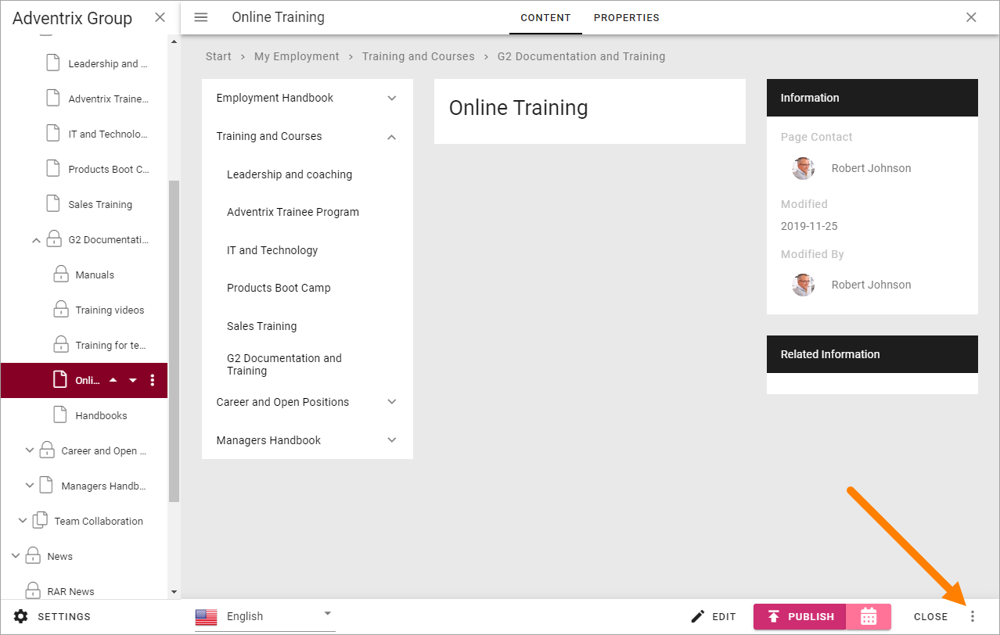
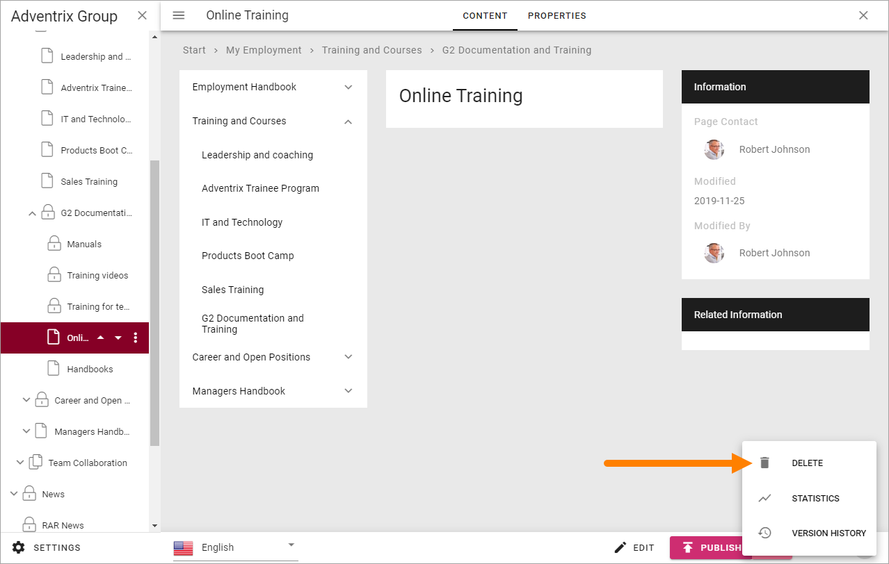
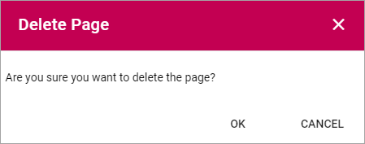

Delete a page
===========================================

When working with the navigation you can delete a page that is no longer needed. Just remember that if other pages links to a page you delete, the links will no longer work. You have to edit or remove such links.

Here's how to delete a page:

1. Go to the page (if it's a page you haven't publishes you must open the edit navigation).
2. Open the action menu at the bottom right.

3. Select "DELETE".

5. Click "OK" to delete the page (or "CANCEL" if you change your mind).

What happens if you delete a page by mistake? When you have clicked OK to delete a page, it can't be undone, but it may be possible to restore the page. 

A deleted page is placed in a system dust bin so normally an administrator can help you restore a page, but that has to be done within a certain time span (default setting is 30 days but can vary, depending on system settings). System dust bins are emptied with regular intervals.

