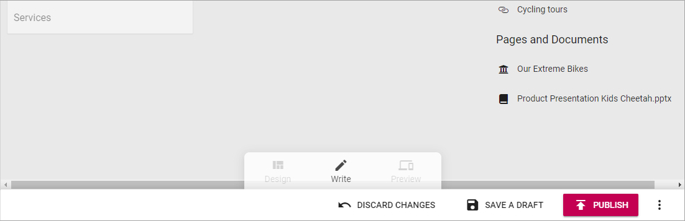

Delete a page
===========================================

When working with the navigation you can delete a page that is no longer needed. Just remember that if other pages links to a page you delete, the links will no longer work. You have to edit or remove such links.

Also note that while you're editing a page, you can't delete it (see below).

Here's how to delete a page:

1. Open Edit mode and select to edit navigation.
2. Select the page to delete.

.. image:: delete-page-1.png

3. Open the action menu at the bottom right.

.. image:: delete-action-menu.png

4. Select "DELETE".

.. image:: delete-page-2.png

5. Click "OK" to delete the page (or "CANCEL" if you change your mind).

.. image:: delete-page-ok.png

What happens if you delete a page by mistake? When you have clicked OK to delete a page, it can't be undone, but it may be possible to restore the page. 

A deleted page is placed in a system dust bin so normally an administrator can help you restore a page, but that has to be done in a certain time span (default settings are 30 days but can vary, depending on system settings). System dust bins are emptied with regular intervals.

As stated earlier, you can't delete a page you're editing, so when this is shown at the bottom, it's not possible:

You must then select "DISCARD CHANGES" (or "SAVE A DRAFT"  or even "PUBLISH", but that is probably not applicable for a page you want to delete), for the "DELETE" option to be present in the action menu.
