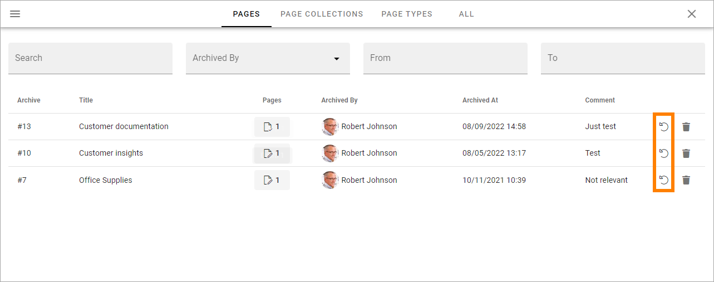
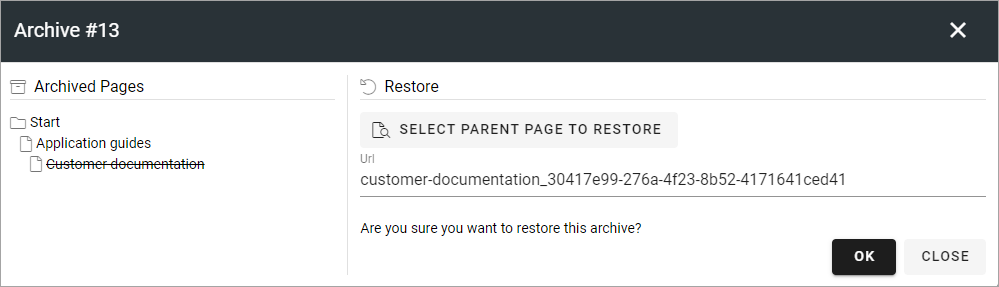

Delete a page
================= 

You can delete a page that is no longer needed. A deleted page is placed in the archive. There it can be restored or terminated. There's one archive per Publishing App. This functionality was called archiving in earlier versions of Omnia.

Just remember that if other pages links to a page you delete, the links will no longer work. You have to edit or remove such links.

If a page has sub pages you can still delete it. Then all sub pages will also be deleted. Both published pages and drafts will be deleted. If variations for the page or sub pages exists, they will also be deleted.

When you delete a page, it may be possible to create a new draft page in that process.

You can delete a whole Page Collection the same way as is described here and you can delete unused Page Types as well.

All colleagues with editor permissions to a page can delete that page. The editor that deletes a page can also restore it, if needed. A Publishing App Administrator can delete and restore all pages, Page Types and Page Collections in a Publishing App.

For more technical information about deleting pages, see the bottom of this description.

Here's how to delete (archive) a page:

1. Go to the page (if it's a page you haven't published you must edit any page and then open the edit navigation to go to the page to delete).
2. Edit the page.
3. If there are changes that has not been saved, save or discard them, or the DELETE button will not be available.
4. Click DELETE.

.. image:: archive-menu2-new3.png

As an alternative, you can use DELETE in the menu in the navigation tree. This option is available all the time (even when you are editing the page).

.. image:: delete-page-menu-new2.png

When you select delete of a main page with sub pages, something like the following is shown:

.. image:: archive-message-new.png

Note the message "You are about to archive a lot of pages" which is telling you that the page you have chosen has sub pages. If the page doesn't have sub pages that message is simply not shown.

5. Type a comment (Mandatory!) and click OK to archive the page, or CANCEL if you change your mind.

Delete and create draft
--------------------------
When deleting (archiving) a page, it may be possible to create a new draft. This is possible if:

+ The page has no sub pages.
+ No variations are created for the page.
+ The page has been punlished at least once.

When it is possible to create a draft when deleting, the following option is available:

.. image:: archive-create-draft-new2.png

Deleting a Page Collection
------------------------------
Deleting (archiving) a Page Collection works exactly the same as described above. Just select the page collection's top node and select DELETE.

Deleting a Page Type
-------------------------
Page Types that are used for active pages (published or drafts) can not be deleted (archived). If you would like to delete pages and the page type used for these pages, delete the pages first, and then the page type.

Deleting a Variation
------------------------
You can delete (archive) a variation separately from the main page if needed. Just open the variation and delete the same way. A deleted variation can be restored or terminated the same way as other pages, see below. If the main page is deleted, variations of that page are always deleted as well.

Automatic Delete and Termination
--------------------------------------
You can setup automatic delete (archiving) for pages based on a property. See the bottom of this page for more information: :doc:`Page Type Settings </pages/page-types/page-type-settings/index>`

Furthermore, you can set up rules for automatic termination of deleted pages, in the Publishing App Settings. See the heading "Delete" at the bottom of this page: :doc:`Publishing App Settings </pages/page-settings/index>`

**Important note!** These delete and termination settings are valid for Omnia. If a page truly must be terminated from your system, settings for dust bins in SharePoint may also need to be edited.

Restore or terminate a deleted page
*****************************************
If you have deleted a page you also have permissions to restore or terminate that page, with eventual sub pages. Page Collections and Page Types works the same way.

All deleted pages for the Publishing App are available here:

.. image:: archive-new2.png

A list of deleted pages can look like this:

.. image:: archive-list-new2.png

Note that four lists are available: PAGES, PAGE COLLECTIONS, PAGE TYPES and ALL. The four lists works the same, the difference is the content.

You can for example see who archived the post and the comment made by that person. Under the column heading "Pages" you can see the number of published pages to the left and the number of drafts to the right (no drafts exist in the image above). 

If the list is long you can use the filters at the top to search or filter the list.

Terminate a deleted page
----------------------------
To save space you can terminate a deleted page (with it's sub pages, variations and drafts if applicable). It's done the same way for Page Collections and Page Types.

**Note!** When you terminate a deleted page it's really gone from Omnia, so be careful here.

You click the dust bin to terminate the page. Just be really careful so you click on the right row!

You get a second chance to change your mind:

.. image:: terminate-new.png

If you're not certain, just click CLOSE here and nothing will happen.

Restore a deleted page
-------------------------
To restore a deleted page (with it's sub pages, variations and drafts if that's applicable), do the following. Restoring a Page Collection or a Page Type works the same way. 

1. Click this icon on the right row:

Something like the following is shown:

2. Choose how to restore the page/pages and click OK.

If you would like to restore the page/pages to it's original place (if that still exist!), just click OK.

If you would like, or need, to restore the page/pages somewhere else - or just want a better view of the information structure - click SELECT PARENT PAGE TO RESTORE (SELECT NAVIGATION NODE TO RESTORE TO).

.. image:: archive-parent-restore-1-new.png

Now something like the following is shown:

.. image:: archive-parent-restore-2-new.png

Use the right part to select the parent node for the deleted page/pages to be placed under. Note that you can browse the list the find a sub page that should be the parent node. Click OK when you're finished.

Deleting pages in Omnia - on the technical side
**************************************************
Deleted pages are stored in a document library in the Communication Site backend in SharePoint and will be stored there until someone decides to manually terminate them.

When a page is deleted, the information is removed from the Omnia database and is only stored in Sharepoint. The page and it's media is moved to a specific archive catalog in the backend connected SharePoint site.

When a page is terminated in Omnia, it is moved to the recycle bin in SharePoint.

