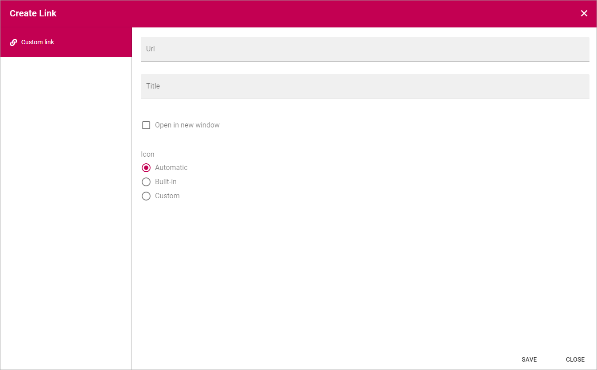
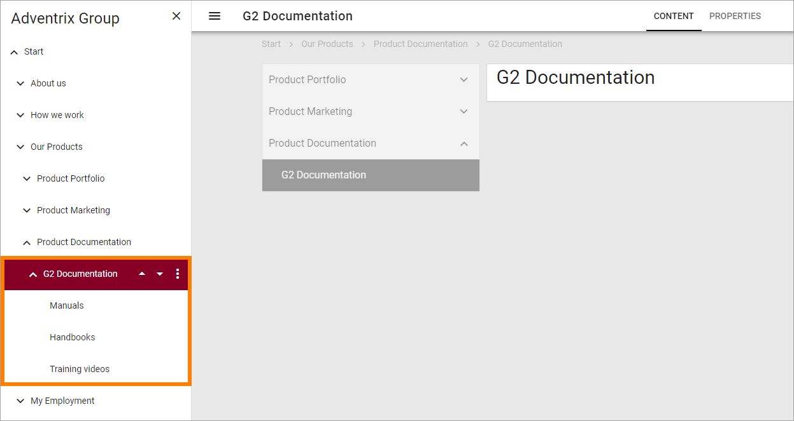

Edit page navigation
===========================================

If needed you can do a number of changes to page navigation. You must have entered Edit mode to be able to do this.

Create Link
****************
Using this option you can add a link to the navigation, to anything you can reach with a link.  

1. Select the page the link will be placed under (in the navigation).
2. Open the menu and select "Create link".

.. image:: navigation-add-link.png

The Add link general asset is opened and you use it to create the link. 

See this page for more information: :doc:`Add link </general-assets/add-link/index>`

Edit navigation
****************
Using this option you can change the title and decide if the node should be present in the Mega Menu and/or Current Navigation.

1. Select the node in the navigation to edit.
2. Open the menu and select "Edit Navigation".

.. image:: selevt-edit-navigation.png

Here you can do the following:

.. image:: edit-navigation-settings.png

+ **Title**: Change the title to be shown in the navigation. (The Title shown on the page or when searching will not be changed.)
+ **Url**: (A description will be added soon.)
+ **Show in Mega Menu**: Per default the navigation node is shown in the Mega Menu (Top Menu). Deselect if you don't want to show it there.
+ **Show in Current Navigation**: Per default the navigation node is shown in the Current Navigation (Left Navigation). Deselect if you don't want to show it there.

Move node
***********
Using this option you can move one or more pages anywhere in the navigation. If you select a node with sub pages, all levels of pages below the one you select are moved.

1. Select the main page.
2. Open the menu and select "Move Node".

.. image:: select-move-node.png

3. Navigate to the page where the selected pages will be placed as a sub navigation.

.. image:: navigate-node.png

4. Click "Save".

The main page and all sub pages (all levels) are now moved to the new location. Here's an example:

