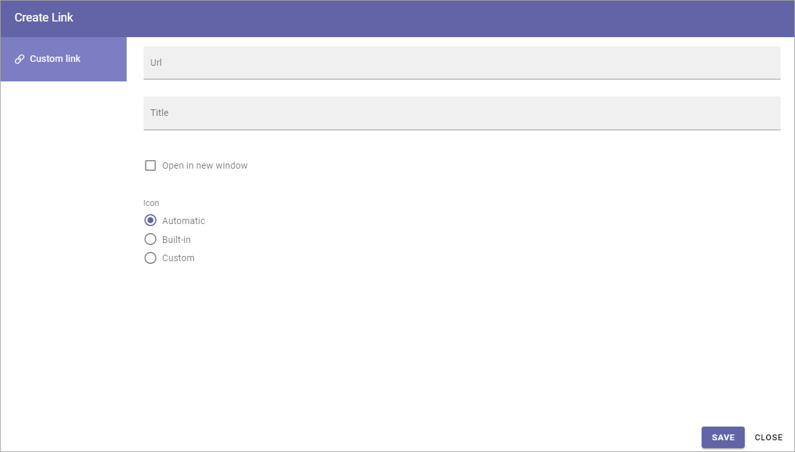

Edit page navigation
===========================================

If needed you can do a number of changes to page navigation. You must have entered Edit mode to be able to do this.

Create Link
****************
Using this option you can add a link to the navigation, to anything you can reach with a link.  

1. Select the page the link will be placed under (in the navigation).
2. Open the menu and select "Create link".

.. image:: navigation-add-link-new2.png

The Add link general asset is opened and you use it to create the link. 

See this page for more information (but note that you can only create a Custom link here): :doc:`Add link </general-assets/add-link/index>`

Edit navigation
****************
Using this option you can change the title and decide if the node should be present in the Mega Menu and/or Current Navigation.

1. Select the node in the navigation to edit.
2. Open the menu and select "Edit Navigation".

.. image:: selevt-edit-navigation-new2.png

Here you can do the following:

.. image:: select-edit-navigation-new3.png

+ **Title**: Change the title to be shown in the navigation. (The Title shown on the page or when searching will not be changed.) If no variations exist for the page, you can set the title in all languages active in the tenant, as is the case in the image above. If there are variations for the page, the variation settings handles different versions of the title.
+ **Url**: The url to the page is shown here. It can be edited if needed, but changing the url must be considered as a rare case. You can also add a Teams Url here (click the Teams icon). The case is if you run Omnia from Teams, the Url you add here will then be used instead of the default Url. 
+ **Show in Mega Menu**: Per default the navigation node is shown in the Mega Menu (Top Menu). Deselect if you don't want to show it there.
+ **Show in Current Navigation**: Per default the navigation node is shown in the Current Navigation (Left Navigation). Deselect if you don't want to show it there.
+ **Open in New Windows**: Select this option if the link should be opened in a new browser window.

For the other options available in the page navigation menu, see:

+ :doc:`Create a page </pages/create-page/index>`
+ :doc:`Delete a page </pages/delete-page/index>`
+ (link to add) :doc:`Copy a page </pages/copy-page/index>`
+ :doc:`Move one or several pages </pages/move-page/index>`
+ :doc:`Hide one or several pages </pages/move-page/index>`

