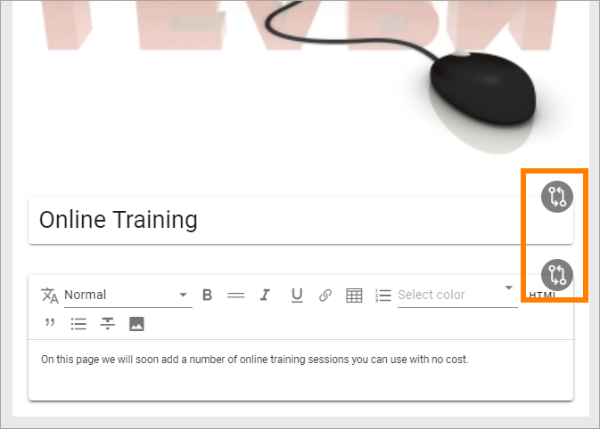
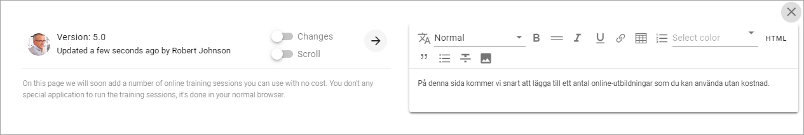
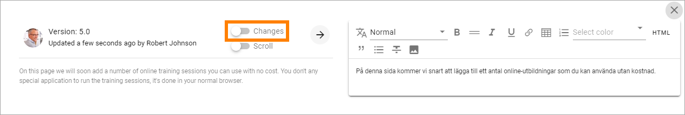
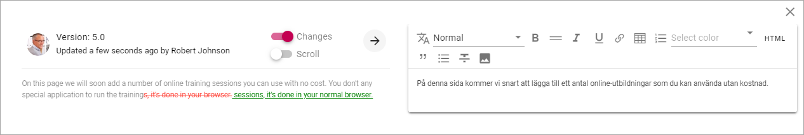
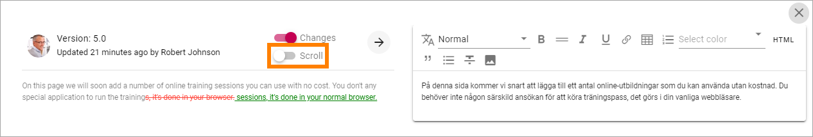

Edit Page Variations
========================

If page variations is used editors with permissions to edit a certain page can always edit the page varitions as well.

When a page variation exists for a page, omnia keeps track of changes on the main page. When the main page has been edited, compare icons are displayed to notify the author about where changes has been made, when a varation is being edited.

To edit the variation according to the changes, click the compare icon.

Something like the following is shown:

To the left you can see the text on the main page, to the right the text for the variation you're editing.

If you would like to see what has been changed, click this icon:

Now you can clearly see what's been altered, for example:

**Note!** The comparison is made between the two last versions of the main page. If you haven't edited the variation for a while there can be more changes and they are not selected here - just the last changes are shown.

You can of course edit the variation manually by typing the text in the right field and just use the information in the left field as a reminder, but as a quick way, machine translation is an integrated part of this functionality.

Click this button to machine translate all text in the left field.

.. image:: edit-variations-5.png

and select to which language you want the translation to be made:

.. image:: edit-variations-6.png

The list displays all languages that has been set up in Omnia Admin.

**Note!** When you click the "Translate" button, a complete, new translation of the text in the left field is made. If you have done any changes manually in the right field before this, they are overwritten. 

If there is a lot of text, a scroll bar is available. Sometimes it can be handy to have separate scroll bars in each field. If you want that, click "Scroll".

When you're finished, just close the compare window. You then save, or discard, changes the normal way.

Varition author
*****************
A Variation author can be added for each variation. That is done in the publishing app settings, see: :doc:`Publishing App Settings </pages/page-settings/index>`

Note that there can be only one variation author for each variation, regardless on how many page the variation is used.

The variation author is notified through e-mail when a main page, with a variation of the variation authors type, is updated.

The variation author needs the same permisions as the author of the main page, to be able to edit the variation for a page.

Archive variations
********************
You can archive a variation even if the main page should not be archived. (If the main page is archived, any variations for that page are always archived as well.)

1. Open the variation.
2. Open the action menu and select ARCHIVE.

Something like the following is shown:

.. image:: archive-variation.png

3. Type a comment and clikc OK.

A variation can be restored or terminated the same way as pages in the archive.

.. image:: archive-variation-archive.png

More information about archiving, restoring and terminating is found here: :doc:`Archive a page </pages/delete-page/index/index>`

