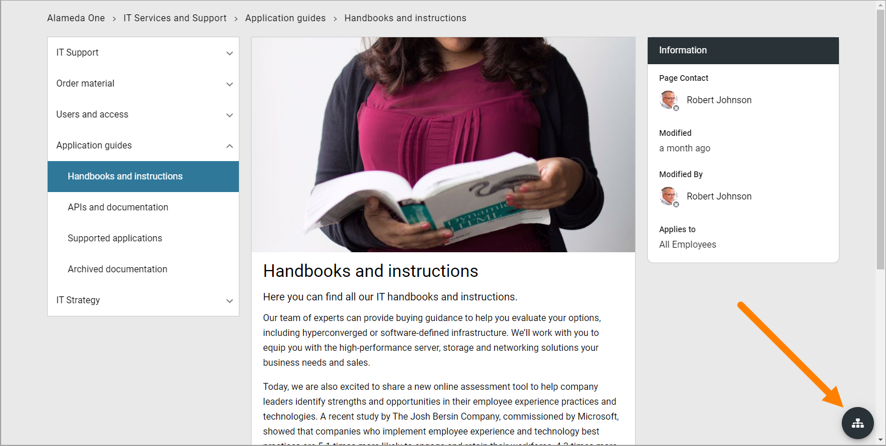
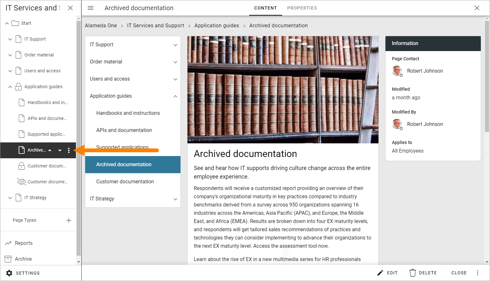
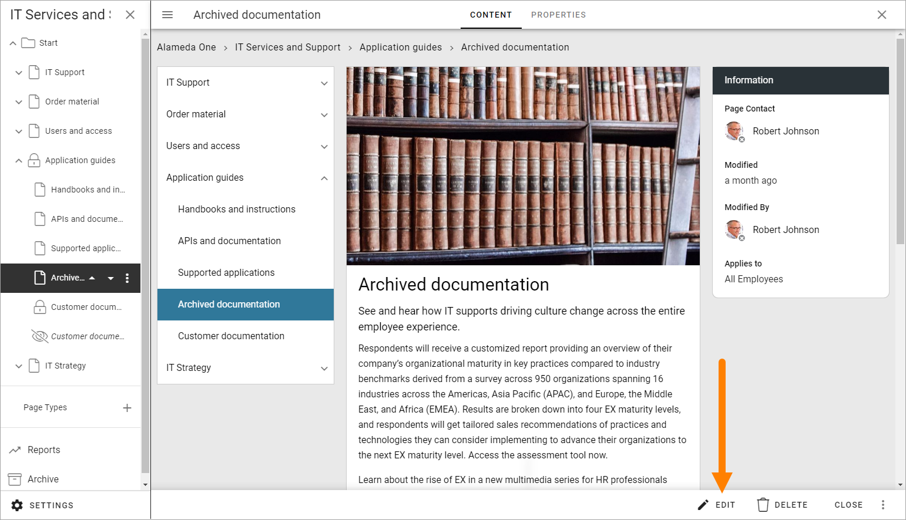
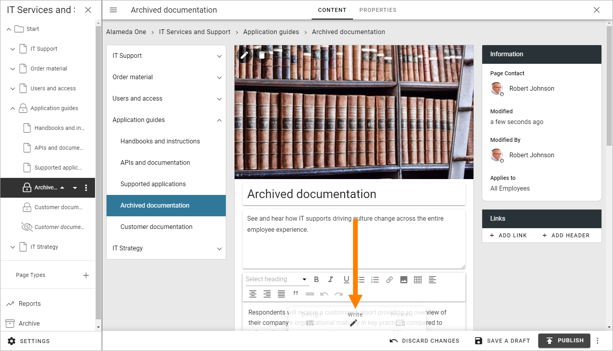
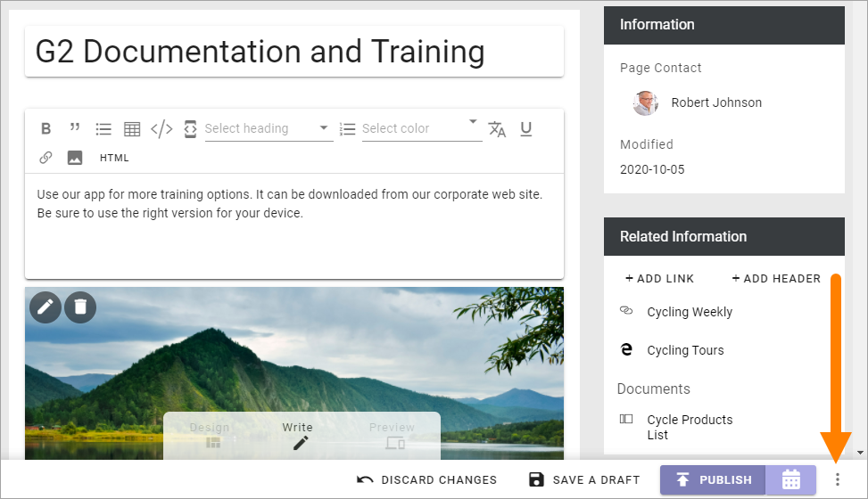
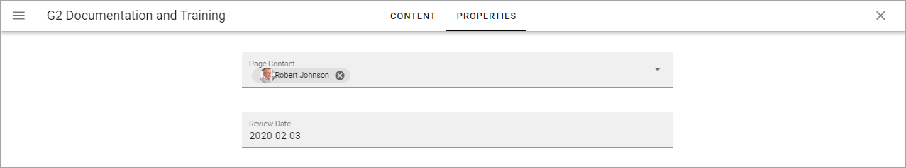
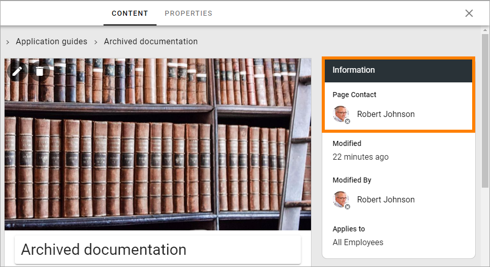
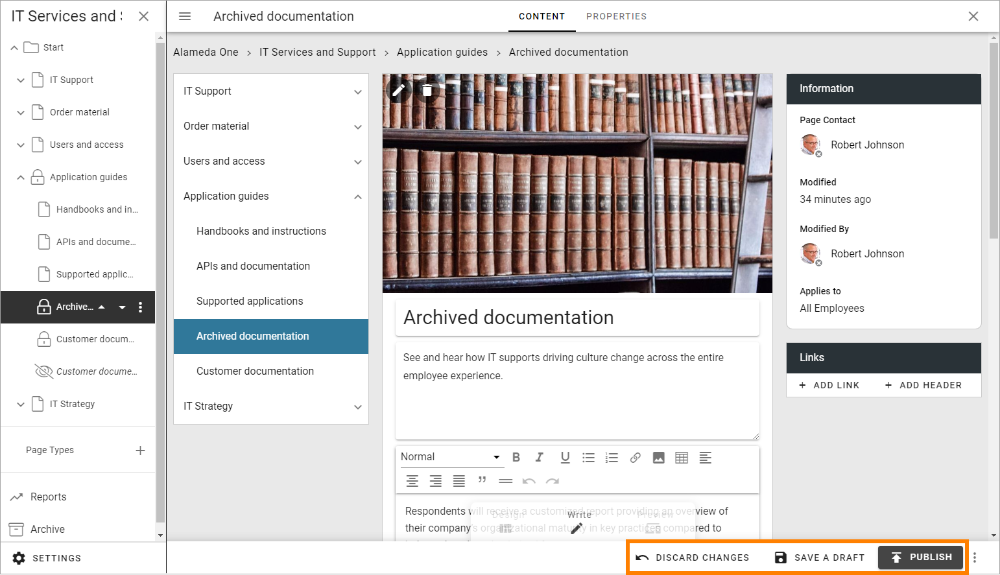

Edit a page
===========================================

The permissions needed to edit a publishing page depends on what is to be done. With Editor permissions you can use Design mode to add, move and remove blocks and edit contents. If you have Author permissions you can edit contents in some blocks, using Write mode.

**Note!** To be able to edit the top page in a Page Collection (often the start page) you must have Page Collection permissions.

When you need to edit a publishing page, do the following:

Click the Edit button:

If the page has been published at least once, you can go to the page before you enter edit mode. If not, go to any publishing page. When you have entered Edit mode you can then use the navigation tree to go to the page you will edit.

Open the navigation tree by clicking here, if it does'nt open automatically:

.. image:: open-navigation-edit-new2.png

And then use the navigation tree to go to the page you will edit:

When you go to a page to edit this way, you may have to reactivate Edit mode. In that case, click "Edit" at the bottom:

Edit contents
**************
If you have Author permissions for the page, Write mode is available for editing contents in some blocks. (If you have Editor permissions, you can edit the blocks the same way). 

In this example you can add content in the following areas in Write mode:

.. image:: write-areas-new2.png

You can:

+ Edit the Media block at the top, to replace the image or add a video instead.
+ Edit the three text blocks: 1) The page heading, 2) The introduction, which is a text field with no format options, 3) The content block, which contains rich text format options. See this page for more information on editing rich text: :doc:`Editing text with the RTF editor </general-assets/rtf-editor/index>`
+ Add links and headers to the Related links block.

The rest of the blocks on the page can't be edited this way.

**Note!** Even Content in blocks that are locked on the page type can be edited this way - if settings in the block allow it.

Edit blocks
************
To edit the blocks, that is, to add and delete blocks on the page, and to work with the block settings, you use Design mode (you must have Editor permissions to be able to do that):

.. image:: enter-design-mode-new2.png

How to work with blocks is described on this page: :doc:`Working with blocks on pages </blocks/working-with-blocks/index>`

Default blocks
***************
The default blocks that belong to the page type is generally locked, which means that you may add and edit contents, but you can't move or delete them, and not edit the settings. Although, you can normally add other blocks both above and below locked blocks, if you have Editor permissions.

When you click a block you can see that it's locked this way:

.. image:: locked-block-new4.png

If settings for the block allow it, it may be possible to unlock a block. It it's possible, the block is marked with a tiny dot in the icon.

.. image:: locked-block-unlock.png

When you click the icon, the following is shown:

.. image:: locked-block-unlock-message.png

As the message states, if you unlock a locked block, the inheritance is broken, meaning the settings you do for the block now are valid for this page only.

Page style
*************
There's also a number of style options available for a page, when Design mode is active, see: :doc:`Page style </general-assets/layout-explorer/page-layout/page-style/index>`

Reuse content
**************
It's possible to reuse contents from another page or another variation. The page where you want to reuse content must be in Edit mode. 

For more information about how to reuse content, see: :doc:`Reusable Content </pages/reusable-content/index>`

Change page type
*****************
It's possible to change page type, if you have Editor permissions, but be aware that some blocks are more suitable to wider sections of the page, so you may have to move or otherwise edit blocks after changing page type. 

**Note!** Changing the page type should primarily be done to a page that is fairly recently created. To change page type for a page with a lot of content may need a lot of work.

Do the following, if you need to change the Page Type:

1. Enter Edit mode if it's not already active.
2. Open the action menu at the bottom right.

3. Select CHANGE PAGE TYPE.

.. image:: change-page-type-new3.png

4. Open the list and select another Page Type.

.. image:: change-page-type-list-new.png

Page types can be tenant page types, meaning they are managed centrally in the tenant settings, or local, meaning they apply to this page collection only. For more info about page types, see:

+ :doc:`Page types </pages/page-types/index>`
+ :doc:`Tenant page types </admin-settings/tenant-settings/webcontent-managament/page-types/index>`

Edit page properties
*********************
If needed, you can edit the page properties, if you have at least Author permissions.

1. Enter Edit mode if it's not already active.
2. Click "PROPERTIES" at the top.

Available properties will differ depending on what has been set up. Here's an example:

.. image:: page-properties-shown-new2.png

3. Edit the properties as needed.

**Note!** Some blocks can display information from page properties. In this example "Page contact" displays the name from the "Page contact" field in the page properties.

4. Click CONTENT to go back to editing the page.

Save or discard changes
************************
When you're finished editing a page you must save your changes, or discard them if you don't want to keep them.

Use the options at the bottom to do that:

**Note!** A page is not shown to users until it has been published at least once. Changes to a published page are not shown to users until published.

