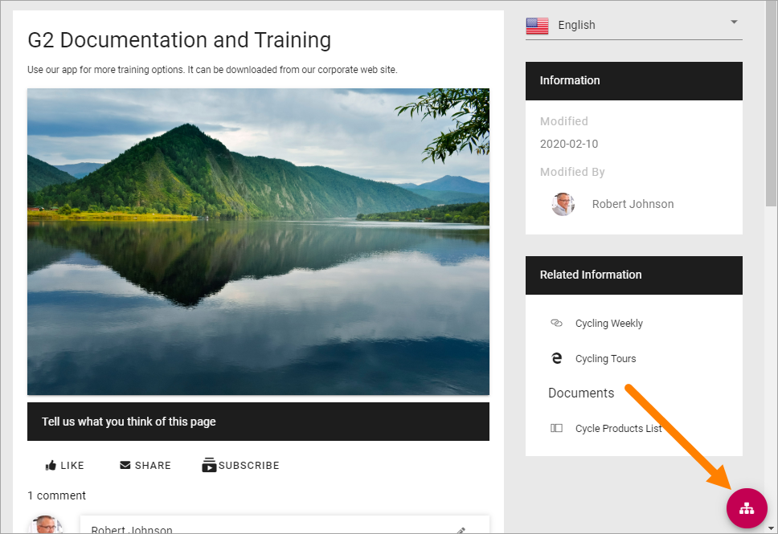
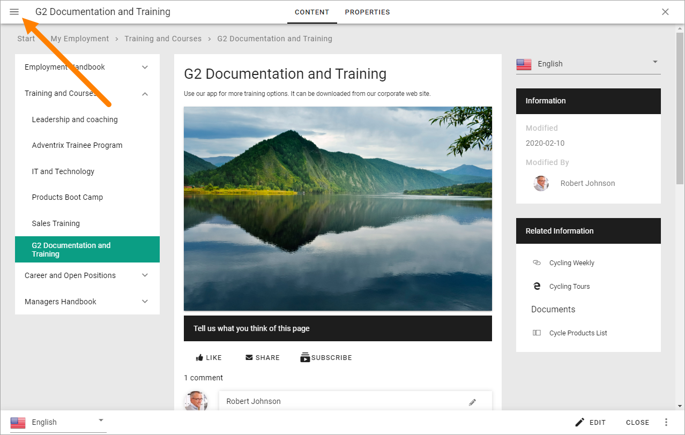
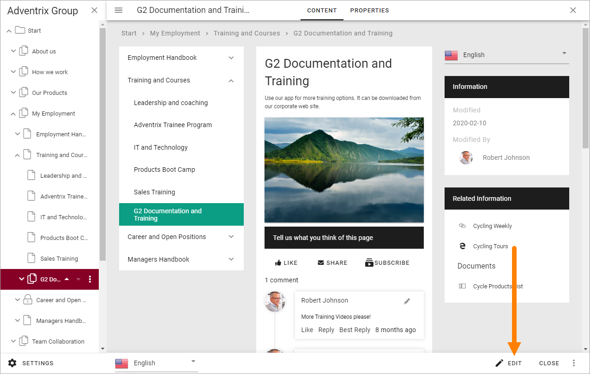
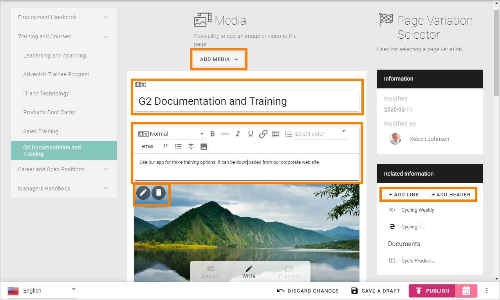
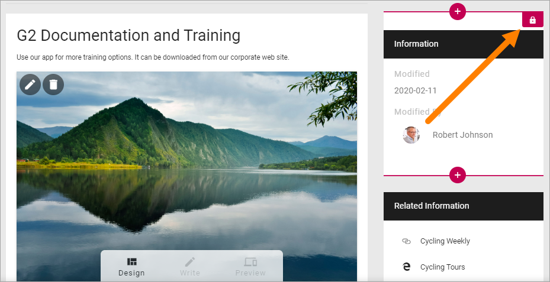
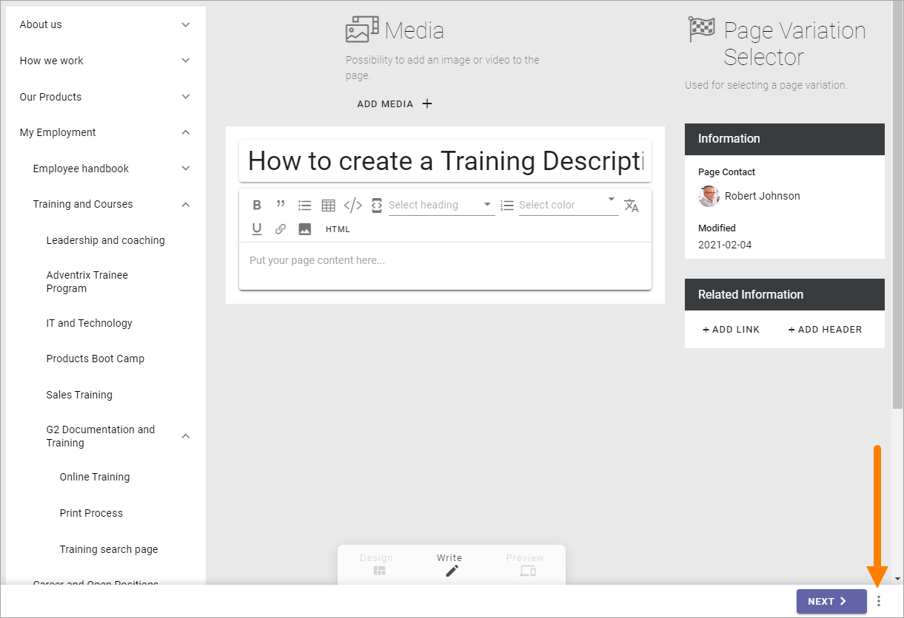
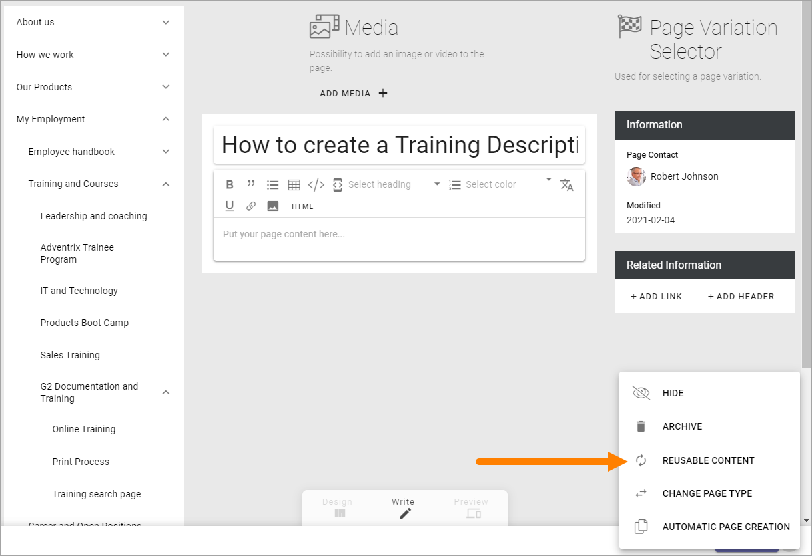
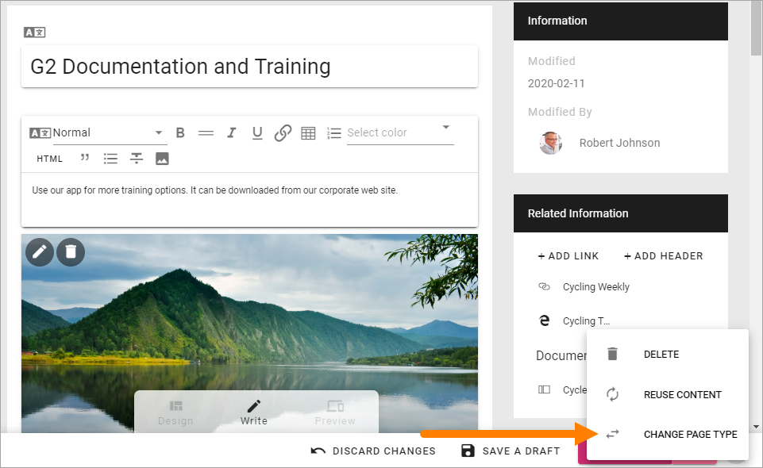
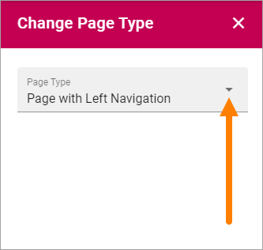
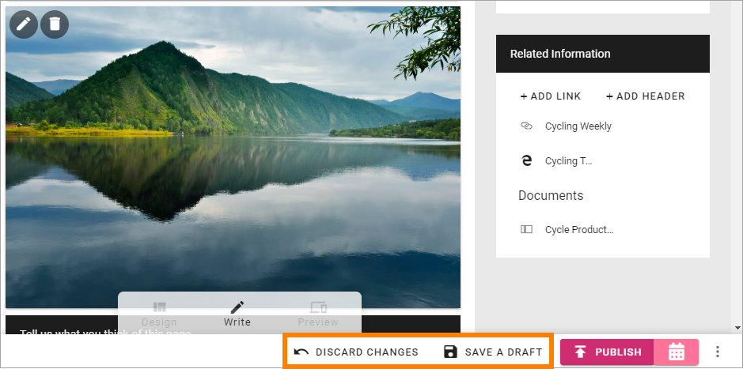

Edit a page
===========================================

The permissions needed to edit a publishing page depends on what is needed. With Editor permissions you can use Design mode to add, move and remove blocks and edit contents. If you have Author permissions you can edit contents in some blocks, using Write mode.

**Note!** To be able to edit the top page in a Page Collection (often the start page) you must have Page Collection permissions.

When you need to edit a publishing page, do the following:

Click the Edit button:

If the page has been published at least once, you can go to the page before you enter edit mode. If not, go to any publishing page. When you have entered Edit mode you can then use the navigation to go the page you will edit.

Open the navigation by clicking here, if it does'nt open automatically:

And then use the navigation to go to the page you will edit:

.. image:: go-to-page-new.png

When you go to a page to edit this way, you may have to reactivate Edit mode. In that case, click "Edit" at the bottom:

Edit Contents
**************
If you have Author permissions for the page, Write mode is available for editing contents in some blocks. (If you have Editor permissions, you can edit the blocks the same way). 

.. image:: write-mode-new2.png

In this example you can add content in the following areas in Write mode:

You can:

+ Add an image or video to the Media block at the top.
+ Edit the page heading.
+ Edit and format text to the Text block under the heading (The how extensive the formatting is).
+ Remove the image from the next Media block, or select another image or video to show there.
+ Add links and headers to the Related links block.

(The Current Navigation block, The Variation Selector block and the Page Properties block - the one with the title "Information" - can't be edited this way.)

You edit each block (the ones you can edit) as is described on the page for the respective block: :doc:`Blocks </blocks/index>`

**Note!** Even locked Content Blocks can be edited this way.

Edit Blocks
************
To edit the blocks, that is, to add and delete blocks on the page, and to work with the block settings, you use Design mode (you must have editor permissions to be able to do that):

.. image:: enter-design-mode-new.png

How to work with blocks is described on this page: :doc:`Working with blocks </blocks/working-with-blocks/index>`

Default blocks
***************
The default blocks that belongs to the Page Type is generally locked, which means that you can add and edit contents, but you can't move or delete them, and not edit the settings. Although, you can normally add other blocks both above and below locked blocks, if you have Editor permissions.

When you click a block you can see that it's locked this way:

Reuse content
**************
It's possible to reuse contents from another page or another variation. The page where you want to reuse content must be in Edit mode. Do the following:

1. Open the action menu at the bottom right:

2. Select REUSEABLE CONTENT.

The following is shown:

.. image:: select-reuse-content2.png

3. Click ADD SOURCE PAGE.

The Page Picker starts and you use to select a source page or variation. See this page for more information: :doc:`Page Picker </general-assets/page-picker/index>`

The properties that are or can be reused on the target page are listed, for example:

.. image:: reuse-content-list.png

If you don't want to reuse content from a property that is listed, clik the dust bin to trmovr it from the list.

If additional properties are availabl, you can add any of them using the "Select Property" list.

Also note that blocks resusing content are indicated this way:

.. image:: reuse-content-on-page.png

Change Page Type
*****************
It's possible to change Page Type, if you have Editor permissions, but be aware that some blocks are more suitable to wider sections of the page, so you may have to edit blocks after changing Page Type. Do the following;

1. Enter Edit mode if it's not already active.
2. Open the action menu at the bottom right.

.. image:: open-action-menu-new4.png

3. Select "CHANGE PAGE TYPE".

4. Open the list and select another Page Type.

Edit Page Properties
*********************
If needed, you can edit the Page Properties, if you have at least Author permissions.

1. Enter Edit mode if it's not already active.
2. Click "PROPERTIES" at the top.

.. image:: edit-properties-new.png

3. Edit the Properties as needed.
4. Click "CONTENT" to go back to editing the page.

.. image:: page-properties-shown-new.png

**Note!** Some blocks can display information from the Page Properties. In this example "Page Contact" displays the name from the "Page Contact" field in the Page Properties.

.. image:: page-contact-example-new.png

Save or discard changes
************************
When you're finished editing a page you must save your changes, or discard them if you don't want to keep them.

Use the options at the bottom to do that:

**Note!** A page is not shown to users until it has been published at least once. Changes to a published page are not shown to users until published.

Page Style
*************
There's also a number of style options available for a  page, see: :doc:`Page Style </pages/page-style/index>`
