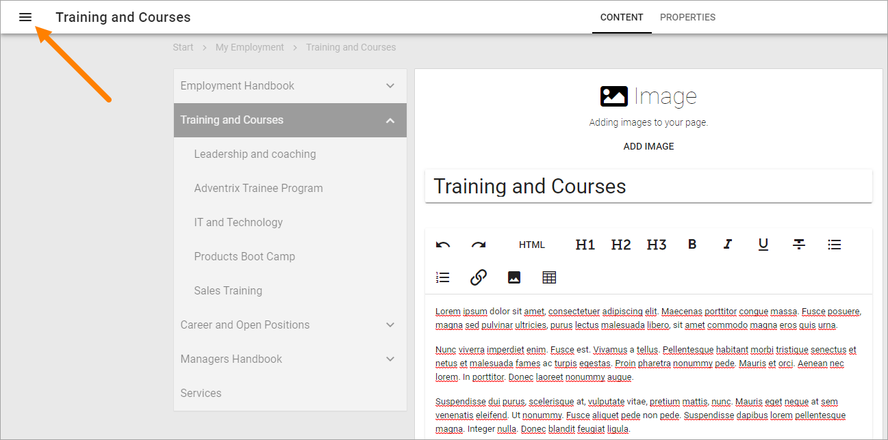
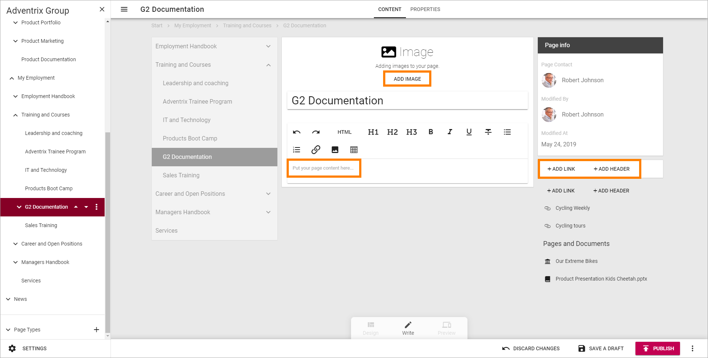
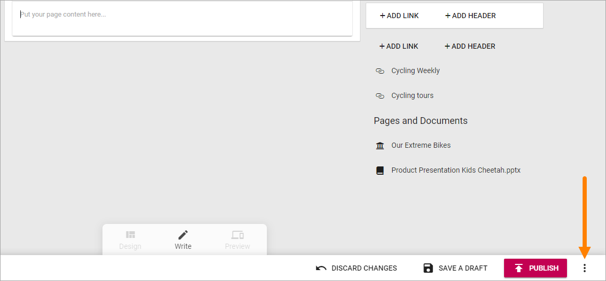
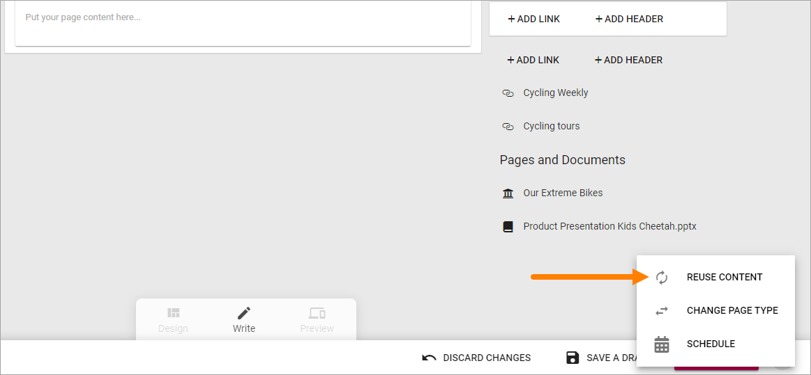
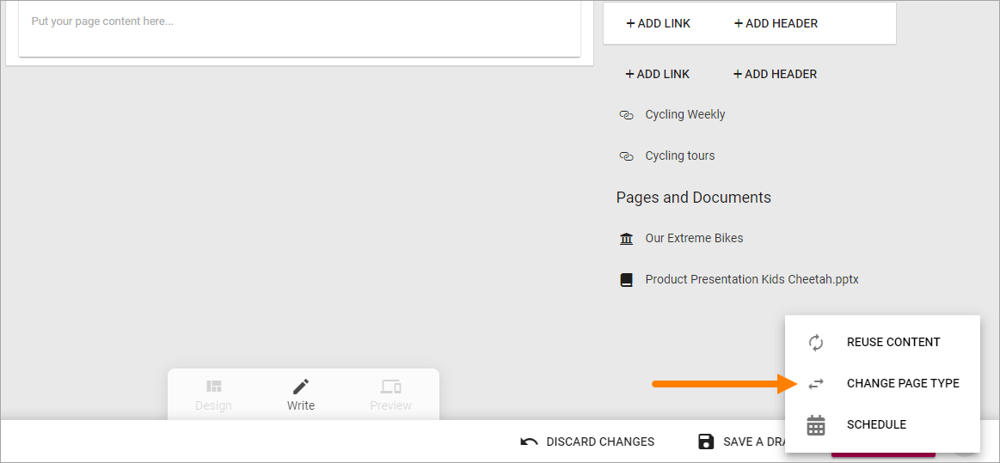
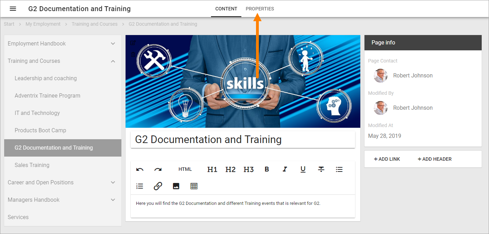
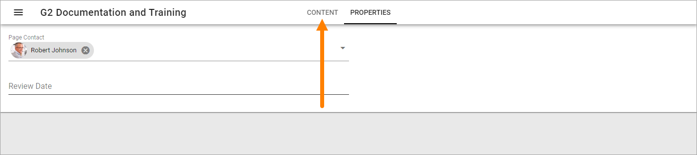
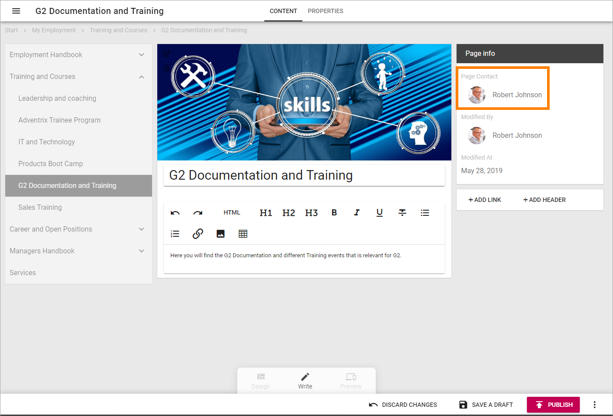
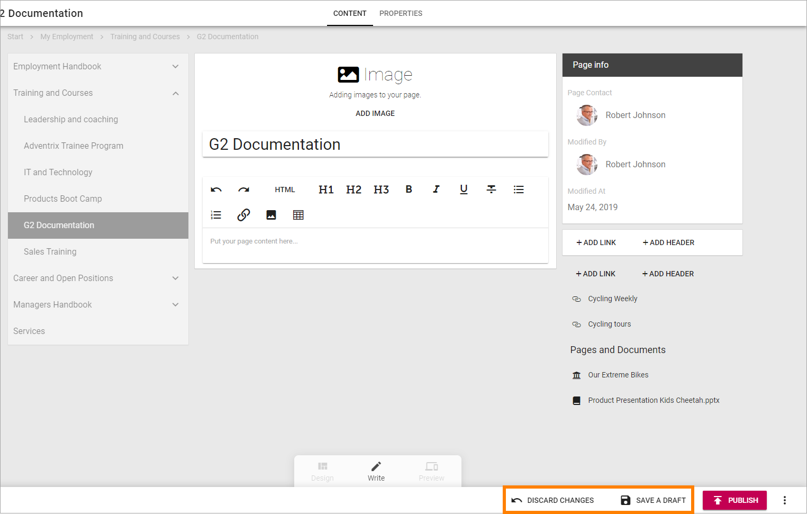

Edit a page
===========================================

When you need to edit a publishing page, do the following:

Click the Edit button to enter Edit mode:

.. image:: enter-edit-mode.png

If the page has been published at least once, you can go to the page before you enter edit mode. If not, go to any publishing page. When you have entered Edit mode you can then use the navigation to go the page you will edit.

Open the navigation by clicking here:

And then use the navigation to go to the page you will edit:

.. image:: go-to-page.png

When you go to a page to edit this way, you may have to reactivate Edit mode. In that case, click "Edit" at the bottom:

.. image:: edit-page-edit.png

Edit Contents
**************
If you are going to just edit contents, for example in a text block, select the "Write" mode (which is the default selection).

.. image:: write-mode.png

In this example you can add content in the following areas in Write mode:

+ Add an image or video to the Image block.
+ Add and format text to the Text block.
+ Add links and headers to the Related links block.

(The Bread Crumb block - at the very top, the Current Navigation block and the Page Properties block - the one with the title "Page info" - can't be edited this way. In the Page Type in this example they are locked.)

You edit each block (the ones you can edit) as is described on the page for the respective block: :doc:`Blocks </blocks/index>`

Edit Blocks
************
To edit the blocks, that is, to add and delete blocks on the page, and to work with the block settings, you use "Design mode":

.. image:: enter-design-mode.png

How to work with blocks is described on this page: :doc:`Working with blocks </blocks/working-with-blocks/index>`

Default blocks
***************
The default blocks that belongs to the Page Type is generally locked, which means that you can add and edit contents, most likely edit settings, but you can't move or delete them. Although, you can normally add other blocks both above and below lockad blocks.

When you click a block you can see that it's locked this way:

.. image:: locked-block.png

Reuse content
**************
It's possible to reuse contents from another page. The page where you want to reuse content must be in Edit mode. Do the following:

1. Open the action menu at the bottom right:

2. Select "REUSE CONTENT".

3. Add a page Url and click "Resolve".

.. image:: add-page-url.png

A tip is to either have copied the page Url earlier, or to open another browser window, go the page, copy the Url and paste it here.

Change Page Type
*****************
It's possible to change Page Type, but be aware that some blocks are more suitable to wider sections of the page, so you may have to edit blocks after changing Page Type. Do the following;

1. Enter Edit mode if it's not already active.
2. Open the action menu at the bottom right.

3. Select "CHANGE PAGE TYPE".

4. Open the list and select another Page Type.

.. image:: change-page-type-list.png

Edit Page Properties
*********************
If needed, you can edit the Page Properties.

1. Enter Edit mode if it's not already active.
2. Click "PROPERTIES" at the top.

3. Edit the Properties as needed.
4. Click "CONTENT" to go back to editing the page.

**Note!** Some blocks can display information from the Page Properties. In this example "Page Contact" displays the name from the "Page Contact" field in the Page Properties.

Save or discard changes
************************
When you're ready editing a page you must save your changes, or discard them if you don't want to keep them.

Use the options at the bottom to do that:

**Note!** A page is not shown to users until it has been published at least once. Changes to a page are not shown to users until published.

