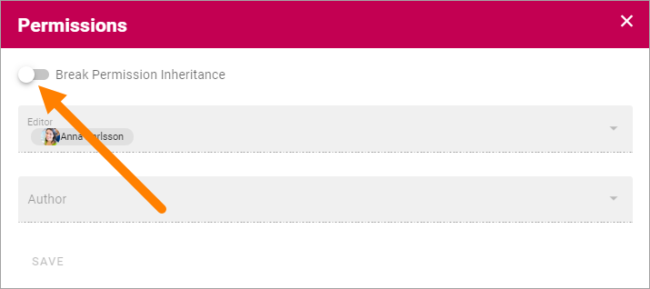
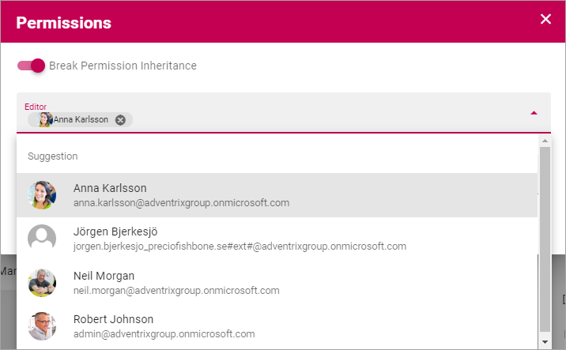
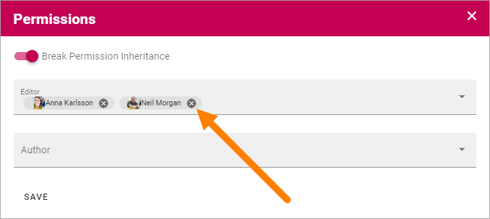

Edit Permissions for a page
=============================

(Documentation just started, will be finiesh soon.)

Default settings is that the same read or edit permissions apply to all pages, but that can be edited if needed. If you change permissions for a pahe that has sub pages, all the sub pages gets the new permissions.

Do the following:

1. Open Edit Mode.
2. Select the page where you need to edit permissions.
3. Open the menu and select "Permissions".

.. image:: page-select-permissions.png

Omnia works with inheritance, just as Sharepoint does, so the first thing you have to do is:

4. Click to break permission inheritance

You can now set the following permissions, for this page and all sub pages:

+ **Editor**: Can create, delete and move pages and nodes, can use both Design mode and Write mode and can edit permissions here.
+ **Author**: Can create pages and can use Write mode.

**Note!** Page Selection administrators and Publishing App administrators are always permitted to edit pages (Eitor permissions) but it's not set up automatically, so these administrator must open the permissions as described here, and add themselves to the list.

Editor permissions must be set but not necessarily Author permissions. It's up to the specific implementation to decide.

5. To add an Editor or an Author, just open the list en select the user.

You can also search for users the same way as in other people lists.

6. To remove a user from one of the list, click the x. 

7. Click "SAVE" when you're done. (If you don't want to save, just close the window to ignore the changes).

