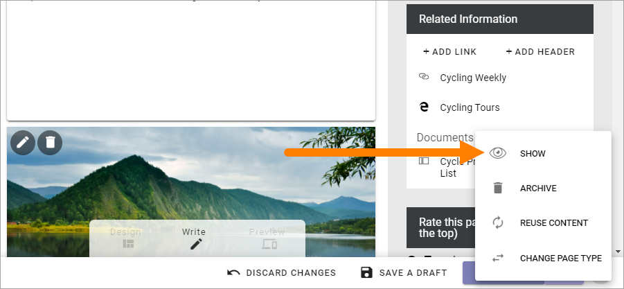
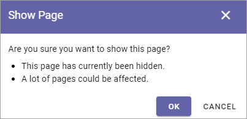

Hide a page
==============

Using this option you can hide a page, draft or published, or a whole section of main page and sub pages. Even a page that has been published for a while, with any number of versions, can be hidden.

You can then unhide (Show) when it's time to make to page(s) available.

While a page is hidden it can not be found through search, not by anyone, in fact even not by yourself. The only way to access a hidden page is through tha navigation when in edit mode.

You can hide any number of sub pages in one go. Just select the main page and hide, and all sub pages are also hidden. The reverse is also true, unhide the main page and all sub pages are also unhidden.

Hide a page
************
To hide a page, do the following:

1. Open a page for editing.
2. Select the page in the navigation (sub pages are automatically selected).

.. image:: hide-select.png

3. Open the Action meny in the lower right corner.

.. image:: hide-menu.png

4. Select HIDE.

.. image:: hide-menu-select.png

Something like the following is shown:

..image:: hide-message.png

Note the message "A lot of pages could be affected" which is an indication of that sub pages exists.

5. Click OK to hide.

A hidden page is indicated this way in the navigation:

.. image:: pages-hidden.png

Show a hidden page
*********************
You show a hidden main page and all it's sub pages in one go. You can't show a sub page separately for a main page that is hidden.

To show a hidden page and all it's sub pages, do the following:

1. Select the (main) page in the navigation:

2. Open the Action menu and select SHOW.

Something like to following is shown:

3. Click OK to show the page with all sub pages.

