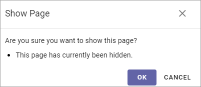

Hide one or more pages
==============================

Using this option you can hide a page, draft or published, or a whole section of main page and sub pages. Even a page that has been published for a while, with any number of versions, can be hidden.  

You can then unhide (Show) when it's time to make the page(s) available.

While a page is hidden it can not be found through search, not by anyone, in fact even not by yourself. The only way to access a hidden page is through the navigation when in edit mode.

You can hide any number of sub pages in one go. Just select the main page and hide, and all sub pages are also hidden. The reverse is also true, unhide (Show) the main page and all sub pages are also unhidden.

Hide a page
************
To hide a page, do the following:

1. Open any page for editing.
2. Select the page in the navigation (sub pages are automatically selected).

.. image:: hide-select-new.png

3. Open the Action menu in the lower right corner.

.. image:: hide-menu-new.png

4. Select HIDE.

.. image:: hide-menu-select-new.png

Something like the following is shown:

.. image:: hide-message-new.png

If you selected a page that has sub pages, you are made aware of the fact by the message "A lot of pages could be affected":

.. image:: hide-message-several.png

5. Click OK to hide.

A hidden page is indicated this way:

.. image:: pages-hidden-new-frame.png

Show a hidden page
*********************
You show a hidden main page and all it's sub pages in one go. You can't show a sub page separately for a main page that is hidden.

To show a hidden page and all it's sub pages, do the following:

1. Select the (main) page in the navigation:

.. image:: unhide-select-new.png

2. Open the Action menu and select SHOW.

.. image:: unhide-show-new.png

Something like to following is displayed:

If the page has sub pages (that also will be shown now), you are made aware of that fact through this message:

.. image:: unhide-show-message-several.png

3. Click OK to show the page with all sub pages (drafts remain drafts of course).

