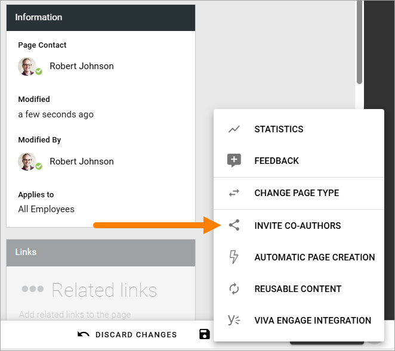
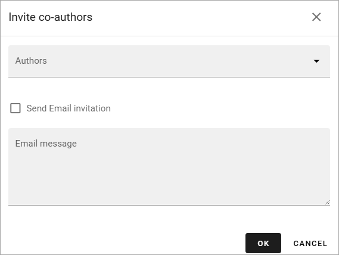
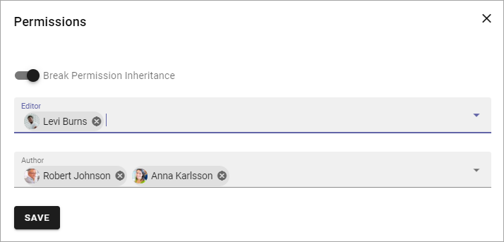

Invite co-authors
==================

If settings in the page collection allow it, authors can invite co-authors for the page. Regarding permissions, co-authors will simply be authors, there's no separate permission for co-authors.

Aonther thing to be aware of is that permission inheritance will be broken when co-authors are invited, if it isn't already, as the permission settings will be specific for the page.

For more information about the settings, see: :doc:`Page collections </pages/page-collections/index>`

This is how it's done:

1. Edit the page.
2. Open the menu and select INVITE CO-AUTHOR.

3. Add co-author(s).

+ **Authors**: Add one or more colleagues to the list.
+ **Send Email invitation**: You can choose to send an Email invitation to the would be co-authors. The Email contains a link to the page. 
+ **Email message**: If you send an Email invitation, use this field to enter a message.

4. Click OK when you're done, to save the settings. If you have chosen to send an Email message, it is now sent.

Under "Permissions" for the page in question, you can now see (if you are page collection administrator) that permission inheritance is broken for the page, which is needed for specific permission settings for this page. The invited co-authors are added to the Author field, for example:

Of course, page collection administrators can use the permission settings for a page to do this, but when it's allowed to invite co-authors, authors can do this as well, using the INVITE CO-AUTHOR option.

**Note!** To remove co-authors you need to be page collection administrator as this is done through the Pemission settings for the page.

