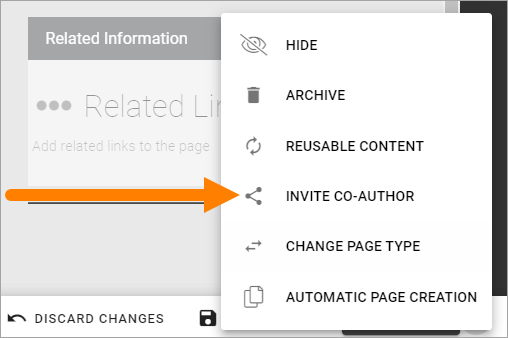

Invite co-authors
==================

If Page Collection settings allow it, authors can invite co-authors to help edit a page.

For more information about the settings, see: :doc:`Page Collections </pages/page-collections/index>`

This is how it's done:

1. Edit the page in question.
2. Open the menu and select INVITE CO-AUTHOR.

3. Add co-authors.

.. image:: co-author-dialog.png

+ **Authors**: Add one or more colleagues to the list.
+ **Send e-mail invitation**: You can choose to send an e-mail invitation to the would be co-authors. The e-mail contains a link to the page. 
+ **E-mail message**: If you send an e-mail invitation, use this field to enter a message.

4. Click OK when you're done, to save the settings. If you have chosen to send an e-mail message, it is now sent.

Under Permissions for the page, you can now see that permission inheritance is broken for the page, which is needed for specific permission settings for this page. The main editor is added to the Editor field and the invited co-authors are added to the Author field, for example:

.. image:: permission-co-authors.png

Of course, Page Editors (Design permission) can use the permission settings for a page to do this here, but when it's allowed to invite co-authors, authors can do this as well, using the INVITE CO-AUTHOR option.

