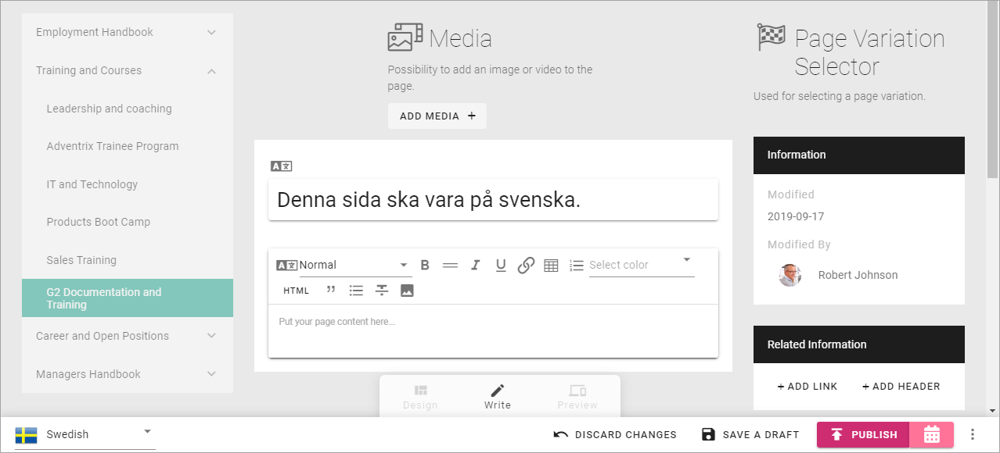

Language versions of a page
===========================================

Do you need to publish a page in more than one language? Then you use the option "Page Variations". 

First a Publishing App Administrator must set up the variations in the Settings, see this page: :doc:`Publishing App settings </pages/page-settings/index>`

A specific author can be set up for a variation, and if not, all authors of a page can edit all variations.

In Omnia 6.5 you will have an additional option. You can either set up a variation for editing by a Variation Author, or you can set up a variation for Automatic Machine Translation. You can decide this for each variation, either a Variation Author or Automatic Machine Translation. 

If variation pages are edited by variation authors, there's still the possibility to use machine translation as a support tool. Machine translation can, in that case, be set up to be a part of the RTF Editor for text blocks.

See this page for information about setting up the RTF editor: :doc:`RTF Editor Settings </admin-settings/tenant-settings/settings/rtf-editor/index>`

And this page for information about how to use it: :doc:`The RTF Editor </general-assets/rtf-editor/index>`

To edit a page variation (if Automatic Machione Translation is not used), for example for another language, do the following:

1. Edit the page.
2. Select variation to work with.

.. image:: select-variation-new3.png

3. Edit the blocks as usual.  

4. Save and publish as ususal.
