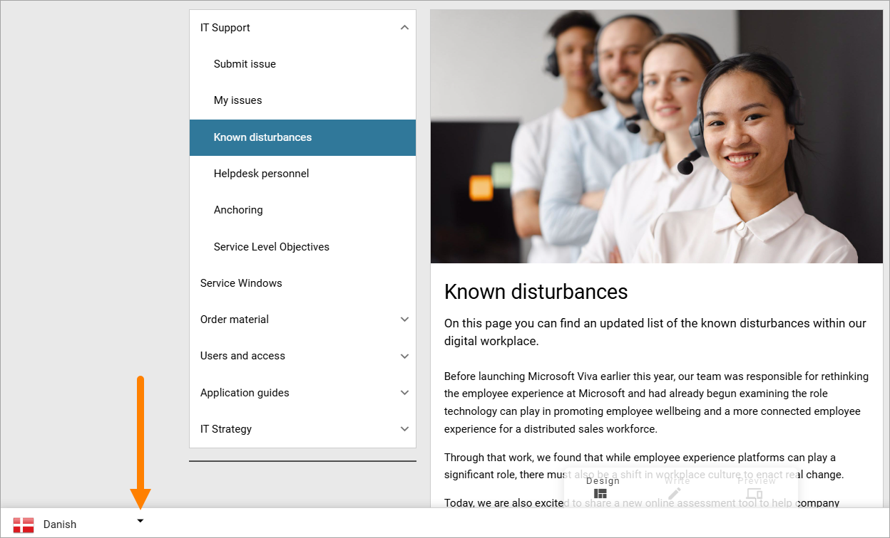
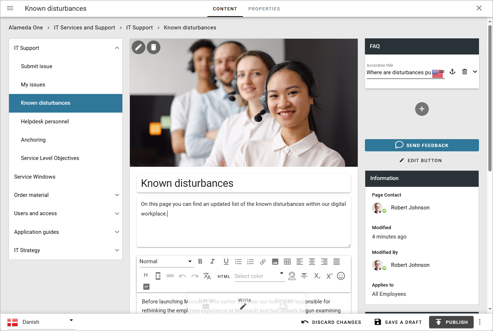

Language versions of a page
===========================================

Do you need to publish a page in more than one language? Then you use the option "Page variations". 

First a publishing app administrator must set up the variations in the settings, see this page: :doc:`Publishing app settings </pages/page-settings/index>`

A specific author can be set up for a variation, and if not, all authors of a page can edit all variations.

You can either set up a variation for editing by a variation author, or you can set up a variation for automatic machine translation. You can decide this for each variation, either a variation author or automatic machine translation. Note that a a variation created with machine translation can not be edited.

**Note!** Machine translation is not available in Omnia on-prem.

If variation pages are edited by variation authors, there's still the possibility to use machine translation as a tool. Machine translation can, in that case, be set up to be a part of the RTF editor for text blocks.

See this page for information about setting up the RTF editor: :doc:`RTF editor settings </admin-settings/tenant-settings/settings/rtf-editor/index>`

And this page for information about how to use it: :doc:`The RTF editor </general-assets/rtf-editor/index>`

To edit a page variation (if automatic machine translation is not used), for example for another language, do the following:

1. Edit the page.
2. Select variation to work with.

3. Edit the content/blocks as usual, for this language.  

4. Save and publish as ususal.

For more information, see: :doc:`Edit page variations </pages/edit-page-variations/index>`

