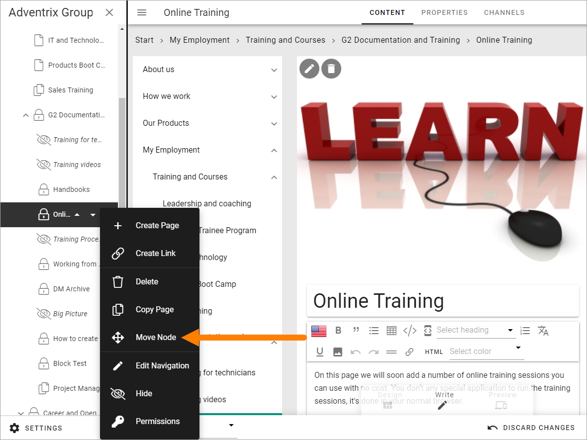

Move one or several pages
===========================================

You can always easily move a page to another position on the same level (within the parent node). By using the navigation tree, you can move a node (one page or a page with all sub pages) to any position in the navigation tree, even to other page collections within the publishing app. 

Move a page on the same level
******************************
Do the following to move a page within the same level:

1. Open the page in Design mode.

The navigation structure with the existing pages are now opened to the left:

.. image:: page-structure-new3.png

If you're already editing the page or the navigation won't open automatically, you can click here to open the navigation:

.. image:: open-navigation-new3.png

2. Select the page you want to move.

.. image:: move-page-select-new2.png

3. Use the triangles to move the page up or down.

4. Save a draft or Publish when you're done.

Move a node
******************
The option "Move Node" can be used for moving a single page or a page with all it's sub pages, aynwhere within the publishing app.

Note that you need to use this option if you want to move a single page outside the current level.

1. Select the node you want to move.
2. Open the navigation tree (if it's not already open) and select "Move Node".

3. Navigate to the page where the selected page(s) will be placed as a sub navigation.

.. image:: navigate-node-new3.png

4. Click "Save".

The page(s) are now moved to the new location. 

