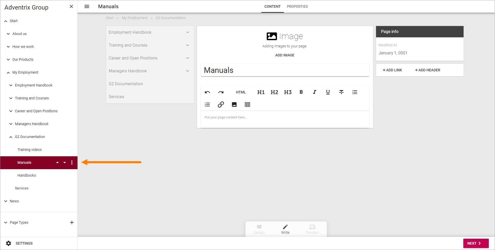

Move a page
===========================================

You can move a page to another position on the same lavel (within the parent node). Dffo the following:

1. Point at the Edit button.

.. image:: select-edit.png

2. Select to edit navigation.

.. image:: edit-navigation.png

The navigation structure with the existing pages are now opened to the left:

3. Select the page you want to move.

4. Use the triangles to move the page up or down.

.. image:: move-page-traingles.png

5. Save the draft or publish.

