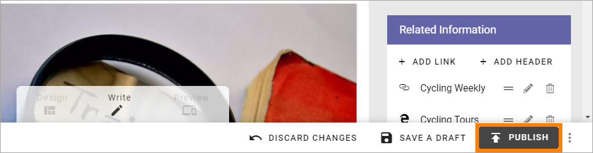
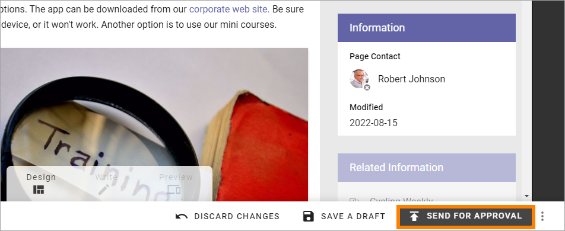
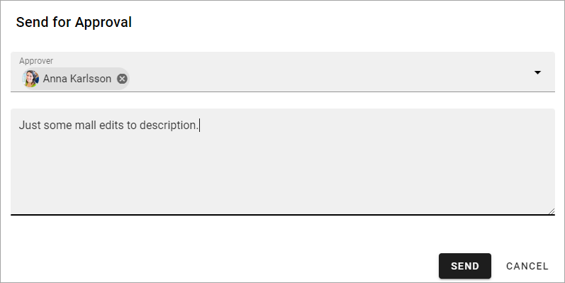
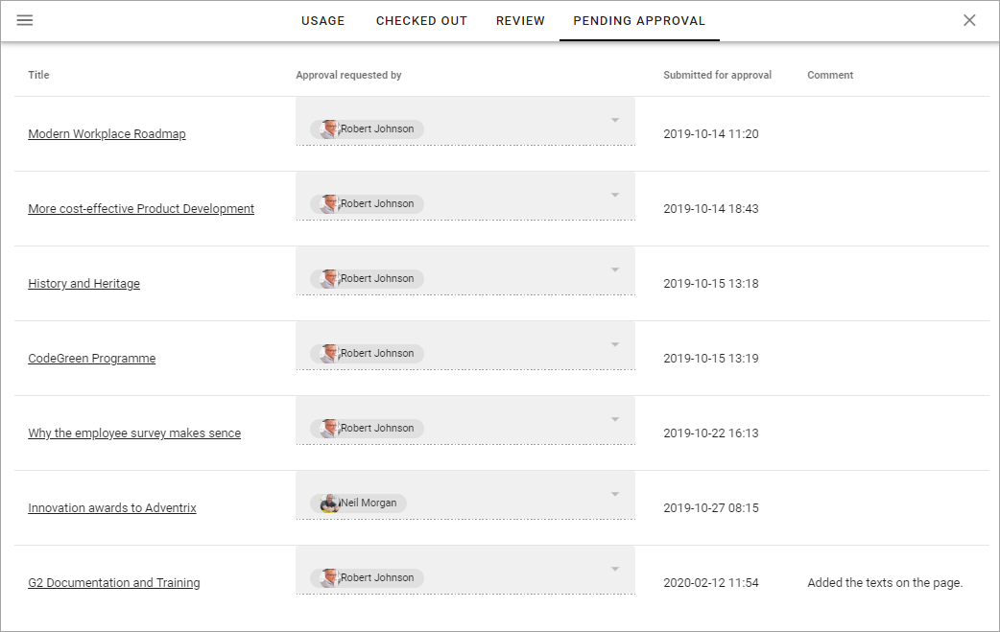
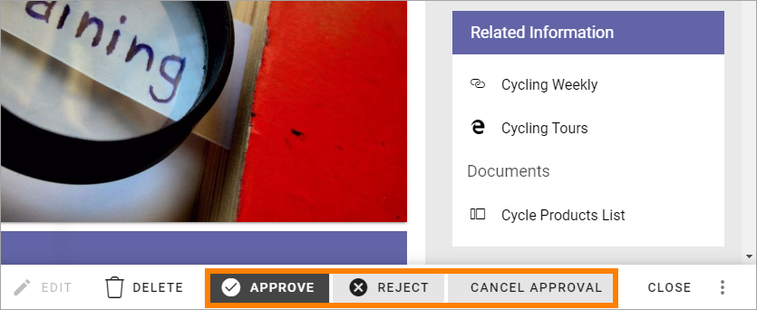

Approve pages
===========================================

This page describes approval of pages in a single step, by one approver, that has been available to set up in Omnia for quite a while. It's still available the same way as before, but a multi-step aporoval functionality is also availble, that can be configured in many different ways.

The multi-step option is described on this page: :doc:`Using multi-step approval </pages/page-approval/using-multi-step-approval/index>`

Omnia can be set up for approval of pages, meaning someone must approve publication of a new page or edits to a page. Approval is set up on page collection level (meaning you have to be page collection administrator to do that).

The label for the publish button will indicate if approval is required or not. If approval is not set up, the label will simply be PUBLISH:

If approval is required the label for the button is instead "Send for approval":

Setting up approval
*********************
Do the following to set up approval:

1. Go to the page collection settings in question (see the sections about settings for approval on this page: :doc:`Page collection settings </pages/page-collections/page-collection-settings/index>`. 
2. Select SETTINGS.
3. Select "Enable approval" and choose how approval will be executed.

Sending for approval
*********************
When an editor has created a new page or edited a page, these are the simple steps to send for approval:

1. Click "Send for approval".
2. Add a comment about what has been done, if needed.

3. Click ¨SEND.

An Email is now sent to the approver(s) and the request is also placed in the Pending approval list.

**General note**: For a user to be able to receive Emails, the acccount must be email enabled.

Approve or reject
*******************
An approver uses this list, found under "Reports" in the navigation tree, when editing pages to approve or reject a page approval:

To approve or reject publication of a page, do the following:

1. Click the link in the "Title" column, to go to the page.
2. Check the new page for edits and decide what to do:

3. If you click APPROVE the page is published. 

If you click REJECT the page is not published and you add a message to the editor:

.. image:: aproval-reject-new.png

4. Click SEND to send the message to the editor.

When the editor has done the changes you have pointed out, the editor sends the page for approval once more the same way.

The option CANCEL APPROVAL cancels the approval process and removes the page from the Pending approval list.

