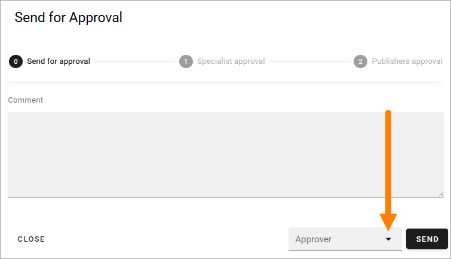
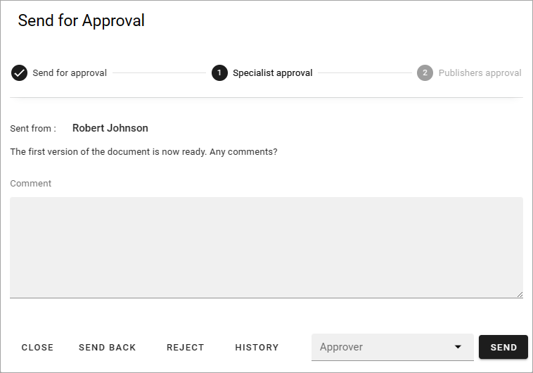
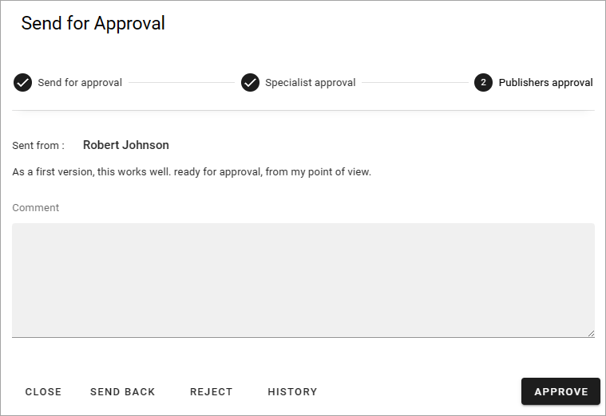
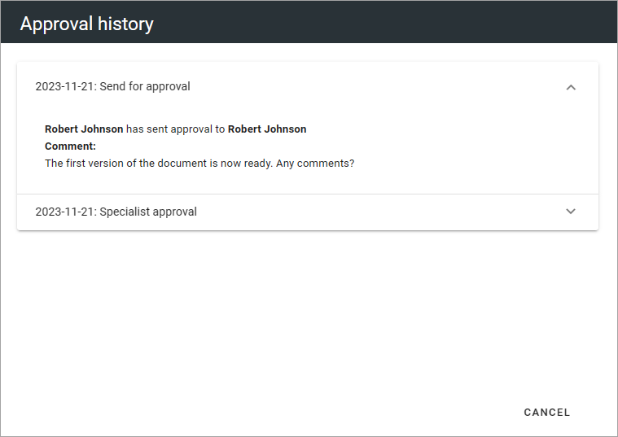

Using multi-step approval for pages
=============================================

In Omnia 7.1 and later, multi-step approval can be set up. This page contains a simple example.

Multi-step approval must be activated in the page collection settings. For information on how to activate and set up this option, see the following page: :doc:`Page Collection Settings </pages/page-collections/page-collection-settings/index>`

The possibilities in the setup is almost endless. Here's a simple example with two steps.

First, the author of the page sends the page for approval when he or she is ready for that.

.. image:: multi-approval-author-new-frame.png

And then the author can add a message to the approvers. Als note that, if more than one approver is available for the first step, the author must select approver in the list (only one colleague can approve in each step).

The author then clicks SEND to start the approval process. If the author selects CLOSE instead, the approval process is simply not started.

The approver for the first step then recieves a message concerning approval of the page, opens the message and starts the process, for example:

In this example the first step is approval from a specialist. At the top information about the steps in the approval is shown. 

A multi step approval can be setup in many ways. The following options CAN be available:

+ **Comment**: Always required to approve each step. Can also be useful when sending the approval request back one step, to explain why you did that.
+ CLOSE: Just used to close the approval for another time.
+ SEND BACK: Use this button to send the approval back one step. If used in the first step it's simply a message to the author that the page was not ready, or perhaps the approval request was sent to the wrong person.
+ REJECT: Use this option to reject the publication. If this option is used in an earlier step, the step after this is not used.
+ HISTORY: Using this option you can see the history of this approval, the actions by the approvers and messages written. 
+ SEND: Used to send the approval to the next step
+ Approver: If more than one colleague is available for approval in this step, this list is used to select approver. See below for more information.
+ APPROVE: Used in the final step to approve publication of the page. The page is always published when the approver of the last step clicks this button.

Which colleagues should be available for approval for a specific step can be setup in several ways. If a few colleagues are available, they are listed there. If any colleague could be chosen as approver, it can look like this. Note that a search field is available.

.. image:: multi-approval-search.png

Here's an example of a final approval step. In this example, the approver is predermined. Therefore there's no list. The message shown is from the step before this.

To see actions and messages from the steps before this, use the history. Here's an example with the information from the first step expanded:

(CANCEL in this dialog, is just used to close the dialog, not to cancel the approval.)
