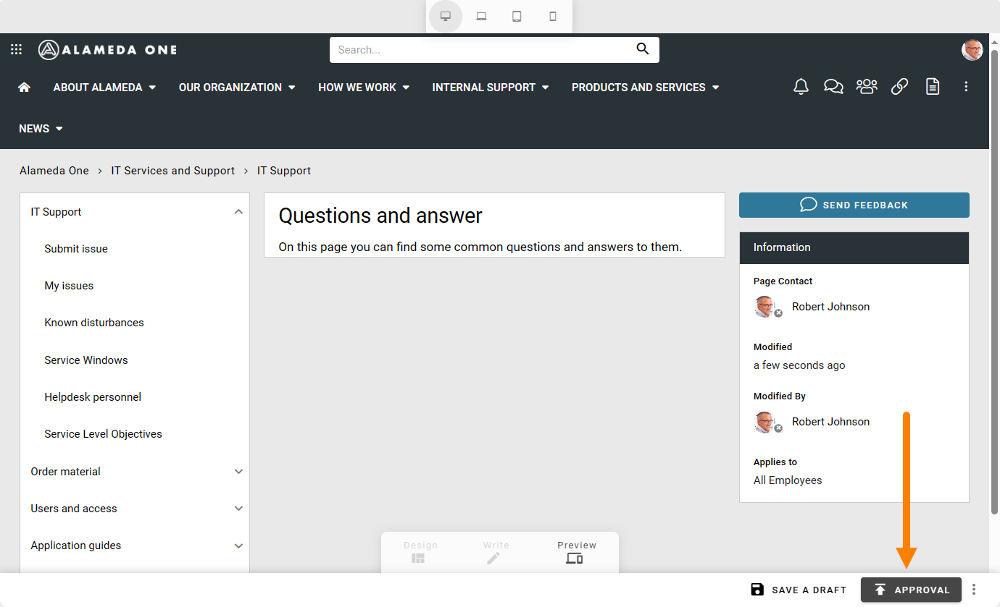
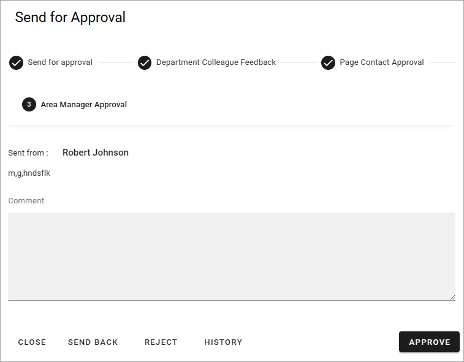

Using multi-step approval for pages
=============================================

**This page is just started. Note that the information added here are still preliminary.**

In Omnia 7.1 and later, multi-step approval can be set up. This page contains a simple example.

Multi-step approval must be activated in the page collection settings. For information on how to activate and set up this option, see the following page: :doc:`Page Collection Settings </pages/page-collections/page-collection-settings/index>`

The possibilities in the setup is almost endless. Here's a simple example with two steps.

First, the author of the page publishes when he or she is ready for that.

And then the author can add a message to the approvers. Als note that, if more than one approver is available for the first step, the author can select approver in the list.

.. image:: multi-approval-author-message.png

The author then clicks SEND to start the approval process. If the author selects CLOSE instead, the approval process is simply not started.

The approver for the first step then recieves a message concerning approval of the page, for example:

In this example the first step is Area manager approval and who that is, is pre determined in the setup. Another possibibility is that the setup allows the author to select approver for the first step.

At the top information about the steps in the approval is shown. You can use these options, if available:

+ **Comment**: Always required to approve this step. Can also be useful when sending the approval request back one step, to explain why you did that.
+ CLOSE: Just used to close the approval for another time. Always avaialble.
+ SEND BACK: Use this button to send the approval back one step, if available. If used in the first step it's simply a message to the author that the page was not ready, or perhaps the approval request was sent to the wrong person.
+ REJECT: Use this option to reject the publication, if availble. If this option is used in an earlier step, the step after this is not used.
+ HISTORY: using this option you can see the the history from this approval, the action by the approvers and messages written. Always available.
+ SEND: 
+ APPROVE: 

