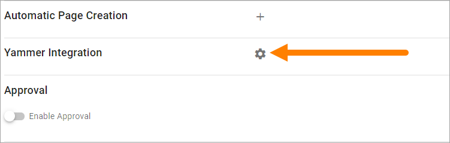
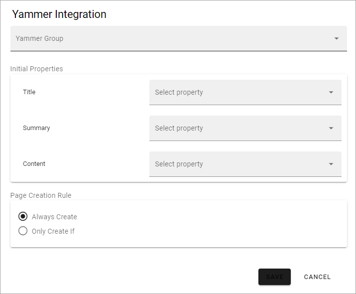

Page Collections
==================

Within a Publishing App a number of Page Collections can exist, where some settings can differ, for example if approval of new pages are needed or not. 

A Page Collection contains, as the name imply, a number of pages.

If the Feature “Default Page Collections and Page Types” has been activated, two Page Collections has been created; Start and News. If needed, additional Page Collections can be created within the Publishing App.

For Page Collections permissions, see this page: :doc:`Page Collection permissions </pages/page-collections/page-collection-permissions/index>`

Page Collection Settings
*************************
A number of settings can be edited for the Page Collection, this way:

1. Edit a page in the Publishing App and open the Page menu.
2. Click the main navigation node for the Page Collection.

In this example, three Page Collections has been added in the Publishing App, besides Start and News, and "Start" is selected:

.. image:: page-collection-general-news2.png

3. Click "Settings".

.. image:: page-collection-click-settings-new2.png

4. Click "Edit" at the bottom to edit the settings.

.. image:: page-collection-click-edit-new2.png

4. Use the following settings (image from Omnia 6.12):

.. image:: page-collection-settings-612.png

All settings are not shown in the image above, but listed below.

Use the settings this way:

+ **Navigation Structure/Flat**: This option is available in Omnia 6.12 and later. Select page collection type here; using a navigation structure or flat.
+ **Title**: The Title for the Page Collection is shown here. It can be edited if needed. It's updated everywhere it's shown when the changes here are published.
+ **Layout**: Applicable for Communities. Here a Layout can be selected. Layouts for Communtites works somewhat like Page Types, but can contain a full set up, ie for several pages. Layouts are created in Omnia Admin.
+ **Create Page Dialog**: You can set the title for the dialog displayed when an editor has selected to create a new page. If you leave this field blank, the dialog title will be "Create New Page".
+ **Show Url**: If the Url for the new page should be shown for the editor when creating a page, select this option. The Url can then be edited.
+ **Show Properties**: If available Page Properties should be shown for the editor when creating a page, select this option. The Properties can then be edited in that stage. Page Properties can always be edited after the page has been created.
+ **Auto Publish**: This is a setting probably most relevant for Communities. If this option is selected a new page is always published automatically. It's only applicable when a new page is created, not when it's updated.
+ **Page Types**: Select which of the Page Types that should be available for an editor to select when creating a page in this Page Collection. It can be Local Page Types or Tenant Page Types. Tenant Page Types are indicated by the text "(Tenant)". For more information about Tenant Page Types, see this page: :doc:`Tenant Page Types </admin-settings/tenant-settings/webcontent-managament/page-types/index>`. In Omnia 6.8 and later you can set default values for the Page Types, see below.
+ **Automatic Page Creation**: A copy of a page can be published automatically to another Page Collection when certain rules are met. These rules can be set up here. For more information, see this page: :doc:`Automatic Page Creation </pages/automatic-page-creation/index>`
+ **Yammer Integration**: When Yammer Integration is setup, a post will be created in the selected Yammer community whenever a new page, matching the selected criteria, is created. See below for more information.
+ **Enable Approval**: If Approval should be needed for publication of pages (new pages and updates), enable this. If not enabled, editors can publish themselves. See more info about Approval settings below.
+ **Enable Activity Tracking**: For a Community, Activity Tracking can be activated. See the heading *Settings for Activity Points* on this page, for more information: :doc:`Setting up a Community </using-communities/settings/index>` 
+ **Reset notification when page is modified**: This setting defines when a notification that a page is new should be shown for users, for example in the Notification Panel. Normally it's only when the page is created, not when it's updated. If this option is activated the page is considered to be new every time it's updated and a new version is published. Therefore it's probably more relevant for pages in Communities than for Publishing Pages.
+ **Enable Send Page as E-mail**: Select this option if pages in the Page Collection should be available to send through e-mail. One example of when this is needed is in a Newsletter inplementation.
+ **Enable Scheduling**: If scheduling should be available in this Page Collection, select this option and select the property to be used. The author can then set a scheduled start date and time, using the PROPERTIES tab for the page. Note that Scheduled Publishing never is mandatory, an author van always choose to oublish directly. 
+ **Break permission inheritance by default**: Select this option if inheritnace should be broken when a new page is created within the Page Collection. This could, for example, be useful for Communities. When this option is active, the colleague creating the page will be the page owner, meaning that he or she has full control over who can edit. The new option "Invite co-authors" can then be used to easily add authors for the page, see below.
+ **Allow invitation of co-authors**: If this option is selected, authors can invite co-authors. 
+ **Enable publishing to channels**: If you enable this, it will be possible for an author to select channels the page should be published to. Publication to a channel may require approval from the channel administrator.

Set default values for a Page Type
--------------------------------------
In Omnia 6.8 and later you can set default values for the Page Types that has been added to the Page Collection. Any changes you do applies to the active Page Collection only.

1. Click the pen for the Page Type.

.. image:: page-type-default-pen.png

The default setting is that the settings are inherited from the tenant setting.

2. Deselect a settings to change it.

.. image:: page-type-default-deselect.png

3. Set a new default value for the Page Type, using the field that becomes available.

.. image:: page-type-default-setnew.png

Don't forget to save your changes.

Setup Yammer integration for the Page Collection
--------------------------------------------------
The Yammer integration you can set up here is a one way integration; from Omnia to Yammer. A prerequisite is that the Feature "Yammer Integration" is activated in Omnia Admin (Tenant level).

To set up Yammer integration, do the following:

1. Select "Edit" to edit the settings.
2. Click the cogwheel for "Yammer Integration".

3. Use these settings:

+ **Yammer Group**: Select a Yammer Group to intergate this Page Collection with.
+ **Initial Properties**: Select the properties used on pages for Title, Summary and Content.
+ **Page Creation Rule**: Select if a Yammer post should always be created when a page is added, or only according to certain rules.

4. Save when you're done.

To set up rules, do the following:

1. Select "Only Create If*.
2. Click ADD to add a rule.
3. Select a property.

.. image:: yammer-integration-property.png

4. Add settings for that property as needed.

By using settings in the Page Likes and Comments block, you can set up a two way Yammer integration. Note that you must set up the integration here first.

For more information, see: :doc:`The Page Likes and Comments block </blocks/page-likes-and-comments/index>`

Allow invitation of co-authors
------------------------------------
If "Allow invitation of co-authors" is selected, an author can use this menu option to invite one or more co-authors:

.. image:: co-author-meny.png

Note that this is not temporary, the co-authors will be added to the page permissions as authors.

For more information about inviting co-authors, see: :doc:`Invite co-authors </pages/invite-co-authors/index>`

Settings for Approval
----------------------
When Approval is activated, the following settings are available (image from Omnia 6.12):

.. image:: page-collection-approval-settings-612.png

+ **Apply to authors only**: This option is available in Omnia 6.12 and later. If you select this, editors never need approval, they can always publish directly. When an author publishes, approval is needed.

You select who can approve the creation of a page:

+ Anyone - The Author can select any colleague as approver when a page is published. See below for more information.
+ Limited list of people - you define the approvers using the field shown (see below). You can define one or more approvers but only one approval is needed each time, from any of the approvers.
+ Based on person property - you select property from the list shown (see below).

When "Anyone" is selected the following is shown when an editor sends the page for approval:

.. image:: approval-anyone-new.png

The author adds the approver to the field "Approver", types a message and sends the approval request.

When selecting "Limited list of people", you add approvers by typing their names in the field displayed:

.. image:: limited-list-new.png

Authors can then only choose between the colleagues in the list when selecting approver.

When you select "Based on person property", you open the list and select property. Normally just one or two properties are available. Page Contact is an example of a field that can be relevant, if such a property is set up.

.. image:: based-on-person-new.png

Based on person property can result in more colleagues being available for approval. Authors can only choose between these colleagues when selecting approver.

For more information, see this page: :doc:`Properties </admin-settings/tenant-settings/properties/index>` 

Saving Page Collection settings
********************************
To save the changes to the Page Collection settings, you need to publish. You can't save a draft, even if that option is present.

Creating a new Page Collection
******************************
If needed, a new Page Collection can be created. Do the following:

1. Edit any page and open the navigation.
2. Select "Settings" and then click "+ Page Collection".

.. image:: settings-page-collection-border-new.png

3. Choose to use a Navigation Structure or just Flat, meaning no navigation structure.

One example where "Flat" is a relevant choice, is when creating a new Page Collection for News.

4. Type a name for the new Page Collection.
5. An Url is added, based on the name. It can be edited if needed.
6. Click "Create".

.. image:: create-page-collection-new.png

The new Page Collection is created and placed in the editors navigation. You can now add pages and everything else that is described in the "Pages" section of this documentation.

For settings for the Page Collection, see above.
